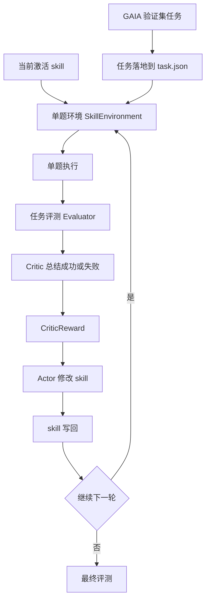
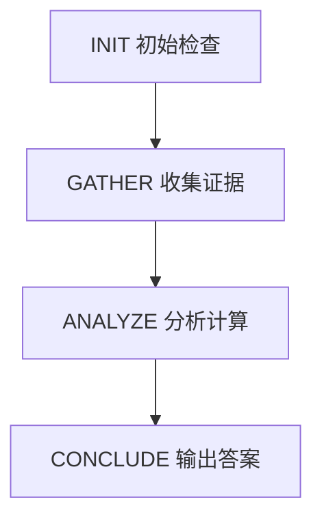

# 26.4.17_1657_GAIA当前Skill闭环架构流程图与单题行为说明

## 1. 这份文档想回答什么

这份文档只讲当前已经落地的版本，方便快速看清三件事：

- `GAIA` 任务现在是怎么接到 `skill` 闭环里的
- 一道题在运行时里会经过哪些阶段和约束
- 现成 smoke 题已经表现出什么行为，短板落在哪

当前主干可以概括成一句话：

`GAIA 任务 -> 分阶段 executor -> critic -> actor -> skill 写回 -> 最终评测`

这里的“图”当前还是固定阶段图，也就是：

`INIT -> GATHER -> ANALYZE -> CONCLUDE`

后面想升级到的 `Skill-State Graph` 属于下一阶段方案，本文先按当前实现来画。

## 2. 当前总流程图

先看总主干，图里只保留当前已经落地的关键节点：

如果只看单题内部，再压成下面这条阶段主干：

## 3. 图里每一层在做什么

### 3.1 数据入口

- 先把 `GAIA` 数据集转成当前项目自己的 task 目录。
- 每道题都会 materialize 成一个独立目录，至少有一个 `task.json`。
- executor 进入任务时先处理本地 task 目录，原始 benchmark 已经提前整理成当前项目的 task 形态。

### 3.2 单题运行主干

每道题都会走一遍 `SkillEnvironment.run(...)`，它做的事情是：

1. 读取当前激活的 `skill`
2. 构造阶段迁移图
3. 构造阶段级工具白名单
4. 调用 `PhaseExecutorAgent` 跑多步执行
5. 记录工具轨迹、阶段迁移、最终答案
6. 交给 `Evaluator` 做任务级判断

当前 phase 语义很清楚：

- `INIT`：只看任务目录和 `task.json`
- `GATHER`：取证，优先本地附件，缺信息时再上网
- `ANALYZE`：把证据收束成最终答案，数值题应尽量调 `run_python`
- `CONCLUDE`：只输出最终答案

### 3.3 critic / actor / 写回闭环

- `critic` 看本轮状态，给出自然语言 reward、问题总结、经验摘要
- `actor` 读取 reward 和历史经验，直接修改 `SKILL.md` 或配套 reference 文件
- 修改结果写回当前 batch 的 skill library
- 下一轮 executor 立即加载最新 skill 继续跑
- 全部 iteration 结束后，再拿最新 skill 做最终评测

所以当前这套系统的学习对象，核心还是外部 `skill` 文本和参考文件，还没有进入“图结构自动改写”的阶段。

## 4. 一道题在这张图里怎么被解

如果把它压成最短路径，当前解题过程就是下面五步：

1. 读题并抽约束
   - 题目真正要的量是什么
   - 指定了哪个来源页面和统计值
   - 最终输出要求什么单位、尺度、舍入和格式
2. 决定证据路由
   - 本地附件够不够
   - 不够时去网页搜索和抓取
3. 抓精确证据
   - 目标是拿到题目指定的那个值
   - 常见值、近似值、相邻页面上的值都要谨慎区分
4. 做计算和尺度转换
   - 多步数值题优先走 `run_python`
   - 中间单位和最终汇报单位要分开
5. 格式核对后作答
   - 检查单位
   - 检查尺度
   - 检查舍入
   - 检查输出字符串格式

这个流程和 `GAIA` 很匹配，因为 `GAIA` 的主干题型很多都能压成：

`题面解析 -> 取证 -> 计算/判断 -> 格式核对 -> 作答`

## 5. 现成 smoke 题例子

当前有现成例子，可以直接拿来说明行为。

- 任务 ID：`e1fc63a2-da7a-432f-be78-7c4a95598703`
- 类型：`validation / level1`
- 题目核心：用 Wikipedia 上 Moon 的 minimum perigee，结合 Eliud Kipchoge 的 marathon pace，回答需要多少 `thousand hours`
- 标准答案：`17`

### 5.1 这题理想上的正确路径

这道题的理想解法很短：

1. 从 `task.json` 读出关键约束
   - 来源页面要用 Wikipedia
   - 统计值要用 Moon 的 minimum perigee
   - 输出单位是 `thousand hours`
   - 要按 nearest `1000 hours` 舍入
2. 去网页拿两个事实
   - Moon 的 minimum perigee
   - Kipchoge 的 marathon record pace
3. 用 `run_python` 做距离 / 配速换算
4. 把小时数转成题目要求的 `thousand hours`
5. 输出 `17`

### 5.2 第一轮 `seqfix` 的真实行为

对应 run：

- `runs/2026/4/2026-4-17/20260417_gaia_smoke_level1_task1_seqfix`

这一轮最后答对了，`run_summary.json` 里记录的是 `success_count = 1`，最终答案是 `17`。

它真实跑出来的行为大致是：

1. `INIT` 里先 `list_dir`
2. `INIT` 里读 `task.json`
3. 随后已经开始 `web_search`
4. 又做了一次 `web_search`
5. 抓取 `Lunar_distance` 页面
6. 抓取 `Eliud_Kipchoge` 页面
7. 中途一度在错误阶段直接给答案
8. 被运行时反馈拦回去后才继续走完阶段流程
9. 最终在收束后答出 `17`

这一轮说明了两件事：

- 闭环已经通了，`executor -> critic -> actor -> skill 写回 -> 最终评测` 可以完整跑完
- executor 的行为还不够干净，存在“过早取网证据”和“过早作答”的冲动

critic 对这一轮的总结也很一致：

- 答案对了
- phase 顺序整体可接受
- 网页检索和抓取偏多
- 没有稳定调用 `run_python`

### 5.3 第二轮 `phaseguard` 的真实行为

对应 run：

- `runs/2026/4/2026-4-17/20260417_gaia_smoke_level1_task1_phaseguard`

这一轮的核心变化是运行时把阶段门控收紧了：

- `INIT` 只允许 `list_dir` 和 `read_json_file`
- `CONCLUDE` 不允许继续调工具

这轮最终评测的结果是 `success_count = 0`。

它真实表现出来的行为是：

1. `INIT` 先 `list_dir`
2. `INIT` 再读 `task.json`
3. 接着想在 `INIT` 里直接 `fetch_url`
4. 运行时当场拦下，提示当前阶段不允许这个工具
5. executor 转去 `GATHER`
6. 在 `GATHER` 阶段开始反复抓 Moon 相关 Wikipedia 页面
7. 证据提取没有稳定收束到题目要的那个精确统计值
8. 最后最终评测没有给出答案，`executor_summary` 是 `max steps reached`

这一轮把系统当前的行为边界暴露得更清楚了：

- phase 约束已经有效
- executor 已经更像“按图走”
- 网页证据抽取还不稳
- 精确统计值定位还弱
- 数值收束和最终尺度转换还不够硬

## 6. 当前从行为上能下什么判断

如果只看现在这个版本，我会把行为总结成下面四点：

- 工程闭环已经成立，系统能完成一轮带 skill 写回的训练式运行。
- phase graph 和 tool gate 已经对 executor 产生实质约束，尤其是 `INIT`。
- 当前最容易出问题的地方在 `GATHER -> ANALYZE` 之间，也就是证据定点抽取和数值收束。
- 当前系统更像“有约束的 phase executor”，离“actor/critic 共同维护图结构”的目标还有一段距离。

## 7. 现在这张图最值得盯的观察点

如果你接下来想看行为，最值得盯的是这几个位置：

- `INIT` 是否真的只做任务检查，没有越权取证
- `GATHER` 是否能拿到题目指定的来源页面和精确统计值
- `ANALYZE` 是否稳定调用 `run_python`
- `CONCLUDE` 前是否真的做了单位、尺度、舍入核对
- actor 写回后的 skill，下一轮是否让这些行为变得更稳

## 8. 一句话结论

当前 `project_gaia_skillrl` 已经形成了一个可运行的最小闭环：

`GAIA 任务 + 固定阶段图 + 工具门控 + critic/actor skill 写回`

它已经能答对部分题，也已经能把行为问题暴露得很具体。下一步最该补的是网页精确证据抽取和数值题的强制收束能力。
