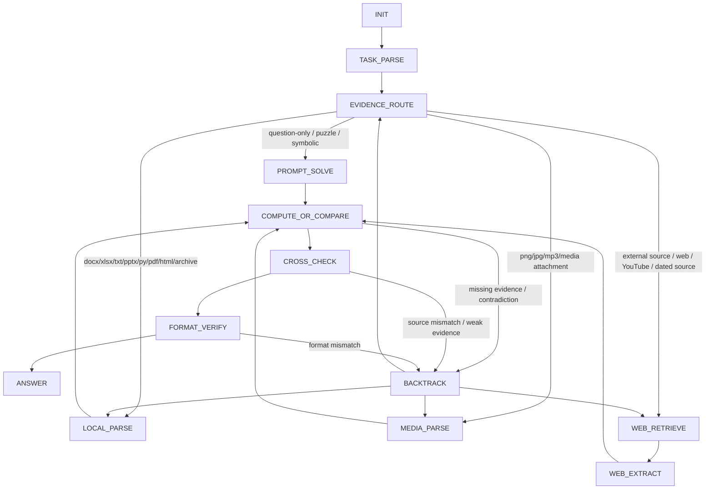

# 26.4.20_GAIA L1 53题扫描后强状态机设计 v1

## 1. 目标

本文件基于 `/data/xsy/project_gaia_skillrl/data/converted/gaia_validation_tasks.json` 的 53 道 GAIA validation level 1 题做一次结构扫描，目标是给下一版 `skill + state graph + actor/critic` 闭环提供一张可落地的强状态机。

当前四阶段 `INIT -> GATHER -> ANALYZE -> CONCLUDE` 的主要问题：

- `GATHER` 同时承担路由、附件解析、网页搜索、网页抽取、补证，职责过重。
- `ANALYZE` 同时承担推理、计算、交叉验证、格式核对，容易提前作答。
- actor 只能往大段 phase 里加规则，缺少对“状态拆分、边条件、回退预算、验证节点”的结构化编辑能力。

本设计把 `GATHER` 拆成路由和取证状态，把 `ANALYZE` 拆成计算、交叉验证、格式验证状态，并显式加入 `BACKTRACK`。

## 2. 53题扫描结论

序号按 `gaia_validation_tasks.json` 中的顺序。

### 2.1 附件分布

- 总数：`53`
- 无附件：`42`
- 有附件：`11`
- 附件类型：`.xlsx` 3，`.png` 2，`.mp3` 2，`.docx` 1，`.txt` 1，`.pptx` 1，`.py` 1

结论：多数题需要网页/知识检索或题内推理；附件题数量少，但一旦出现附件，附件通常是主证据，应该强制先走本地分支。

### 2.2 任务族

| 任务族 | 题号 | 状态机主路径 |
|---|---:|---|
| A. 题内推理 / 题内变换 / 可用 `run_python` 模拟 | 03, 09, 11, 12, 15, 21, 24, 26, 30, 36, 37, 38, 49 | `PROMPT_SOLVE -> COMPUTE_OR_COMPARE -> FORMAT_VERIFY` |
| B. 本地结构化附件 / 代码 / 网格 | 10, 23, 28, 35, 52 | `LOCAL_PARSE -> COMPUTE_OR_COMPARE -> CROSS_CHECK` |
| C. 本地非结构化附件 / 图像 / 音频 / 文档 | 08, 17, 22, 25, 31, 45 | `MEDIA_PARSE 或 LOCAL_PARSE -> CROSS_CHECK` |
| D. 单源网页检索 | 02, 04, 07, 20, 29, 32, 41, 43, 44, 47, 48, 50, 53 | `WEB_RETRIEVE -> WEB_EXTRACT -> CROSS_CHECK` |
| E. 多跳网页链路 / 外部媒体间接检索 | 01, 05, 06, 13, 14, 16, 18, 19, 27, 33, 34, 39, 40, 42, 46, 51 | `WEB_RETRIEVE -> WEB_EXTRACT -> COMPUTE_OR_COMPARE -> CROSS_CHECK` |

### 2.3 格式敏感题

至少 `23/53` 题显式要求排序、逗号分隔、无空格、单位换算、四舍五入、只给名字、只给城市、plain text 数字等输出格式：

`01, 03, 07, 12, 21, 22, 24, 28, 30, 31, 32, 33, 37, 39, 40, 42, 45, 48, 49, 50, 51, 52, 53`

结论：`FORMAT_VERIFY` 必须是独立状态，且所有路径都要经过它。

## 3. 强状态机 v1



## 4. 状态契约

### `INIT`

- 目标：确认任务目录、`task.json`、附件清单。
- 工具：`list_dir`, `read_json_file`
- 产物：`task_manifest_loaded`, `attachment_inventory`
- 退出条件：已读取 `task.json`，附件列表已规范化。
- 失败信号：没读 `task.json` 就开始搜索或作答。

### `TASK_PARSE`

- 目标：从题面抽取答案类型、证据需求、格式约束、是否需要外部来源。
- 工具：默认无；必要时可用 `read_json_file`
- 产物：`answer_schema`, `evidence_requirements`, `format_constraints`, `route_hints`
- 退出条件：至少明确以下字段：答案是数字/名字/列表/句子/代码/坐标/颜色；是否需要附件；是否需要网页；最终格式。
- 失败信号：未识别 `only`, `exactly`, `comma-separated`, `alphabetical`, `round`, `without prefix`, `as of`。

### `EVIDENCE_ROUTE`

- 目标：选择主证据路径。
- 工具：无。
- 产物：`selected_route`
- 退出条件：只能进入一个主分支：`PROMPT_SOLVE`, `LOCAL_PARSE`, `MEDIA_PARSE`, `WEB_RETRIEVE`。
- 路由规则：
- 有附件时，优先本地分支；仅当题面要求外部信息时再补网页。
- 纯谜题、逻辑题、表内题面题进入 `PROMPT_SOLVE`。
- YouTube 题进入 `WEB_RETRIEVE`，搜索 transcript、caption、quote、species、scene description。
- 网页题如果含日期、版本、来源名，要把来源约束写进 `source_query_plan`。

### `PROMPT_SOLVE`

- 目标：解决题内足够的信息题，避免无意义搜索。
- 工具：`run_python`
- 适用题：03, 09, 11, 12, 15, 21, 24, 26, 30, 36, 37, 38, 49
- 产物：`reasoning_plan`, `candidate_evidence`
- 退出条件：已得到可计算或可验证的候选答案；复杂组合题必须准备 `run_python` 或明确枚举逻辑。
- 失败信号：对提示注入题没有遵守最高层题面要求；对组合题心算。

### `LOCAL_PARSE`

- 目标：解析非媒体附件和结构化附件。
- 工具：`read_file`, `read_json_file`, `extract_pdf_text`, `read_table`, `parse_docx`, `parse_pptx`, `extract_archive`, `html_extract`, `run_python`
- 适用题：08, 10, 23, 25, 28, 35, 52
- 产物：`local_evidence`, `parsed_rows_or_text`, `attachment_summary`
- 退出条件：附件内容已转成文本、表格、坐标、代码输出或可计算结构。
- 失败信号：有 `.xlsx/.pptx/.docx/.py/.txt` 却跳到网页；解析失败后没有换工具或用 `run_python` 直接读取文件。

### `MEDIA_PARSE`

- 目标：解析图像和音频附件。
- 工具：`image_metadata`, `ocr_image`, `image_qa`, `audio_transcribe`, `run_python`
- 适用题：17, 22, 31, 45；YouTube 题不在这里，走 `WEB_RETRIEVE`
- 产物：`media_evidence`, `transcript_or_visual_facts`
- 退出条件：音频已转写；图像中可见文本或棋局/图形关系已抽取。
- 失败信号：图像只 OCR 文本但题目需要视觉语义；音频题未转写就猜 ingredient/page。

### `WEB_RETRIEVE`

- 目标：找候选来源页。
- 工具：`web_search`
- 适用题：所有 D/E 网页题，以及 YouTube 外部媒体题。
- 产物：`candidate_sources`
- 退出条件：至少有一个高相关来源；多跳题要保留当前跳的实体链。
- 预算：默认最多 2 次搜索；搜索失败后改写 query，不重复同义 query。
- 失败信号：泛搜后直接答；未携带题面中的版本、日期、来源名、exact phrase。

### `WEB_EXTRACT`

- 目标：打开来源并抽取证据。
- 工具：`fetch_url`, `html_extract`, `read_file`, `run_python`
- 产物：`source_evidence`, `source_url`, `quoted_key_fields`
- 退出条件：答案字段或下一跳实体已从页面中抽取。
- 预算：默认最多 3 次 fetch/html_extract；同一题最多 2 个主域。
- 失败信号：搜索摘要当最终证据；多跳题没有记录中间实体。

### `COMPUTE_OR_COMPARE`

- 目标：把证据变成候选答案。
- 工具：`run_python`
- 产物：`candidate_answer`, `calculation_trace`
- 退出条件：候选答案已形成，并能解释单位、排序、筛选条件。
- 强制规则：
- 任何算术、计数、路径搜索、组合优化、表格汇总、颜色坐标、日期差、排序 tie-break 都用 `run_python`。
- 对 01、03、10、12、21、23、28、37、40、43、49、52 这类题，不能只靠心算。
- 失败信号：候选答案没有中间数；输出单位和题目单位不一致。

### `CROSS_CHECK`

- 目标：确认候选答案由正确来源、正确行列、正确实体链、正确筛选条件得到。
- 工具：`fetch_url`, `html_extract`, `read_file`, `read_table`, `run_python`
- 产物：`verification_note`, `confidence_label`
- 退出条件：满足以下至少一项：
- 本地附件题：候选答案可回指到附件中的具体文本、表格、坐标、转写片段。
- 网页题：候选答案可回指到题面指定来源或实体链。
- 推理题：候选答案通过枚举、反例、模拟或逻辑一致性检查。
- 失败信号：网页题没有 URL/来源名；多跳题只验证最后一步；附件题没有回查原始文件。

### `FORMAT_VERIFY`

- 目标：最终答案格式核验。
- 工具：`run_python`
- 产物：`final_answer_string`
- 退出条件：输出已满足题面所有格式约束。
- 强制检查：
- 数字单位、尺度、舍入、是否需要 USD、是否保留两位小数。
- 列表排序、逗号、有无空格、颜色/城市/姓氏/名字顺序。
- 是否要求 `first name`, `last names only`, `city name without abbreviations`, `without prefix`, `plain text numbers`。
- 失败信号：答案内容正确但格式不合规；把解释写进答案。

### `ANSWER`

- 目标：只输出最终答案。
- 工具：无。
- 退出条件：`<ANSWER>final answer</ANSWER>`
- 失败信号：附带解释；输出占位串；输出多个候选。

### `BACKTRACK`

- 目标：受控回退，避免无限搜索和早答。
- 工具：无。
- 进入条件：
- `COMPUTE_OR_COMPARE` 发现证据缺失或计算矛盾。
- `CROSS_CHECK` 发现来源链不合格。
- `FORMAT_VERIFY` 发现输出不符合题面格式。
- 回退目标：
- 缺来源：回 `WEB_RETRIEVE`
- 缺附件字段：回 `LOCAL_PARSE` 或 `MEDIA_PARSE`
- 路由选错：回 `EVIDENCE_ROUTE`
- 计算错误：回 `COMPUTE_OR_COMPARE`
- 预算：全题最多 2 次 `BACKTRACK`。

## 5. 推荐 graph-v1 skill schema

```yaml
---
name: gaia-general-skill
description: Graph-constrained GAIA execution skill for level-1 task routing, evidence extraction, computation, verification, and answer formatting.
allowed-tools:
  - list_dir
  - read_file
  - read_json_file
  - extract_pdf_text
  - read_table
  - image_metadata
  - audio_transcribe
  - ocr_image
  - image_qa
  - parse_docx
  - parse_pptx
  - extract_archive
  - web_search
  - fetch_url
  - html_extract
  - run_python
graph-version: "0.1"
entry-state: INIT
answer-state: ANSWER
backtrack-state: BACKTRACK
states:
  - id: INIT
    allowed_tools: [list_dir, read_json_file]
    allowed_next: [TASK_PARSE]
    exit_conditions: [task_manifest_loaded, attachment_inventory_ready]
  - id: TASK_PARSE
    allowed_tools: [read_json_file]
    allowed_next: [EVIDENCE_ROUTE]
    exit_conditions: [answer_schema_ready, format_constraints_ready, route_hints_ready]
  - id: EVIDENCE_ROUTE
    allowed_tools: []
    allowed_next: [PROMPT_SOLVE, LOCAL_PARSE, MEDIA_PARSE, WEB_RETRIEVE]
    exit_conditions: [selected_route_ready]
  - id: PROMPT_SOLVE
    allowed_tools: [run_python]
    allowed_next: [COMPUTE_OR_COMPARE, CROSS_CHECK, BACKTRACK]
    exit_conditions: [candidate_evidence_ready]
  - id: LOCAL_PARSE
    allowed_tools: [read_file, read_json_file, extract_pdf_text, read_table, parse_docx, parse_pptx, extract_archive, html_extract, run_python]
    allowed_next: [COMPUTE_OR_COMPARE, CROSS_CHECK, BACKTRACK]
    exit_conditions: [local_evidence_ready]
  - id: MEDIA_PARSE
    allowed_tools: [image_metadata, ocr_image, image_qa, audio_transcribe, run_python]
    allowed_next: [COMPUTE_OR_COMPARE, CROSS_CHECK, BACKTRACK]
    exit_conditions: [media_evidence_ready]
  - id: WEB_RETRIEVE
    allowed_tools: [web_search]
    allowed_next: [WEB_EXTRACT, BACKTRACK]
    exit_conditions: [candidate_sources_ready]
  - id: WEB_EXTRACT
    allowed_tools: [fetch_url, html_extract, run_python]
    allowed_next: [COMPUTE_OR_COMPARE, CROSS_CHECK, WEB_RETRIEVE, BACKTRACK]
    exit_conditions: [source_evidence_ready]
  - id: COMPUTE_OR_COMPARE
    allowed_tools: [run_python]
    allowed_next: [CROSS_CHECK, BACKTRACK]
    exit_conditions: [candidate_answer_ready, calculation_trace_ready]
  - id: CROSS_CHECK
    allowed_tools: [read_file, read_table, fetch_url, html_extract, run_python]
    allowed_next: [FORMAT_VERIFY, BACKTRACK]
    exit_conditions: [candidate_answer_verified]
  - id: FORMAT_VERIFY
    allowed_tools: [run_python]
    allowed_next: [ANSWER, BACKTRACK]
    exit_conditions: [final_answer_string_ready]
  - id: ANSWER
    allowed_tools: []
    allowed_next: []
    exit_conditions: [answer_emitted]
  - id: BACKTRACK
    allowed_tools: []
    allowed_next: [EVIDENCE_ROUTE, LOCAL_PARSE, MEDIA_PARSE, WEB_RETRIEVE, COMPUTE_OR_COMPARE]
    exit_conditions: [backtrack_target_selected]
---
```

## 6. actor / critic 的编辑边界

### critic 应输出的结构信号

- `bad_state`: 哪个状态职责过载或说明不足。
- `bad_edge`: 哪条边导致早答、绕路或死循环。
- `missing_guard`: 缺少什么迁移条件。
- `missing_verifier`: 哪类题缺少校验节点。
- `failure_cluster`: 对应题号集合和失败签名。

### actor 首轮只开放安全编辑

- `update_state_instruction`
- `add_guard`
- `tighten_guard`
- `add_exit_condition`
- `add_failure_signal`
- `split_state`
- `add_edge`

首轮不开放：

- `delete_state`
- `merge_state`
- `remove_edge`
- 修改 `ANSWER` 的协议

理由：先让图能稳定收敛，再让 actor 做破坏性结构编辑。

## 7. 直接试跑前的过渡映射

当前代码仍以 `## Phase:` 解析。若还没改 runtime，可以先把这张图压回四阶段做试跑：

| 当前 phase | 内部子状态 |
|---|---|
| `INIT` | `INIT`, `TASK_PARSE` |
| `GATHER` | `EVIDENCE_ROUTE`, `LOCAL_PARSE`, `MEDIA_PARSE`, `WEB_RETRIEVE`, `WEB_EXTRACT` |
| `ANALYZE` | `PROMPT_SOLVE`, `COMPUTE_OR_COMPARE`, `CROSS_CHECK`, `FORMAT_VERIFY`, `BACKTRACK` |
| `CONCLUDE` | `ANSWER` |

但真正要验证“自定义状态机”的价值，应改 runtime 读取 `graph-version/states/allowed_next`，让 executor 按状态图执行，而非只把这些状态写进文本。

## 8. 最小验收方案

先不要上全量训练，建议三步：

1. 用这张图生成一个 bootstrap seed skill，先跑 `level1 max-tasks 5 c5` 冒烟，覆盖一题 prompt-only、一题 xlsx、一题 image/audio、一题单源 web、一题多跳 web。
2. 冒烟通过后跑 `53题 c10`，不训练，只看 direct graph executor 分数和卡点。
3. 再开 `train2 c10`，观察 actor 是否主要修改状态条件和 verifier，而非只往大段说明里堆规则。

建议优先观察：

- 零工具直接猜的题是否减少。
- 网页题是否记录了来源链。
- 附件题是否优先本地解析。
- `FORMAT_VERIFY` 是否降低格式错。
- `BACKTRACK` 是否减少 `max steps reached`。

