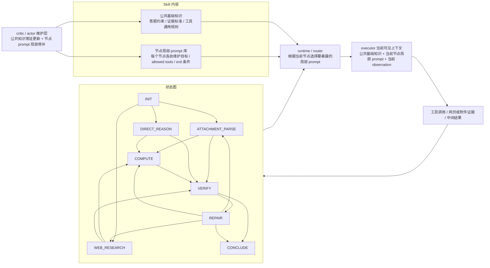

# RA-熊思远两周进展整理（图表版）

时间范围：2026.4.10-2026.4.23

## 0. 总览

这两周主线从 EarthBench 切到 GAIA。EarthBench 前半段主要做 benchmark 诊断和交付准备，结论是训练划分、数据、工具、gold trajectory 需要先处理；GAIA 后半段已经搭起完整闭环，并开始围绕固定图、boot、critic、actor 做 dev/test 实验。

当前重点：继续看 GAIA test 错例，判断瓶颈主要落在图行为、证据指导、工具/helper，还是 executor 能力和 API 稳定性。

## 1. EarthBench：暂缓原因

| 维度 | 已确认现象 | 影响 |
| --- | --- | --- |
| 训练划分 | 缺明确训练集 | 在 test 上训练 skill 会削弱泛化意义 |
| gold answer | 248 题中有 `24` 题高置信异常 | reward 信号混入噪声 |
| gold trajectory | 30 题 strict replay 只有 `1/30` 完整通过 | 轨迹监督难直接使用 |
| 工具契约 | `63/248` 命中 batch 契约冲突 | gold 抽象 step 与工具实现不对齐 |
| 数据错位 | `26` 题题面 / 选项 / 数据目录不一致 | executor 可能按题面走到错误数据 |
| 任务范式 | 多数题偏工具选择 + 参数传递 | 对复杂 SkillRL 架构区分度有限 |

一句话判断：EarthBench 适合继续作为诊断集和回归集；主线调架构先转到 GAIA。4.21 学长侧提到数据已修，代码侧可以交付，但训练集划分仍需要补齐。

## 2. GAIA：当前闭环

补上前置链路后，当前 GAIA 主干可以表述成：先完成数据接入、`materialize` 和 runtime contract 约束，再用 bootstrap 生成第一版 `SKILL.md`，然后才进入 actor / critic 的训练闭环。

| 层 | 已落地内容 |
| --- | --- |
| 数据 | GAIA validation 接入；内部切成 `validation_dev=83` 和 `validation_test=82` |
| 评分 | 接入官方 GAIA scorer，后续按 leaderboard-aligned 口径看分 |
| 工具 | 文件、表格、PDF、docx、pptx、音频、OCR、图片问答、网页、HTML、Python |
| 训练 | `validation_dev` task snapshot + runtime contract 先生成初始 skill；然后 executor rollout；critic 归因；actor 写回；dev/test eval |

### 2.1 工具层说明

| 工具族 | 工具 | 用途 | 当前状态 |
| --- | --- | --- | --- |
| 任务目录 | `list_dir`、`read_file`、`read_json_file` | 读 task、文件清单、文本/JSON | 已注册 |
| PDF / 表格 | `extract_pdf_text`、`read_table` | PDF 文本、CSV/XLSX 预览 | 已注册 |
| Office 附件 | `parse_docx`、`parse_pptx` | docx 段落/表格、pptx slide/notes | 已注册 |
| 压缩包 | `extract_archive` | zip/tar 解包和文件列表 | 已注册 |
| 图像 | `image_metadata`、`ocr_image`、`image_qa` | 尺寸、OCR、视觉问答 | 已注册 |
| 音频 | `audio_transcribe` | mp3 等音频转写 | 已注册 |
| 联网 | `web_search`、`fetch_url`、`html_extract` | 搜索、抓网页、抽正文和链接 | 已注册 |
| 计算 | `run_python` | 数值计算、枚举、表格处理 | 已注册 |

| 联网工具 | 实现方式 | 当前边界 |
| --- | --- | --- |
| `web_search` | `duckduckgo_search.DDGS().text(...)`；异常时走 DuckDuckGo HTML fallback | 搜索结果受 DuckDuckGo 排名和可访问性影响 |
| `fetch_url` | `requests.get` + `BeautifulSoup` 清理 HTML 文本 | 无浏览器渲染；403、JS 页面、登录页会失败 |
| `html_extract` | URL 或本地 HTML；优先 `trafilatura.extract`，再回退 BeautifulSoup | 动态网页仍需要 browser/helper |
| proxy | 自动优先 `http://127.0.0.1:17890` | 站点级封禁仍可能发生 |

| 4.23 轻量 smoke | 结果 |
| --- | --- |
| 工具注册数 | `16` |
| `web_search("GAIA benchmark General AI Assistants")` | 返回 arXiv 和 Hugging Face GAIA 结果 |
| `fetch_url("https://arxiv.org/abs/2311.12983")` | `200`，可抽取标题和正文 |
| `fetch_url("http://example.com")` | `200`，可抽取标题和正文 |

## 3. 从四阶段到强状态图

| 实验 | 结果 / 信号 | 结论 |
| --- | --- | --- |
| 人工强状态图 partial run | `15/51` 有效成功，2 题中止 | 图能驱动 8B 做路由，但健康上限偏低 |
| 协议摩擦 | `invalid_answer_phase=186` | 答案出口太硬，候选答案常被拒 |
| 图边摩擦 | `invalid_phase_transition=119` | 节点和边太细，跳转成本高 |
| 步数压力 | `21` 题打满 24 步，`29` 题步数 `>=22` | 强状态图过重，长题容易耗尽预算 |

这一轮的作用主要是诊断：复杂图方向有价值，但硬 phase 过多会把收益吃掉。后续回到更轻的 boot / critic / actor，让 boot 定图，RL 轮次改节点细节。

## 4. boot-v3 固定图

| 图结构 | 设计取舍 |
| --- | --- |
| `INIT` | 读取任务、识别附件和题面约束 |
| `ATTACHMENT_PARSE` | 处理本地附件、表格、文档、多模态 |
| `WEB_RESEARCH` | 处理网页检索和网页证据 |
| `DIRECT_REASON` | 处理题内推理和短逻辑题 |
| `COMPUTE` | 承接计算、枚举、表格汇总 |
| `VERIFY` | 做证据和格式检查 |
| `REPAIR` | 有界回退，修证据或计算 |
| `CONCLUDE` | 唯一最终答案出口 |

### 4.1 skill + 图结构：渐进式披露

| 维护层 | 当前思路 |
| --- | --- |
| 公共基础知识 | 常驻给 executor，看作所有节点共享的答题纪律、证据标准、工具总规则 |
| 节点局部 prompt | 按图跳转渐进式披露，进入哪个节点，就补哪一段局部规则 |
| 图结构 | 先由 boot 定大图，后续 RL 轮次尽量少改边，多修节点内策略 |

一句话理解：当前在维护的是“共性知识 + 节点 prompt + 固定图”三层。runtime 常驻公共部分，节点局部信息按跳转披露给 executor，这样更容易控上下文长度，也更方便 critic / actor 做小步修补。

## 5. boot-v3 A/B 训练

| skill / run | validation_dev | validation_test | 观察 |
| --- | ---: | ---: | --- |
| direct qwen3-8b baseline | - | `14/82` | test 对照 |
| bootstrap v0.2 | `18/83` | `15/82` | 轻量 bootstrap 略高 |
| boot-v3 初始 skill | `18/83` | `14/82` | 与 direct test 持平 |
| A full critic iter2 | `21/83` | `11/82` | dev 涨，test 掉 |
| B sharded critic iter2 | `14/83` | `17/82` | test 最高，但后续未保持 |
| A full critic iter3 | `21/83` | `14/82` | 回到 baseline 附近 |
| B sharded critic iter3 | `21/83` | `13/82` | dev 涨，test 未保住 |

当前判断：critic / actor 能修 dev 局部题，但 test 泛化还不稳定。A 路 full critic 容易写宽规则，B 路 sharded critic 的硬证据门一度提升 test，但也会让 executor 更保守。

## 6. 当前瓶颈

| 瓶颈 | 具体表现 | 下一步 |
| --- | --- | --- |
| executor prompt 与动态图不完全对齐 | 旧 prompt 曾保留 `GATHER / ANALYZE` 规则 | 已修；需要做修复前后 A/B |
| critic 输入太压缩 | compact row 缺 observation、候选答案来源、失败工具上下文 | 加 evidence-rich exemplar |
| actor 改写幅度偏大 | dev 局部上涨，test 题集合漂移 | 做 minimal actor diff |
| web / local 证据链不稳 | 网页找错页、表格 join/filter 错、实体链断 | 先看 `validation_test` 错例 |
| 工具/helper 不足 | Wikipedia revision、HTML table、USGS/NASA 类检索不稳 | 选 2-3 个高频 helper 补强 |
| API 资源受限 | 上海 AI Lab quota / 403；`gpt-5.4` 不稳定 | 强模型侧用 `SSSAI gpt-5.2`，executor 用可用 qwen3-8b 小并发 |

## 7. 下一步

1. 先看 GAIA `validation_test` 错例，按图行为、证据指导、工具/helper、executor 能力分族。
2. 做 executor prompt 修复前后 A/B，重点看协议失败、平均步数、空答案和 test 分数。
3. 改 critic 输入，给每类失败补少量关键 observation 和候选答案来源。
4. 限制 actor 每轮只改少量规则，提高正确题保留率。
5. 补高频 helper；若仍卡在粗图表达，再开 graph revision。
