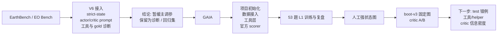
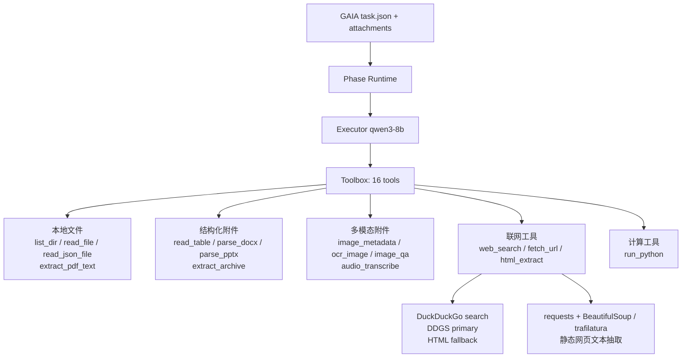
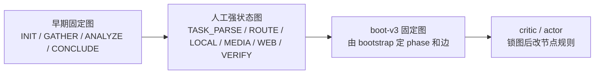
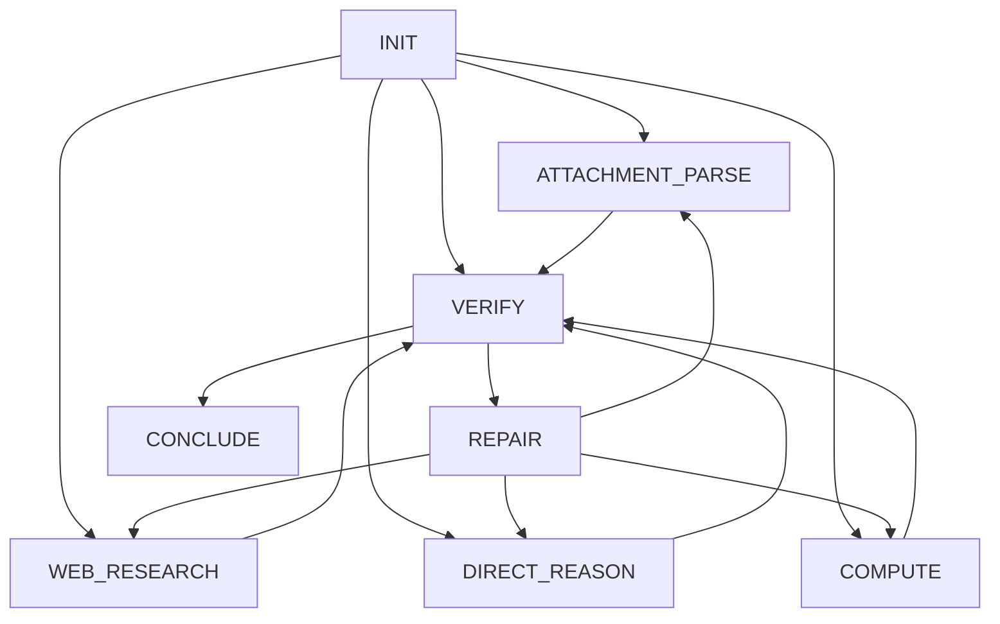

# RA-熊思远两周进展图表版

时间范围：2026.4.10-2026.4.23

## 0. 总览

| 阶段 | 主要目标 | 当前状态 | 一句话判断 |
| --- | --- | --- | --- |
| EarthBench | 验证渐进式 skill 与 V6 链路 | 工程链路跑通，问题集中到数据 / 工具 / gold | 暂时降级为诊断集 |
| GAIA 工具层 | 自建 GAIA executor 工具箱 | 16 个工具已注册，联网搜索和网页抓取已 smoke | L1 基础能力够用，复杂网页和站点 403 需 helper |
| GAIA 架构 | 从固定 phase 到 boot 定图 | boot-v3 能在 dev 局部涨分 | test 泛化尚不稳定 |
| 资源 | 控制模型成本和额度 | 上海 AI Lab 额度不足；SSSAI gpt-5.2 可作 actor/critic | 后续小并发跑 qwen3-8b |

## 1. 时间线

| 日期 | 主线 | 关键产出 | 结论 |
| --- | --- | --- | --- |
| 4.10-4.16 | EarthBench V6 | strict-state、工具契约、dataalignv1、gold 覆盖、30 题复盘 | 分数稳定在 `17-18/30`，脏 gold / 工具 / 数据问题很重 |
| 4.15-4.16 | EarthBench 诊断 | `strict gold replay = 1/30`；`gpt-5.2 no-skill = 14/30` | 当前 reward 信号不干净 |
| 4.17 | GAIA 初始化 | 独立项目、GAIA 数据、最小闭环、去掉 metadata 泄漏 | `executor -> critic -> actor -> skill writeback` 跑通 |
| 4.18 | GAIA L1 53 题 | direct baseline、c20 / c20G 两轮训练、逐题复盘 | 流程能改善，答案准确率提升有限 |
| 4.20 | GAIA 工具 / scorer / 强图 | 官方 scorer 对齐；多模态工具补齐；人工强状态图 | 强图有路由价值，但协议摩擦大 |
| 4.21-4.22 | boot-v3 A/B | dev/test 切分；boot 定图；full vs sharded critic | dev 局部涨分，test 泛化不稳 |
| 4.22-4.23 | 资源与下一步 | AI Lab quota 触底；准备切可用 API | 转向错例分析和工具/helper 补强 |

## 2. EarthBench：量化证据

| 观察项 | 数字 | 含义 |
| --- | ---: | --- |
| gold answer 高置信异常 | `24/248` | 答案标签本身有噪声 |
| 记录不完整 | `5/248` | 一批题无法完整追溯 |
| gold batch 契约冲突 | `63/248` | gold 一步 batch 写法和 runtime 工具接口不一致 |
| 题面 / 数据目录错位 | `26/248` | 题面、选项、真实数据存在版本漂移 |
| strict gold replay | `1/30` | gold trajectory 难以在当前 runtime 顺序执行 |
| gpt-5.2 no-skill | `14/30` | 强模型直跑也被数据 / 工具 / gold 问题卡住 |
| V6 多轮训练区间 | `17-18/30` | 修工具和 prompt 后未稳定突破 |

**阶段结论**

| 维度 | 判断 |
| --- | --- |
| 工程链路 | 已经能跑 |
| benchmark 信号 | 当前偏脏 |
| 训练 / 测试划分 | 仍需补训练集方案 |
| 后续定位 | 保留作诊断集和回归集 |

## 3. GAIA 工具层说明

### 3.1 工具箱总图

### 3.2 当前注册工具

| 工具族 | 工具 | 用途 | 当前状态 |
| --- | --- | --- | --- |
| 任务目录 | `list_dir`、`read_file`、`read_json_file` | 读 task、文件清单、文本/JSON | 已注册 |
| PDF / 表格 | `extract_pdf_text`、`read_table` | PDF 文本、CSV/XLSX 预览 | 已注册 |
| Office 附件 | `parse_docx`、`parse_pptx` | docx 段落/表格、pptx slide/notes | 已注册 |
| 压缩包 | `extract_archive` | zip/tar 解包和文件列表 | 已注册 |
| 图像 | `image_metadata`、`ocr_image`、`image_qa` | 尺寸、OCR、视觉问答 | 已注册；OCR 优先本地，失败走视觉模型 |
| 音频 | `audio_transcribe` | mp3 等音频转写 | 已注册；优先本地 faster-whisper，失败走 API |
| 联网 | `web_search`、`fetch_url`、`html_extract` | 搜索、抓网页、抽正文和链接 | 已注册；见下表 |
| 计算 | `run_python` | 数值计算、枚举、表格处理 | 已注册 |

### 3.3 联网工具确认

| 工具 | 实现方式 | 回答学长问题 | 已知边界 |
| --- | --- | --- | --- |
| `web_search` | `duckduckgo_search.DDGS().text(...)`；异常时走 `https://html.duckduckgo.com/html/?q=...` fallback | 当前 search 后端是 DuckDuckGo；未接 Google / Bing API | 搜索结果受 DuckDuckGo 排名和可访问性影响 |
| `fetch_url` | `requests.get` + `BeautifulSoup` 清理 HTML 文本 | 用于打开搜索结果页和普通静态网页 | 无浏览器渲染；遇到 403、JS 页面、登录页会失败 |
| `html_extract` | URL 或本地 HTML；优先 `trafilatura.extract`，再回退 BeautifulSoup；最多返回 20 条链接 | 用于正文和链接抽取 | 对复杂动态网页仍需 browser/helper |
| 代理 | `ensure_preferred_proxy_env()` 自动优先 `http://127.0.0.1:17890` | 避免走旧 `127.0.0.1:43214` | 站点级封禁仍可能发生 |

### 3.4 4.23 轻量 smoke

| 项目 | 结果 |
| --- | --- |
| 工具注册数 | `16` |
| `web_search("GAIA benchmark General AI Assistants")` | 返回 arXiv 和 Hugging Face GAIA 结果 |
| `fetch_url("https://arxiv.org/abs/2311.12983")` | `200`，可抽取标题和正文 |
| `fetch_url("http://example.com")` | `200`，可抽取标题和正文 |
| 说明 | 工具入口可用；复杂网页、站点 403、动态渲染属于后续 helper / browser 能力范围 |

## 4. GAIA 架构演化

### 4.1 当前训练闭环

这版图把前置接入也放进来了：`GAIA` 任务先 materialize 成 task workspace，bootstrap 再结合 runtime contract 和 `validation_dev` task snapshot 生成第一版 `SKILL.md`，后面才进入训练闭环。

### 4.2 状态图路线

### 4.3 boot-v3 图简图

## 5. GAIA 量化结果

### 5.1 53 题 L1 早期实验

| run | iteration_01 | iteration_02 | 官方 scorer 补充 | 观察 |
| --- | ---: | ---: | ---: | --- |
| direct qwen3-8b | - | - | `11/53` | 8B 无 skill 基线 |
| train2 c20 | `13/53` | `11/53` | final `14/53` | 两轮后有波动 |
| train2 c20G | `10/53` | `12/53` | final `9/53` | 训练内提升，最终验证回落 |

### 5.2 人工强状态图 partial

| 指标 | 数字 | 含义 |
| --- | ---: | --- |
| 有效完成 | `51/53` | 2 题中止未完成 |
| 成功 | `15/51` | 图能带来一部分路由能力 |
| `invalid_answer_phase` | `186` | 答案出口过硬，早答被频繁拒绝 |
| `invalid_phase_transition` | `119` | 图边过窄 |
| 打满 24 步 | `21` | 状态成本偏高 |
| 步数 >= 22 | `29` | 大量任务接近上限 |

### 5.3 boot-v3 dev/test A/B

| skill / run | validation_dev | validation_test | 判断 |
| --- | ---: | ---: | --- |
| direct qwen3-8b baseline | - | `14/82` | test 基线 |
| bootstrap v0.2 | `18/83` | `15/82` | 轻量 bootstrap 略高 |
| boot-v3 初始 skill | `18/83` | `14/82` | 和 direct test 持平 |
| A full critic iter2 | `21/83` | `11/82` | dev 涨，test 掉 |
| B sharded critic iter2 | `14/83` | `17/82` | test 短期最高 |
| A full critic iter3 | `21/83` | `14/82` | 回到 baseline |
| B sharded critic iter3 | `21/83` | `13/82` | 回落 |

## 6. 当前瓶颈矩阵

| 瓶颈 | 证据 | 下一步实验 | 观察指标 |
| --- | --- | --- | --- |
| 协议摩擦 | `invalid_answer_phase` 高 | executor system prompt 修复前后 A/B | early answer、平均步数、空答案 |
| critic 信息不足 | compact row 缺 observation 和候选答案来源 | evidence-rich critic row | test 分数、正确题保留率 |
| actor 改写过大 | dev 涨分伴随 test 回落 | minimal actor diff | skill 长度、退化题数 |
| 网页 / 站点可达性 | 403、动态页、长链检索 | web helper / site-specific helper | web failure、证据链完整率 |
| 表格 / 附件推理 | xlsx join/filter、图像/音频细节 | 工具/helper augmentation | 附件题成功率 |
| 图结构粒度 | `WEB_RESEARCH`、`VERIFY` 过重 | graph revision 单独实验 | phase path、step hit、test 分数 |

## 7. 接下来可直接推进

| 优先级 | 任务 | 产出 |
| ---: | --- | --- |
| 1 | 看 `validation_test` 错例 | 错误族表：图行为 / 证据指导 / 工具能力 / executor 能力 |
| 2 | 跑 executor prompt 修复 A/B | 修复前后协议指标和分数表 |
| 3 | 改 critic 输入 | 每个 failure family 加 2-3 个 evidence-rich exemplar |
| 4 | minimal actor diff | 每轮限制改 5-8 条规则 |
| 5 | 工具/helper 补强 | HTML 表格、Wikipedia revision、USGS/NASA 精确查询优先 |
| 6 | graph revision | 在工具和 critic 修完后再拆图 |

## 8. 资源现状

| 项 | 当前情况 |
| --- | --- |
| actor / critic | 上海 AI Lab `gpt-5.4` 额度不足；当前可用 `SSSAI gpt-5.2` |
| executor | 原 `qwen3-8b` endpoint 出现过 quota / 403；后续优先小并发可用 endpoint |
| 自己账号 | 硅基流动 qwen3-8b 小并发可支撑后续错例和小规模实验 |
| 并发建议 | 单 endpoint 默认 `c20`；多实验并行时要降并发或排队 |

## 9. 相关路径

| 类型 | 路径 |
| --- | --- |
| 本图表版 | `/data/xsy/project_gaia_skillrl/实验设计与迭代/26.4.23飞书文档维护/26.4.23_1131_RA两周进展图表版.md` |
| 长文版 | `/data/xsy/project_gaia_skillrl/实验设计与迭代/26.4.23飞书文档维护/26.4.23_1122_RA两周进展整理.md` |
| GAIA 工具实现 | `/data/xsy/project_gaia_skillrl/gaia_skillrl/tools.py` |
| GAIA 配置 | `/data/xsy/project_gaia_skillrl/configs/system.json` |
| boot-v3 A/B 记录 | `/data/xsy/project_gaia_skillrl/实验设计与迭代/26.4.21_2142_GAIA_bootv3固定图与critic分族AB实验设计.md` |
| EarthBench V6 总说明 | `/data/xsy/project_skills-3.18dhc-19.40/实验设计与迭代/2026-04-20_V6到当前修改与运行总说明.md` |
