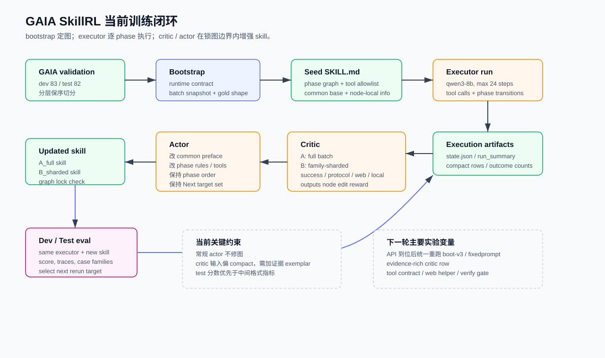
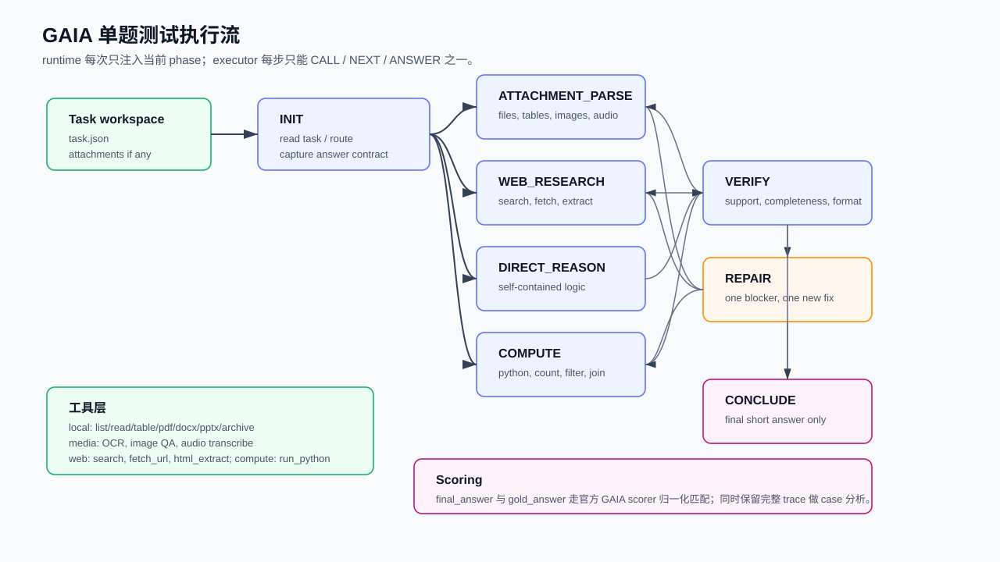

# GAIA 当前进度汇总与后续展望

时间：2026-04-25 20:34 +0800

## 0. 当前目标

接下来主线很直接：

- 第一目标：把 GAIA `validation_test` / 后续官方 test 方向的分数稳定调高，优先看最终可打分结果。
- 第二目标：在 GAIA 框架稳定后，把同一套 `skill + tool + critic / actor` 思路迁移到几个相似任务上，验证跨任务扩展价值。

当前框架已经基本定型。真正影响收益的核心部件主要是：

- runtime：逐 phase 注入 skill，限制工具和转移边。
- executor prompt：约束 `qwen3-8b` 按 `<CALL> / <NEXT> / <ANSWER>` 执行。
- bootstrap prompt：强模型一次性生成初始图和初始节点说明。
- critic prompt：从批量轨迹里归纳失败族和节点级改法。
- actor prompt：在锁图边界内改写 `SKILL.md`。

本轮文档的定位是“交接用总览”：把现在做到哪里、为什么卡住、后面先做什么、迁移任务放哪里讲清楚。

## 1. 当前框架行为

### 1.1 训练闭环

训练流现在是：

1. `validation` 被拆成 `validation_dev` 和 `validation_test`。
2. bootstrap 读取 runtime contract 和 dev task snapshot，生成 `gaia-general-skill/SKILL.md`。
3. executor 用当前 skill 跑一批任务，得到 `state.json`、tool trace、phase transition、action trace。
4. critic 把每题压成 compact row，输出 actor-facing reward。
5. actor 改写 skill 的公共说明和节点内规则，图结构保持锁定。
6. 用更新后的 skill 在 dev / test 上重新评估，继续看 case 和分数。

### 1.2 单题测试执行

单题执行有几个关键点：

- executor 初始只看到 task 信息和 `INIT` 节点。
- 每次 `<NEXT>` 被接受后，runtime 只注入目标 phase 内容。
- 每个 phase 的 `Allowed tools:` 和 `Next:` 决定工具白名单与可走边。
- `CONCLUDE` 是唯一合法答案出口；非 `CONCLUDE` 的 `<ANSWER>` 会被 runtime 拒绝并反馈。
- 最后只把 `final_answer` 送入 GAIA scorer，trace 留给 critic 和人工复盘。

## 2. 当前配置与数据

### 2.1 数据切分

| split | 数量 | level 分布 | 用途 |
| --- | ---: | --- | --- |
| `gaia_2023_all_validation_tasks.json` | 165 | L1=53, L2=86, L3=26 | 原始 validation，本地可打分 |
| `gaia_2023_all_validation_dev_tasks.json` | 83 | L1=27, L2=43, L3=13 | bootstrap、critic / actor 调参 |
| `gaia_2023_all_validation_test_tasks.json` | 82 | L1=26, L2=43, L3=13 | 本地 held-out test |
| `gaia_2023_all_test_tasks.json` | 官方 test | 无 gold | 最后提交方向，当前本地调参不使用 |

切分策略是 `stratified_by_level_preserve_original_order_ceil_to_dev`。

### 2.2 模型与工具

| 组件 | 当前 / 历史设置 | 说明 |
| --- | --- | --- |
| executor | `qwen3-8b` | 主打低成本执行，后续涨分要重点证明小模型可受益 |
| actor / critic | 历史 run 多处用 `gpt-5.4`；当前 `configs/system.json` 是 SSSAI `gpt-5.2` | API 额度恢复后要统一重跑，避免把模型变化和 prompt 变化混在一起 |
| max steps | 当前配置 24；部分 stategraph 实验试过 32 | 步数增加能缓解部分超时，但会放大协议摩擦 |
| task concurrency | 常用 `c20`，资源紧张时降到 `c6` | 后续正式重跑建议从小并发 smoke 开始 |
| 工具数 | 16 | local / media / web / compute 四族 |

工具族：

- 本地：`list_dir`、`read_file`、`read_json_file`、`extract_pdf_text`、`read_table`、`parse_docx`、`parse_pptx`、`extract_archive`
- 多模态：`image_metadata`、`ocr_image`、`image_qa`、`audio_transcribe`
- Web：`web_search`、`fetch_url`、`html_extract`
- 计算：`run_python`

## 3. Skill 架构现状

### 3.1 boot-v3 固定图

当前主力图是 8 个 phase：

| phase | 职责 | 主要工具 |
| --- | --- | --- |
| `INIT` | 读 task、识别题型、记录答案约束、路由 | `list_dir`、`read_json_file`、`read_file` |
| `ATTACHMENT_PARSE` | 附件解析，生成本地证据或结构化数据 | 文件、表格、Office、图像、音频、archive、`run_python` |
| `WEB_RESEARCH` | 搜索、抓取、抽取网页证据 | `web_search`、`fetch_url`、`html_extract`、`run_python` |
| `DIRECT_REASON` | 纯题面逻辑、字符串变换、规则推理 | `run_python` |
| `COMPUTE` | 计数、过滤、join、枚举、单位换算 | `run_python` 和少量读取工具 |
| `VERIFY` | 支撑性、完整性、格式、单位、字段检查 | 读取 / 抽取 / `run_python` |
| `REPAIR` | 对一个具体 blocker 做一次不同策略修复 | 全工具 |
| `CONCLUDE` | 只输出最终答案 | 无工具 |

这版图的优点：

- 图结构足够覆盖 GAIA 的 local / web / compute / media / repair 需求。
- 逐节点注入能让 8B executor 少背全局策略。
- `VERIFY` 和 `REPAIR` 给 critic / actor 提供了可解释的改写位置。

这版图的约束：

- actor 常规轮次只能改节点文本和工具权限，不能增删 phase 或改 `Next:` 目标集合。
- `CONCLUDE` 单出口带来可控性，也导致大量 `invalid_answer_phase`。
- compact critic row 太短时，critic 看不到关键 observation，容易给泛化建议。
- 图锁有利于 A/B，可一旦初始图有硬伤，常规 actor 很难补。

### 3.2 fixedprompt 方向

4.22-4.23 还尝试过 `bootv3_fixedprompt`，生成过 9 phase 图：

`INIT -> ROUTE -> LOCAL_INVENTORY / EXTRACT_LOCAL / EXTRACT_WEB / COMPUTE / VERIFY / REPAIR / CONCLUDE`

这个方向的动机是让图更接近人工强状态机，减少 `INIT` 直接分叉过宽的问题。当前它还没有形成可靠完整分数，主要受 API / 队列中断影响。后续应作为“图重修”候选，和 boot-v3 8 phase 图分开比较。

## 4. GAIA 观察基线

### 4.1 关键分数

| run / skill | dev | validation_test | 观察 |
| --- | ---: | ---: | --- |
| direct qwen3-8b | - | `14/82` | 当前 test 直跑基线 |
| bootstrap v0.2 | `18/83` | `15/82` | 轻量 bootstrap 略高 |
| boot-v3 初始 skill | `18/83` | `14/82` | test 与 direct 持平 |
| A full critic iter2 | `21/83` | `11/82` | dev 涨，test 掉 |
| B sharded critic iter2 | `14/83` | `17/82` | test 短期最高，后续需重跑确认 |
| A full critic iter3 | `21/83` | `14/82` | 回到 baseline |
| B sharded critic iter3 | `21/83` | `13/82` | dev 追上，test 回落 |

目前最重要的事实：

- dev 能涨到 `21/83`，说明 skill 文本确实能改 executor 行为。
- test 没有稳定跟涨，说明当前 critic / actor 容易把 dev 错例修成局部规则。
- B sharded 曾短期到 `17/82`，说明按失败族分 critic 有价值，但 actor 后续继续叠规则会变重，泛化会回落。

### 4.2 B_sharded iter3 test 的行为指标

`20260422_104135_gaia_bootv3_ab_B_sharded_iter3_test_eval_c20`：

| 指标 | 数字 |
| --- | ---: |
| 总题数 | 82 |
| 成功 | 13 |
| `tool_call_succeeded` | 294 |
| `phase_transition` | 226 |
| `invalid_answer_phase` | 91 |
| `tool_call_failed` | 64 |
| `unrecognized_action` | 12 |
| `tool_call_rejected` | 8 |
| `invalid_phase_transition` | 7 |

Top path：

| path | 题数 |
| --- | ---: |
| `INIT > WEB_RESEARCH > CONCLUDE` | 27 |
| `INIT > WEB_RESEARCH > COMPUTE > CONCLUDE` | 21 |
| `INIT > ATTACHMENT_PARSE > COMPUTE > CONCLUDE` | 9 |
| `INIT > COMPUTE > CONCLUDE` | 3 |
| `INIT > ATTACHMENT_PARSE > WEB_RESEARCH > CONCLUDE` | 3 |
| `INIT > WEB_RESEARCH > COMPUTE > VERIFY > CONCLUDE` | 3 |

这说明两个问题同时存在：

- 仍然有大量 web 题绕开 `VERIFY`，从 `WEB_RESEARCH` 或 `COMPUTE` 直接去 `CONCLUDE`。
- `VERIFY` 虽然存在，但没有成为强门禁；它在成功题和失败题中的覆盖都偏低。

## 5. Case 观察

### 5.1 成功样例：直接检索 + 简短答案

| 项 | 内容 |
| --- | --- |
| task | arXiv 2016 Physics and Society 文章里哪一个词描述 society 类型 |
| gold / final | `egalitarian` / `egalitarian` |
| 路径 | `INIT > WEB_RESEARCH > CONCLUDE` |
| 工具 | `read_json_file`，`web_search` |
| 现象 | 搜索结果标题和摘要足够强，答案是单词级别，格式简单 |
| 经验 | 这类题适合短路径；要求是强 anchor、单跳、答案字段明确 |

这类题不应被强制走复杂 verify / repair。后续 prompt 要保留“强证据短路”的能力。

### 5.2 成功样例：网页多跳 + 计算

| 项 | 内容 |
| --- | --- |
| task | 2023-07-03 版本的 Wikipedia 页面，从 The Lord of the Rings 到 A Song of Ice and Fire 最少点几次链接 |
| gold / final | `2` / `2` |
| 路径 | `INIT > WEB_RESEARCH > COMPUTE > CONCLUDE` |
| 工具 | `web_search`、`fetch_url`、`html_extract` 多次 |
| 现象 | 开始有 404 / search 失败，但后续直接抓取 Wikipedia 页面，抽链接并计算 |
| 经验 | canonical URL fallback、版本/历史页处理、抽链接后计算，是 web 复杂题的有效模板 |

这类题支持增加 `WEB_RESEARCH` 的 direct-fetch ladder，也支持给 critic row 加少量 observation exemplar。

### 5.3 失败样例：USGS NAS 数据库查询

| 项 | 内容 |
| --- | --- |
| task | 2000-2020 年 Florida 非本地 crocodiles 数量 |
| gold / final | `6` / `Unable to retrieve...` |
| 路径 | `INIT > WEB_RESEARCH > COMPUTE > CONCLUDE` |
| 工具 | `web_search`、USGS 首页 `fetch_url`、`html_extract`、GBIF 403 |
| 失败点 | 只找到了 USGS NAS 查询入口，没有真正构造数据库查询；GBIF 403 后直接转 inability |
| 建议 | 增加 USGS NAS helper 或 site-specific query playbook；`VERIFY` 禁止 inability 作为具体数值题答案 |

这一类对“网页 helper”收益最大。单靠 prompt 很难完全解决。

### 5.4 失败样例：表格附件解析

| 项 | 内容 |
| --- | --- |
| task | 北美铁路博物馆 locomotives 表格，统计 steam locomotives 总轮数 |
| gold / final | `60` / 空答案 |
| 文件 | `.xlsx` |
| 路径 | `INIT > ATTACHMENT_PARSE > REPAIR > CONCLUDE` |
| 工具失败 | `read_table` 报 unsupported，`extract_archive`、`read_file`、`extract_pdf_text`、`ocr_image` 均失败 |
| 失败点 | 表格工具兼容性和 repair 工具选择都不稳，最后进入空答案 |
| 建议 | 优先修 `read_table` 对 xlsx/csv 的稳定性；repair 要先确认扩展名和工具契约，禁止乱切 PDF / OCR |

这类是工程优先级，不应只交给 actor 改 prompt。

### 5.5 失败样例：run_python schema 摩擦

| 项 | 内容 |
| --- | --- |
| task | Caesar cipher 解密 picnic 位置 |
| gold / final | `Picnic is in Ploybius Plaza.` / `Meet me at the park on Friday.` |
| 路径 | `INIT > COMPUTE > VERIFY > CONCLUDE` |
| 工具失败 | 连续 9 次 `run_python` 使用 `_raw` 参数，均被拒绝 |
| 失败点 | executor 反复用错误 schema；repair 没把 schema 错误转成一次性纠正 |
| 建议 | 工具层可以做 `_raw` 到合法 `code` 的兼容兜底；prompt 层要求 schema 错误一次后改最小合法调用 |

这是低成本高收益项。修完可以降低失败步数，也会让 critic row 更干净。

### 5.6 失败样例：附件 + 外部 denominator + 单位

| 项 | 内容 |
| --- | --- |
| task | penguin csv 中一组企鹅占 2012 年 Wikipedia 上界总数的百分比，按指定精度输出 |
| gold / final | `0.00033` / `98.76543` |
| 文件 | `.csv` |
| 路径 | `INIT > ATTACHMENT_PARSE > COMPUTE > CONCLUDE` |
| 失败点 | 本地筛选、外部总量、百分比方向和格式全都要对；当前 compute 直接给出错方向的大数 |
| 建议 | `COMPUTE` 强制写 inputs、denominator、unit、ratio direction；`VERIFY` 对比例题做数量级 sanity check |

这类题说明 skill 需要把“字段选择 + 单位 + 数量级”变成固定门禁。

### 5.7 失败样例：图像几何

| 项 | 内容 |
| --- | --- |
| task | 图片中绿色多边形面积，紫色数字为边长 |
| gold / final | `39` / `2082.5` |
| 文件 | `.png` |
| 路径 | `INIT > ATTACHMENT_PARSE > COMPUTE > CONCLUDE` |
| 工具 | `ocr_image` 成功，但没有可靠几何结构 |
| 失败点 | OCR 读到文本不能直接推导形状面积；需要视觉几何 helper 或专门的 image_qa 子问题 |
| 建议 | 对 geometry image 题加 helper：提取顶点/边长关系，再 `run_python` 计算；低优先于 xlsx / run_python schema |

## 6. Critic / Actor 对 skill 的增强情况

### 6.1 full critic 的倾向

full critic 一次吃全 batch，优点是整体视野完整；问题是容易输出平均化建议。A 路的表现是：

- dev 从 `18/83` 到 `21/83`。
- test 从 `14/82` 到 `11/82`，后续回到 `14/82`。

推断：full critic 能修 dev 上的显性错误，但 actor 容易把全局规则写重，使 executor 在 test 上更慢、更保守，甚至更早走 fallback prose。

### 6.2 sharded critic 的倾向

sharded critic 按失败族拆：

`success_anchor`、`no_answer_or_timeout`、`protocol_friction`、`media_attachment_failure`、`local_attachment_failure`、`web_retrieval_failure`、`answer_synthesis_or_format_failure`、`other_failure`

B 路的表现是：

- iter2 test 曾到 `17/82`，说明分族诊断抓到了可迁移错误。
- iter3 dev 到 `21/83`，test 回落到 `13/82`，说明继续叠规则后有过拟合和冗长化风险。

推断：sharded critic 应保留，但 actor 要加“minimal diff”限制，每轮只改少数高置信规则。

### 6.3 当前 skill 约束

目前常规 actor 的边界是对的：

- 允许改公共说明、节点内 `Allowed tools`、`Rules`、`Exit handoff`、`Available actions`。
- 保持 phase 名称、顺序、header、`Next:` 目标集合。

后续要加两个约束：

- actor diff budget：每轮限制 5-8 条规则级改动，记录新增/删除/改写条目。
- protected success anchors：critic 输出必须列出哪些成功路径要保护，actor 写 skill 时要避免破坏短路径。

## 7. 后续优先级

### P0：API 到位后统一重跑

原因：现在 gpt-5.4 / gpt-5.2、并发、tail missing、fixedprompt 中断这些变量混在一起。正式结论需要干净队列。

建议队列：

1. `boot-v3 initial`：dev bootstrap + dev eval + test eval。
2. `A_full iter1`：复用同一批 dev states，只跑 offline critic / actor，再 dev/test eval。
3. `B_sharded iter1`：同上。
4. `A/B iter2`：只在 iter1 test 有明显收益时继续。
5. `fixedprompt`：作为图重修候选单独跑，不和常规 actor 混在一起。

记录要求：

- 每个 run 记录 actor/critic/executor 模型、base_url、并发、max_steps、skill path。
- 使用 `nohup` 后台启动，并写 `/data/xsy/活的进程.csv`。
- 每次跑完立即写 `score + case families + skill diff` 小结。

### P1：先修三类高收益工程点

| 项 | 原因 | 预期收益 |
| --- | --- | --- |
| `run_python` schema 兼容 / 明确化 | `_raw` 连续失败是纯摩擦 | 降低无效步，改善 compute / cipher / enumeration |
| `read_table` xlsx/csv 稳定性 | 表格题是 GAIA 常见强信号 | 直接救回附件题 |
| web helper playbook | USGS、Census、Wikipedia revision、Science/DOI 等失败集中 | 提升 web 多跳题和数据库题 |

### P1：增强 critic 输入

当前 compact row 保留了题面、gold、final、path、tools、outcome_counts。下一版建议加“轻量证据列”：

- 每题最多 2 条关键 observation 摘要。
- 失败工具的完整错误类型。
- 最后一次候选答案来自哪个 phase。
- 对失败族抽 2-3 个 exemplar 附带 action trace 片段。

这样 critic 能区分：

- 工具能力不足。
- 工具 schema 摩擦。
- 证据已经有但字段取错。
- 证据缺失却强行结论。
- 纯格式 / 单位错误。

### P2：runtime 级协议摩擦 A/B

`invalid_answer_phase` 在 B iter3 test 有 91 次，说明单出口设计带来明显摩擦。建议做一个小 A/B：

- hard mode：保持当前，非 `CONCLUDE` 答案拒绝。
- soft handoff：非 `CONCLUDE` 答案若非空，runtime 注入 `CONCLUDE` 并要求 executor 用同一候选重发，仍然保留 trace 标记。

观察指标：

- 成功数。
- 平均步数。
- `invalid_answer_phase`。
- unsupported answer 进入最终答案的比例。

如果 soft handoff 提升分数且没有明显放大乱答，可以作为 executor friction fix。

### P2：graph revision 单独开线

现有 8 phase 图可继续调；fixedprompt 9 phase 图值得保留。建议等 P1 工具和 critic row 修完后，再比较：

- 8 phase boot-v3。
- 9 phase fixedprompt。
- 人工强图简化版。

图重修必须独立实验，避免常规 actor 在同一次 A/B 里既改图又改规则。

## 8. 跨任务迁移候选

筛选标准：

- 工作范式要接近“提示 + 工具步骤压缩 + 证据/状态门禁”。
- 工具切换不能过多，动作空间要能被 phase graph 吸收。
- benchmark 要有一定知名度和公开代码 / 评测协议。
- 最好能先做 text / API / terminal 版本，再考虑重浏览器 GUI。

### 8.1 推荐排序

| 优先级 | benchmark | 推荐理由 | 风险 | split / 数据情况 |
| ---: | --- | --- | --- | --- |
| 1 | AgentBench 的 DB / OS 子任务 | 官方就是 agent 多工具评测，dev/test 两 split；DB/OS 工具少、评分确定、适合 skill 压缩 | 老版依赖 Docker / Python 3.9；全套异构，先只接 DB/OS | 官方 repo 写明每个 dataset 有 Dev 和 Test |
| 2 | WebShop text mode | 搜索、筛选、比较、购买，动作空间很规则；比 WebArena 轻很多 | standalone README 没有清晰 train/dev/test；可用 AgentBench WS split 或自切 | 12,087 instructions；本项目可固定 seed 切 train/dev/test |
| 3 | tau2 / tau3 retail text mode | 结构化 domain policy + tools + 可验证 end state，适合 critic 分族 | 有用户模拟器和 policy 约束，交互轮次比 GAIA复杂 | tau3 README 有 `base` eval split，Gym 文档含 train/test split |
| 4 | MiniWoB++ 子集 | 100+ 小网页环境，任务短，便于观察 UI action 模板 | Selenium / 浏览器动作层和当前 GAIA 工具差异大 | 官方库提供环境集合；需要自行定义训练/验证子集 |
| 5 | Terminal-Bench 2.0 小子集 | 89 个终端任务，评分确定，和本地工具/命令执行相通 | 长任务、写文件、调环境，工程复杂度高 | 官方页面列 2.0 为 89 high-quality tasks |
| 6 | WebArena / WorkArena | 知名度高，长期价值大 | 浏览器环境、登录态、动态 UI、站点服务重；当前阶段容易吞工程时间 | WebArena 812 examples；WorkArena 需要 gated ServiceNow instances |

### 8.2 具体任务形态与解题步骤

#### AgentBench DB / OS

公开信息：

- AgentBench 原始版本覆盖 OS、DB、KG、card game、lateral thinking、ALFWorld、WebShop、Mind2Web。
- repo 说明每个 dataset 提供 Dev 和 Test 两 split。
- FC 版当前支持 `dbbench`、`os_interaction`、`knowledgegraph`、`webshop`、`alfworld`。

建议先接：

- DB：自然语言问题 -> SQL 查询 -> 返回答案。
- OS：文件系统 / shell 操作 -> deterministic checker。

样例题形态：

- DB：给一个数据库，让 agent 查询“2020 年销量最高的产品类别及总销售额”。
- OS：在给定目录里找出所有 `.log` 的错误行，生成一个 summary 文件。

解题步骤：

1. `INIT` 读取任务说明和 schema / 文件树。
2. `INSPECT` 用 `show tables` / `ls` / `cat` 建立数据结构。
3. `PLAN_QUERY` 明确目标字段、过滤条件、聚合方式。
4. `EXECUTE` 调 SQL 或 shell。
5. `VERIFY` 对行数、字段、文件内容做检查。
6. `CONCLUDE` 输出答案或提交产物。

适配价值：和当前 GAIA 的 `INIT / COMPUTE / VERIFY / REPAIR` 很接近，只需要把 GAIA 工具换成 DB / shell 工具。

#### WebShop text mode

公开信息：

- WebShop 有 1.18M 商品、12,087 条 crowd-sourced instructions。
- agent 要基于商品需求导航网页、搜索、筛选、选择商品并购买。
- README 提供 `simple` text environment，可用 Gym 接口交互。

样例题形态：

- “Find me a slim fit black men’s shirt under $30 with cotton material and good rating.”

解题步骤：

1. `INIT` 抽取硬约束：品类、颜色、价格、材质、评分、尺寸。
2. `SEARCH` 生成短 query，拿候选商品列表。
3. `FILTER` 逐项检查标题、属性、价格、评价。
4. `SELECT_OPTIONS` 选择 size / color 等变体。
5. `VERIFY` 确认所有约束满足。
6. `BUY` 点击购买，环境给 reward。

适配价值：任务重复度高，skill 可以压缩“抽约束 -> 搜索 -> 属性核对 -> 购买”的动作链。它比 GAIA 窄，适合验证 skill 是否能让小模型少走弯路。

数据建议：

- 如果走 standalone WebShop，固定 seed 自切：train 8k、dev 2k、test 2k，剩余留作 debug / smoke。
- 如果走 AgentBench WS，优先复用官方 Dev/Test，便于对外说法。

#### tau3 / tau2 retail

公开信息：

- tau-bench 系列评估 customer service agents，域包括 airline、retail、telecom、banking_knowledge。
- 每个 domain 有 policy、agent tools、tasks，可选 user simulator。
- tau3 修了 75+ task 质量问题，增加 banking knowledge 和 voice；文本 retail 仍是最适合先接的入口。

样例题形态：

- 用户说“我想退一件已经到货的商品，并把退款打回原支付方式”；agent 需要查订单、判断政策、调用退货/退款工具。

解题步骤：

1. `INIT` 读用户诉求，识别订单/商品/政策类型。
2. `LOOKUP` 调 `get_user_details`、`get_order_details`。
3. `POLICY_CHECK` 检查退货窗口、商品状态、例外条件。
4. `ACT` 调退货、退款、换货等工具。
5. `CONFIRM` 向用户确认必要信息。
6. `VERIFY` 检查最终数据库状态和 policy 合规。

适配价值：非常适合测试“skill 约束 + policy 门禁 + tool plan”。风险是多轮用户模拟会引入 GAIA 当前没有的对话状态管理。

#### MiniWoB++

公开信息：

- MiniWoB++ 提供 100+ web interaction environments。
- Python 接口遵循 Gymnasium API，用 Selenium WebDriver 执行动作。

样例题形态：

- “Click the button labeled OK.”
- “Enter the given text into the field and submit.”

解题步骤：

1. `OBSERVE` 读 DOM / screenshot。
2. `LOCATE` 找目标元素。
3. `ACT` click / type。
4. `VERIFY` 看 reward 或页面状态。

适配价值：动作短，能测 route / verify / action schema。问题是它偏 UI 控制，和 GAIA 的文本工具链差异较大，优先级低于 WebShop text。

#### Terminal-Bench 2.0

公开信息：

- Terminal-Bench 2.0 页面列出 89 个高质量 terminal tasks。
- 示例包括 build Linux kernel、配置 git webserver、破解 7z hash、生成 OpenSSL 证书等。

样例题形态：

- “Create `/app/ssl/server.key` and `/app/ssl/server.crt` with 2048-bit RSA self-signed certificate and correct permissions.”

解题步骤：

1. `INIT` 读任务和文件树。
2. `PLAN` 拆命令和验证条件。
3. `EXECUTE` 运行 shell 命令或写脚本。
4. `TEST` 运行验收命令。
5. `REPAIR` 根据错误修一次。
6. `CONCLUDE` 留下可检查产物。

适配价值：和本地命令工具天然相通，评分确定。风险是任务跨度大，很多是工程长任务，当前阶段适合抽 10-20 个中等难度小子集。

#### WebArena / WorkArena

公开信息：

- WebArena 是 self-hostable web environment，官方 end-to-end eval 是 812 examples。
- WorkArena 基于 ServiceNow，评估知识工作任务，需要 gated ServiceNow instances。

样例题形态：

- WebArena：在购物站点按条件买商品，在 Reddit / GitLab / map / Wikipedia 环境里完成网页任务。
- WorkArena：在 ServiceNow 里处理 incident、服务目录请求、知识库查询。

解题步骤：

1. `OBSERVE` 读 accessibility tree / DOM。
2. `ROUTE` 判断网站和任务类型。
3. `NAVIGATE` 搜索、点击、填表。
4. `VERIFY` 检查页面状态。
5. `SUBMIT` 完成任务。

适配价值：知名度高，长期应该做。当前风险是浏览器环境工程量大，动作空间复杂，容易把主线从 skill 调优拖到浏览器适配。

## 9. 建议的迁移路线

最稳的路线：

1. GAIA 先完成 P0 / P1，形成一版稳定的 `score + case + skill diff` 评估模板。
2. 接 AgentBench DB 子任务，验证“phase skill + critic/actor”在结构化工具上能否稳定提分。
3. 接 WebShop text mode，验证“搜索/筛选/购买”这类重复动作链。
4. 如果前两者有正收益，再接 tau retail text，测试 policy / user 状态。
5. 浏览器重任务放到后面：MiniWoB++ 小子集先行，WebArena / WorkArena 等 GAIA 稳定后再开。

## 10. 近期可执行清单

| 顺序 | 事项 | 产出 |
| ---: | --- | --- |
| 1 | 等 API 到位后跑干净 boot-v3 A/B 队列 | 一张 dev/test 分数表 + 每路 skill path |
| 2 | 生成 `validation_test` case family 报告 | 每族 5-10 个代表 case，含 path、工具、失败原因 |
| 3 | 修 `run_python` schema 兼容 | schema 错误 case 重跑对照 |
| 4 | 修 `read_table` xlsx/csv | locomotive / penguin / 表格族重跑 |
| 5 | 给 critic row 增加 evidence exemplar | full / sharded 新一轮 A/B |
| 6 | 做 soft handoff 协议 A/B | 看 `invalid_answer_phase` 是否能转化为分数 |
| 7 | 接 AgentBench DB smoke | 最小 adapter + 5-10 题可跑 |
| 8 | 接 WebShop text smoke | 最小 Gym wrapper + 20 题 smoke |

## 11. 相关路径

| 类型 | 路径 |
| --- | --- |
| boot-v3 A/B 设计 | `/data/xsy/project_gaia_skillrl/实验设计与迭代/26.4.21_2142_GAIA_bootv3固定图与critic分族AB实验设计.md` |
| RA 两周图表版 | `/data/xsy/project_gaia_skillrl/实验设计与迭代/26.4.23飞书文档维护/26.4.23_1131_RA两周进展图表版.md` |
| 当前配置 | `/data/xsy/project_gaia_skillrl/configs/system.json` |
| executor runtime | `/data/xsy/project_gaia_skillrl/gaia_skillrl/environment.py` |
| trainer | `/data/xsy/project_gaia_skillrl/gaia_skillrl/trainer.py` |
| critic | `/data/xsy/project_gaia_skillrl/gaia_skillrl/critic.py` |
| actor | `/data/xsy/project_gaia_skillrl/gaia_skillrl/actor.py` |
| 工具实现 | `/data/xsy/project_gaia_skillrl/gaia_skillrl/tools.py` |
| dev/test split manifest | `/data/xsy/project_gaia_skillrl/data/converted/gaia_2023_all_validation_dev_test_split_manifest.json` |

## 12. 外部资料

- AgentBench repo: https://github.com/THUDM/AgentBench
- WebShop paper: https://arxiv.org/abs/2207.01206
- WebShop repo: https://github.com/princeton-nlp/WebShop
- tau2 / tau3 repo: https://github.com/sierra-research/tau2-bench
- MiniWoB++ repo: https://github.com/Farama-Foundation/miniwob-plusplus
- Terminal-Bench: https://www.tbench.ai/benchmarks
- WebArena repo: https://github.com/web-arena-x/webarena
- WorkArena repo: https://github.com/ServiceNow/WorkArena
