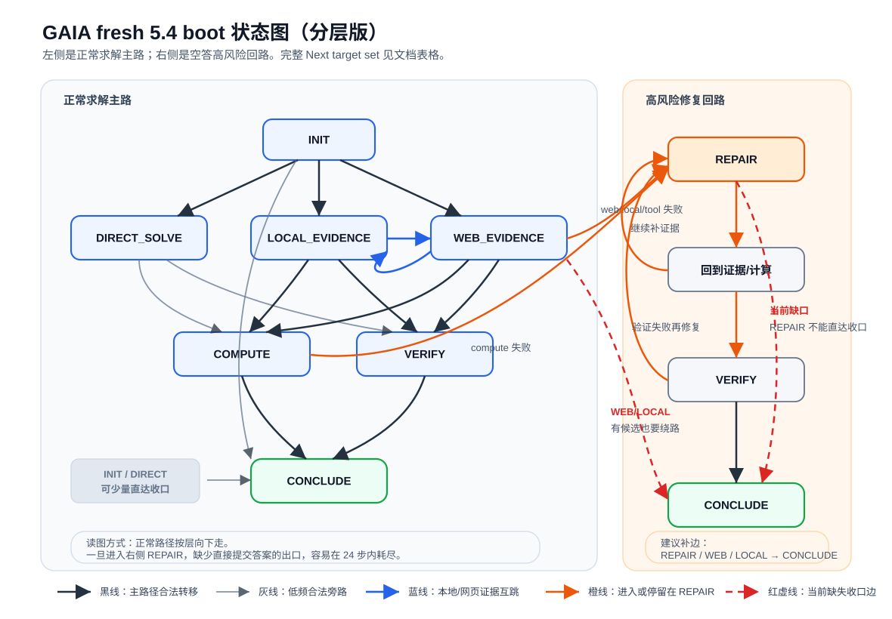

# GAIA fresh 5.4 boot 空答状态图分析

记录时间：2026-04-27 10:35 +0800

## 范围

本次先看 ACC-002 第二组 fresh 5.4 boot 产出的 bootstrap skill，以及它在 bootstrap dev/test 上的空答情况。

关键路径：

- skill：`/data/xsy/project_gaia_skillrl/runs/2026/4/2026-4-27/20260427_001726_codex54_fresh_bootstrap_ab_fresh_bootv3_boot_dev_c20/bootstrap/skill_after_bootstrap/gaia-general-skill/SKILL.md`
- boot dev：`20260427_001726_codex54_fresh_bootstrap_ab_fresh_bootv3_boot_dev_c20`
- boot test：`20260427_001726_codex54_fresh_bootstrap_ab_fresh_bootv3_boot_test_c20`
- executor：`Qwen3-8B-local`
- actor/critic/bootstrap：`codex exec -m gpt-5.4`
- `max_executor_steps`：`24`

## 状态图解析

从 `SKILL.md` 的 `Next:` 行经运行时解析后，实际状态图如下。A/B skill 保持同一套 phase order 和 Next target set。



图里只保留正常主路、高频回路和空答相关缺口；完整 `Next:` 边以表格为准。黑线是主路径合法转移，灰线是低频合法旁路，蓝线是本地/网页证据互跳，橙线表示进入或停留在 `REPAIR`，红色虚线是本轮空答暴露出的缺失收口边。模型经常已经想从 `REPAIR` 或 `WEB_EVIDENCE` 收口，但这些虚线在当前图里不合法。

| Phase | 允许下一阶段 |
|---|---|
| `INIT` | `CONCLUDE`, `DIRECT_SOLVE`, `LOCAL_EVIDENCE`, `WEB_EVIDENCE` |
| `DIRECT_SOLVE` | `CONCLUDE`, `VERIFY`, `LOCAL_EVIDENCE`, `WEB_EVIDENCE` |
| `LOCAL_EVIDENCE` | `VERIFY`, `COMPUTE`, `WEB_EVIDENCE`, `REPAIR` |
| `WEB_EVIDENCE` | `VERIFY`, `COMPUTE`, `LOCAL_EVIDENCE`, `REPAIR` |
| `COMPUTE` | `CONCLUDE`, `VERIFY`, `REPAIR` |
| `VERIFY` | `CONCLUDE`, `REPAIR` |
| `REPAIR` | `LOCAL_EVIDENCE`, `WEB_EVIDENCE`, `COMPUTE`, `VERIFY` |
| `CONCLUDE` | terminal |

关键约束：

- 只有 `CONCLUDE` 阶段允许 `<ANSWER>...</ANSWER>`。
- `WEB_EVIDENCE`、`LOCAL_EVIDENCE`、`REPAIR` 都没有直达 `CONCLUDE` 的边。
- `REPAIR` 写了“最多两个工具调用”和“不要循环回 REPAIR”，但这是 prompt 规则，运行时没有硬性计数。
- 运行时低步数兜底只在当前阶段本来允许 `CONCLUDE` 时触发：`remaining_steps <= 3 and "CONCLUDE" in phase_transition_graph[current_phase]`。
- 默认 `final_action` 是空答案；如果 24 步结束前没有在 `CONCLUDE` 内接受 `<ANSWER>`，最后就记录为空答。

所以空答机制可以分成两类：

1. 走不到 `CONCLUDE`：模型在 `WEB_EVIDENCE` 或 `REPAIR` 中已经想收口，但图不允许直接收口。
2. 到了 `CONCLUDE` 仍输出空串：少量 A/B 样本出现过这种情况，bootstrap dev/test 这次主要属于第一类。

## 空答统计

bootstrap dev/test 共 22 个空答：

| run | 完成数 | 空答数 | 空答最后阶段 | 空答最后动作 |
|---|---:|---:|---|---|
| boot dev | 81 | 14 | `REPAIR` 12，`WEB_EVIDENCE` 2 | invalid transition 9，invalid answer 4，tool success 1 |
| boot test | 80 | 8 | `REPAIR` 7，`WEB_EVIDENCE` 1 | invalid transition 4，invalid answer 4 |
| 合计 | 161 | 22 | `REPAIR` 19，`WEB_EVIDENCE` 3 | invalid transition 13，invalid answer 8，tool success 1 |

22 个空答全部走满 24 步。

## invalid transition 反馈是否可见

可见。运行时代码在解析到非法 `<NEXT>` 时，会生成 `Invalid phase transition`，并把这段反馈追加成下一轮的 user message。对应逻辑在 `gaia_skillrl/agent_loop.py`：

```text
elif next_phase not in allowed_next:
    feedback = _invalid_phase_transition_feedback(current_phase, next_phase, allowed_next)
    messages.append(LLMMessage(role="user", content=feedback))
```

所以这里的关键现象是：模型能看到反馈，但经常没有把反馈转成正确恢复路径。

以 `076c8171...` 为例：

- step 19：`WEB_EVIDENCE -> CONCLUDE` 被拒，反馈里写明允许去 `VERIFY, COMPUTE, LOCAL_EVIDENCE, REPAIR`。
- step 20：模型确实改去了 `REPAIR`，说明反馈进入了上下文并产生了作用。
- step 21-24：进入 `REPAIR` 后，模型连续尝试 `REPAIR -> CONCLUDE`，每次都收到允许目标 `LOCAL_EVIDENCE, WEB_EVIDENCE, COMPUTE, VERIFY`，但仍重复同一个非法转移。

这说明单纯反馈“允许目标有哪些”还不够。旧反馈没有把非法目标写出来，也没有在低步数时强制接管收口。对于 Qwen3 executor，这种弱反馈很容易变成重复无效动作。

进一步核查 step 级请求日志后，可以排除两个常见误会：

- 反馈确实接进了下一轮请求。`076c8171...` 的 step 22-24 request 最后一条 user message 都是 `Invalid phase transition / Current phase: REPAIR / Allowed next: LOCAL_EVIDENCE, WEB_EVIDENCE, COMPUTE, VERIFY`。
- 上下文没有把这段反馈截掉。step 22-24 的 request 总字符数约 `38.9k-39.7k`，低于 `max_context_chars=48000`；最后一条消息正是 invalid transition 反馈。
- thinking 已开启。请求里有 `chat_template_kwargs: {"enable_thinking": true}`，vLLM raw response 里也记录了 `reasoning_chunk_count`。
- 系统提示也写了硬规则：`Respect the dynamic phase graph strictly. Move only to a phase listed as allowed for the current phase.`

真正的问题更像“恢复反馈不够强”。改动前 invalid transition 的反馈只告诉允许目标列表，没有明确写出本轮非法目标，例如：

```text
CONCLUDE is illegal from REPAIR.
You must choose one of: LOCAL_EVIDENCE, WEB_EVIDENCE, COMPUTE, VERIFY.
```

此外，messages 里保留了多轮 assistant 自己输出的 `<NEXT>CONCLUDE</NEXT>`。短反馈夹在这些重复输出之间，Qwen3-8B 会继续沿着“任务 blocked，所以去 CONCLUDE”的惯性走。这个现象说明要么补图边，要么把非法转移恢复逻辑做成运行时强制改写，单靠三行错误提示不稳。

bootstrap 空答样本里的累计运行时拒绝：

| 拒绝类型 | 次数 | 说明 |
|---|---:|---|
| `REPAIR -> CONCLUDE` invalid transition | 142 | 最大主因；`REPAIR` 没有 `CONCLUDE` 边 |
| `WEB_EVIDENCE -> CONCLUDE` invalid transition | 36 | web 证据阶段拿到候选后无法直接收口 |
| non-CONCLUDE `<ANSWER>` in `REPAIR` | 48 | 模型直接作答，被“只许 CONCLUDE 作答”拒绝 |
| non-CONCLUDE `<ANSWER>` in `WEB_EVIDENCE` | 15 | 同上 |
| 其他 invalid answer | 2 | 出现在 `LOCAL_EVIDENCE` / `VERIFY` |

工具失败也把大量样本推向 `REPAIR`：

| 失败来源 | 次数 | 影响 |
|---|---:|---|
| `web_search` timeout | 49 | 证据阶段反复失败，转入 `REPAIR` 后继续耗步 |
| `run_python` 错误 | 19 | 数据处理阶段失败后进入修复路径 |
| `ocr_image` / `image_qa` 额度 403 | 7 | 图像任务无法完成证据抽取 |
| `read_table` / archive / PDF extraction 失败 | 约 12 | 本地证据抽取失败后转入修复路径 |

## 典型样本

### `076c8171...`：`REPAIR -> CONCLUDE` 被反复拒绝

最后 5 步：

| step | phase | action | target | outcome |
|---:|---|---|---|---|
| 20 | `WEB_EVIDENCE` | next | `REPAIR` | accepted |
| 21 | `REPAIR` | next | `CONCLUDE` | invalid transition |
| 22 | `REPAIR` | next | `CONCLUDE` | invalid transition |
| 23 | `REPAIR` | next | `CONCLUDE` | invalid transition |
| 24 | `REPAIR` | next | `CONCLUDE` | invalid transition |

运行时反馈明确写了：

```text
Invalid phase transition.
Current phase: REPAIR
Allowed next: LOCAL_EVIDENCE, WEB_EVIDENCE, COMPUTE, VERIFY
```

这类样本已经表现出收口意图，但状态图禁止 `REPAIR` 直连 `CONCLUDE`，低步数兜底也不会触发。

### `5188369a...`：有候选答案，但卡在 `REPAIR`

后段多次尝试从 `REPAIR` 收口，最后一步输出了候选答案：

```text
Julian E. Barnes
```

因为当前阶段仍是 `REPAIR`，`<ANSWER>` 被拒绝，最终落成空答。这里已经有候选答案，真正缺的是合法出口。

### `114d5fd0...`：`REPAIR` 内连续工具调用耗尽步数

最后 5 步都在 `REPAIR` 中调用 `html_extract`，每步都成功，但没有进入 `VERIFY` 或 `CONCLUDE`。`REPAIR` 的“最多两个工具调用”只写在 skill 文本里，运行时没有强约束，所以这类样本会持续消耗到 24 步。

### `9318445f...`：`WEB_EVIDENCE` 中直接作答被拒

该样本最后停在 `WEB_EVIDENCE`，多次直接 `<ANSWER>`。`WEB_EVIDENCE` 没有 `CONCLUDE` 边，直接 `<ANSWER>` 也被拒，最终空答。

## 结论

用户的判断基本成立：空答主要来自状态图和步数上限的交互。更具体地说，`REPAIR` / `WEB_EVIDENCE` 中存在候选或收口意图时，合法路径要求先绕到 `VERIFY` 或 `COMPUTE`，再到 `CONCLUDE`。在剩余步数很少、模型已经开始尝试收口时，这个绕路经常失败，24 步结束后默认空答案。

当前 skill 里最危险的结构是：

```text
WEB_EVIDENCE -> REPAIR
REPAIR -> {LOCAL_EVIDENCE, WEB_EVIDENCE, COMPUTE, VERIFY}
```

`REPAIR` 作为问题处理阶段吸收了大量失败样本，但它没有直接终止边。模型在这里最常做的两件事是 `NEXT CONCLUDE` 和直接 `<ANSWER>`，二者都被运行时拒绝。

## 已落地框架改动

本次先按最小侵入方案改 executor runtime 反馈，归入 `ARCH-V4 candidate`：

- `gaia_skillrl/agent_loop.py` 的 invalid `<NEXT>` 分支会把模型刚请求的目标状态传入 feedback helper。
- 任意非法下一跳都返回强约束反馈：`{target} is illegal from {current_phase}. You must choose one of: ...`
- 未知 phase 也给出同类恢复指令，避免 executor 只看到泛化错误。
- `scripts/resume_gaia_partial_run.py` 同步改调用签名，partial 恢复分析里的 runtime feedback 口径一致。

典型反馈变为：

```text
Invalid phase transition.
CONCLUDE is illegal from REPAIR.
You must choose one of: LOCAL_EVIDENCE, WEB_EVIDENCE, COMPUTE, VERIFY.
```

## 建议修复

### 1. 先改状态图出口

建议在下一版 bootstrap prompt 或 skill postprocess 中加入以下边：

```text
LOCAL_EVIDENCE -> CONCLUDE
WEB_EVIDENCE -> CONCLUDE
REPAIR -> CONCLUDE
```

对应规则要写窄：

- `LOCAL_EVIDENCE -> CONCLUDE`：本地证据已经直接给出最终字符串，且格式已检查。
- `WEB_EVIDENCE -> CONCLUDE`：外部证据已经直接给出最终字符串，且无需计算。
- `REPAIR -> CONCLUDE`：修复动作已经得到一个最佳支持候选，或剩余步数很低且已有可提交候选。

这会直接消除 `REPAIR -> CONCLUDE` 和 `WEB_EVIDENCE -> CONCLUDE` 的 invalid transition。

### 2. 运行时兜底放宽

当前兜底要求当前阶段本来有 `CONCLUDE` 边。建议调整为：

- 剩余步数 `<= 3`；
- 当前已有非空候选答案，来源可以是最近一次 invalid answer、candidate handoff、或 trace 中已记录的 answer；
- 自动注入 `CONCLUDE` prompt，允许下一步输出 `<ANSWER>`。

这样即使 skill 图漏掉终止边，运行时也能保护结果。

### 3. 把 non-CONCLUDE `<ANSWER>` 当成候选缓存

现在 non-CONCLUDE `<ANSWER>` 只反馈错误。建议额外记录：

```text
last_candidate_answer = parsed.answer
```

如果当前阶段没有 `CONCLUDE` 边，可以给模型追加更具体的恢复指令：

```text
You proposed a candidate answer, but this phase cannot answer directly.
Move to VERIFY if available, then CONCLUDE. If remaining steps are low, the runtime will route you to CONCLUDE.
```

更激进的版本是运行时直接把这类非空 answer 转成 `CONCLUDE` 候选，再要求下一步确认输出。

### 4. 对 `REPAIR` 加硬限制

建议运行时记录每个任务的 `REPAIR` 进入次数和 `REPAIR` 内工具调用次数：

- `REPAIR` 内工具调用超过 2 次，强制要求 `VERIFY` 或 `CONCLUDE`。
- `REPAIR` 已经进入第二轮，禁止再次回到 `REPAIR`。
- 如果没有候选，允许进入 `VERIFY` 产出“最佳可支持候选”；不要继续宽泛搜索。

这和当前 skill 文本一致，只是把软规则变成运行时约束。

### 5. 同步修工具失败源

状态图修完后还会剩下一批真实工具失败导致的低分：

- `web_search` timeout：需要换搜索端点、加代理稳定性检查，或缩短失败后的重试次数。
- 图像工具 403：需要确认 `NLRL_TOOL_API_KEY` 额度，否则图像任务会系统性进入 `REPAIR`。
- `read_table` / archive / PDF 失败：需要让本地文件类型识别更早发生，减少错误工具调用。

这些会影响正确率和步数，但先修终止边能直接降低空答数。

## 下一步建议

最小可验收改法：

1. 生成 `P-BOOT-v20260427.1-repair-conclude-exit`：在 bootstrap prompt 中要求 `REPAIR`、`WEB_EVIDENCE`、`LOCAL_EVIDENCE` 显式提供 `Next: CONCLUDE`。
2. 同步改运行时兜底：低步数且已有候选时允许强制进入 `CONCLUDE`。
3. 用 fresh 5.4 boot 的 boot dev/test 重跑一轮小样本或全量，验收指标先看空答数是否从 `14/81 + 8/80` 明显下降。
