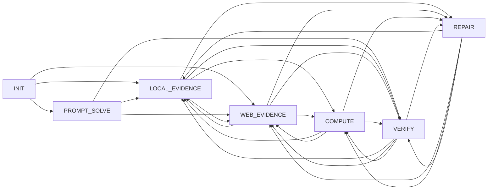

# 26.5.04 9B p04 boot 提示词与 R 固定图输入梳理

记录时间：2026-05-04 19:23 +0800

用途：开始优化 boot 提示词和后续 R 框架前，先把本轮 `20260504_1611_9b_p04_token_guard` 的固定图结构、bootstrap 输入、A_full/B_sharded 的 critic/actor 输入文件列清楚。后续 R 训练阶段只允许改文本与节点内规则，不能改图的节点或边。

## 本轮 9B Scale 图

本轮 scale 的硬图由 bootstrap 生成。后续 A_full / B_sharded actor 都经过 `actor_graph_lock_check.json`，图签名保持一致。

固定节点顺序：

`INIT -> PROMPT_SOLVE -> LOCAL_EVIDENCE -> WEB_EVIDENCE -> COMPUTE -> VERIFY -> REPAIR`

固定边集合：

- `INIT`: `PROMPT_SOLVE`, `LOCAL_EVIDENCE`, `WEB_EVIDENCE`
- `PROMPT_SOLVE`: `LOCAL_EVIDENCE`, `WEB_EVIDENCE`, `VERIFY`
- `LOCAL_EVIDENCE`: `WEB_EVIDENCE`, `COMPUTE`, `VERIFY`, `REPAIR`
- `WEB_EVIDENCE`: `LOCAL_EVIDENCE`, `COMPUTE`, `VERIFY`, `REPAIR`
- `COMPUTE`: `LOCAL_EVIDENCE`, `WEB_EVIDENCE`, `VERIFY`, `REPAIR`
- `VERIFY`: `LOCAL_EVIDENCE`, `WEB_EVIDENCE`, `COMPUTE`, `REPAIR`
- `REPAIR`: `LOCAL_EVIDENCE`, `WEB_EVIDENCE`, `COMPUTE`, `VERIFY`

R 阶段图锁规则：

- 不能新增、删除、重命名、拆分、合并 phase。
- 不能改变 phase 顺序。
- 不能改变任何 phase 的 `Next:` target set。
- 可以改 common preface、节点内 `Goal / Allowed tools / Rules / Exit handoff / Available actions`、已有边的自然语言触发条件。
- 代码锁点：[actor.py](/data/xsy/project_gaia_skillrl/gaia_skillrl/actor.py) 的 `_validate_graph_lock()` 会解析 actor 输出的 `SKILL.md`，比较 `graph_signature`。

## 源码入口

- **bootstrap**

  - 代码路径：[bootstrap.py](/data/xsy/project_gaia_skillrl/gaia_skillrl/bootstrap.py)
  - 说明：`SkillBootstrapper.bootstrap()` 写 `bootstrap_input.json` / `bootstrap_batch_input.json`，渲染 boot prompt，调用 actor LLM 生成初始 `SKILL.md`。
- **A/B offline**

  - 代码路径：[run_gaia_fresh_bootstrap_ab_tail_queue.py](/data/xsy/project_gaia_skillrl/scripts/run_gaia_fresh_bootstrap_ab_tail_queue.py)
  - 说明：`run_offline_variant(strategy=...)` 从 boot_dev states 和 boot skill 生成 A/B skill。A 用 `critic_strategy=full`，B 用 `critic_strategy=sharded`。
- **critic**

  - 代码路径：[critic.py](/data/xsy/project_gaia_skillrl/gaia_skillrl/critic.py)
  - 说明：`SkillCritic.evaluate_batch()` 把 state 压成 compact rows；full 直接一次 critic；sharded 按 failure family 分 shard，再 aggregate。
- **actor**

  - 代码路径：[actor.py](/data/xsy/project_gaia_skillrl/gaia_skillrl/actor.py)
  - 说明：`SkillActor.act()` 接收 critic reward、current skill、history、similar experiences，输出完整更新版 `SKILL.md`，并执行 graph lock。
- **graph signature**

  - 代码路径：[skill_graph.py](/data/xsy/project_gaia_skillrl/gaia_skillrl/skill_graph.py)
  - 说明：从 phase 顺序和 `Next:` target set 构造图签名。

## Prompt 模板

- **bootstrap system**

  - 模板路径：[bootstrap_skill_system.md](/data/xsy/project_gaia_skillrl/prompts/bootstrap_skill_system.md)
  - 作用：定义 boot 架构师角色、输出 JSON contract、no-CONCLUDE、初始硬图由 bootstrap 设计、后续 critic/actor 锁图。
- **bootstrap user**

  - 模板路径：[bootstrap_skill_user.md](/data/xsy/project_gaia_skillrl/prompts/bootstrap_skill_user.md)
  - 作用：注入 runtime contract 和 batch task snapshot，要求生成初始 seed skill。
- **critic system**

  - 模板路径：[critic_system.md](/data/xsy/project_gaia_skillrl/prompts/critic_system.md)
  - 作用：定义固定图 critic 边界：诊断 common text / node-local instruction，不建议改图。
- **critic full/shard user**

  - 模板路径：[critic_user.md](/data/xsy/project_gaia_skillrl/prompts/critic_user.md)
  - 作用：注入 critic mode、shard context、locked graph、current skill、compact batch rows、history。
- **critic aggregate**

  - 模板路径：[critic_aggregate_user.md](/data/xsy/project_gaia_skillrl/prompts/critic_aggregate_user.md)
  - 作用：B_sharded 用：把各 shard findings 聚合成 actor-facing diagnosis。
- **actor system**

  - 模板路径：[actor_system.md](/data/xsy/project_gaia_skillrl/prompts/actor_system.md)
  - 作用：定义 fixed-graph actor，列 allowed edits 和 forbidden edits。
- **actor user**

  - 模板路径：[actor_modify_skill.md](/data/xsy/project_gaia_skillrl/prompts/actor_modify_skill.md)
  - 作用：注入 critic reward、locked graph、current skill、history、similar experiences，要求输出完整 `SKILL.md`。

## 本轮 Bootstrap 输入与输出

run dir：

[20260504_161117_9b_p04_token_guard_bootab_fresh_bootv3_boot_dev_c20](/data/xsy/project_gaia_skillrl/runs/2026/5/2026-5-4/20260504_161117_9b_p04_token_guard_bootab_fresh_bootv3_boot_dev_c20)

- **bootstrap_input**

  - 路径：[bootstrap_input.json](/data/xsy/project_gaia_skillrl/runs/2026/5/2026-5-4/20260504_161117_9b_p04_token_guard_bootab_fresh_bootv3_boot_dev_c20/bootstrap/bootstrap_input.json)
  - 内容：包含 `runtime_contract` 和 `batch_task_snapshot`，是 boot prompt 的核心输入。
- **batch snapshot**

  - 路径：[bootstrap_batch_input.json](/data/xsy/project_gaia_skillrl/runs/2026/5/2026-5-4/20260504_161117_9b_p04_token_guard_bootab_fresh_bootv3_boot_dev_c20/bootstrap/bootstrap_batch_input.json)
  - 内容：83 个 validation_dev 任务摘要，含 levels、attachment suffix histogram、question/gold answer 形状。
- **bootstrap LLM request**

  - 路径：[20260504T084321Z_bootstrap_initial_skill_request.json](/data/xsy/project_gaia_skillrl/runs/2026/5/2026-5-4/20260504_161117_9b_p04_token_guard_bootab_fresh_bootv3_boot_dev_c20/bootstrap/20260504T084321Z_bootstrap_initial_skill_request.json)
  - 内容：实际发给 `gpt-5.4 codex_cli` 的完整 prompt 和 codex 命令。
- **bootstrap LLM response**

  - 路径：[20260504T084321Z_bootstrap_initial_skill_response.json](/data/xsy/project_gaia_skillrl/runs/2026/5/2026-5-4/20260504_161117_9b_p04_token_guard_bootab_fresh_bootv3_boot_dev_c20/bootstrap/20260504T084321Z_bootstrap_initial_skill_response.json)
  - 内容：Codex CLI 原始响应。
- **bootstrap decision**

  - 路径：[bootstrap_skill_decision.json](/data/xsy/project_gaia_skillrl/runs/2026/5/2026-5-4/20260504_161117_9b_p04_token_guard_bootab_fresh_bootv3_boot_dev_c20/bootstrap/bootstrap_skill_decision.json)
  - 内容：解析后的 `summary`、`target_skill_name`、`files_to_write`。
- **boot skill**

  - 路径：[boot SKILL.md](/data/xsy/project_gaia_skillrl/runs/2026/5/2026-5-4/20260504_161117_9b_p04_token_guard_bootab_fresh_bootv3_boot_dev_c20/bootstrap/skill_after_bootstrap/gaia-general-skill/SKILL.md)
  - 内容：bootstrap 产出的初始固定图 skill；A/B 都以这个图为锁。

## A_full 输入文件

A_full 使用 `critic_strategy=full`：80 个 boot_dev state 压成 compact rows，critic 一次读全量 rows，actor 再按 reward 改同一张图。

run dir：

[20260504_161115_9b_p04_token_guard_bootab_fresh_bootv3_A_full_offline_actor_iter1](/data/xsy/project_gaia_skillrl/runs/2026/5/2026-5-4/20260504_161115_9b_p04_token_guard_bootab_fresh_bootv3_A_full_offline_actor_iter1)

- **critic compact rows**

  - 路径：[critic_compact_rows.json](/data/xsy/project_gaia_skillrl/runs/2026/5/2026-5-4/20260504_161115_9b_p04_token_guard_bootab_fresh_bootv3_A_full_offline_actor_iter1/offline_iter1/critic_compact_rows.json)
  - 内容：critic 的结构化输入，来自 boot_dev state：task_prompt、file_list、gold_answer、final_answer、success、step_count、path、tools、outcome_counts。
- **skill before actor**

  - 路径：[skill_before_actor/SKILL.md](/data/xsy/project_gaia_skillrl/runs/2026/5/2026-5-4/20260504_161115_9b_p04_token_guard_bootab_fresh_bootv3_A_full_offline_actor_iter1/offline_iter1/skill_before_actor/gaia-general-skill/SKILL.md)
  - 内容：actor 修改前的 skill，等同于 boot skill 快照。
- **critic request**

  - 路径：[20260504T092552Z_critic_request.json](/data/xsy/project_gaia_skillrl/runs/2026/5/2026-5-4/20260504_161115_9b_p04_token_guard_bootab_fresh_bootv3_A_full_offline_actor_iter1/offline_iter1/20260504T092552Z_critic_request.json)
  - 内容：A 模式 critic 的完整输入 prompt，含 locked graph、current skill、compact rows、history。
- **critic response**

  - 路径：[critic_response.json](/data/xsy/project_gaia_skillrl/runs/2026/5/2026-5-4/20260504_161115_9b_p04_token_guard_bootab_fresh_bootv3_A_full_offline_actor_iter1/offline_iter1/critic_response.json)
  - 内容：critic 诊断结果。
- **reward**

  - 路径：[reward.json](/data/xsy/project_gaia_skillrl/runs/2026/5/2026-5-4/20260504_161115_9b_p04_token_guard_bootab_fresh_bootv3_A_full_offline_actor_iter1/offline_iter1/reward.json)
  - 内容：actor 直接消费的 reward JSON。
- **actor request**

  - 路径：[20260504T093000Z_actor_modify_skill_request.json](/data/xsy/project_gaia_skillrl/runs/2026/5/2026-5-4/20260504_161115_9b_p04_token_guard_bootab_fresh_bootv3_A_full_offline_actor_iter1/offline_iter1/20260504T093000Z_actor_modify_skill_request.json)
  - 内容：A 模式 actor 的完整输入 prompt，含 reward、locked graph、current skill、history、similar experiences。
- **graph lock check**

  - 路径：[actor_graph_lock_check.json](/data/xsy/project_gaia_skillrl/runs/2026/5/2026-5-4/20260504_161115_9b_p04_token_guard_bootab_fresh_bootv3_A_full_offline_actor_iter1/offline_iter1/actor_graph_lock_check.json)
  - 内容：old/new graph signature 一致。
- **A skill output**

  - 路径：[A skill_after_actor/SKILL.md](/data/xsy/project_gaia_skillrl/runs/2026/5/2026-5-4/20260504_161115_9b_p04_token_guard_bootab_fresh_bootv3_A_full_offline_actor_iter1/offline_iter1/skill_after_actor/gaia-general-skill/SKILL.md)
  - 内容：A_full 生成的 skill，供 A_dev/A_test eval 使用。

## B_sharded 输入文件

B_sharded 使用 `critic_strategy=sharded`：先按 failure family 分 shard，每个 shard 单独 critic，再 aggregate，然后 actor 修改 skill。B 的 shard family 更适合看局部失败类型。

run dir：

[20260504_161115_9b_p04_token_guard_bootab_fresh_bootv3_B_sharded_offline_actor_iter1](/data/xsy/project_gaia_skillrl/runs/2026/5/2026-5-4/20260504_161115_9b_p04_token_guard_bootab_fresh_bootv3_B_sharded_offline_actor_iter1)

- **critic compact rows**

  - 路径：[critic_compact_rows.json](/data/xsy/project_gaia_skillrl/runs/2026/5/2026-5-4/20260504_161115_9b_p04_token_guard_bootab_fresh_bootv3_B_sharded_offline_actor_iter1/offline_iter1/critic_compact_rows.json)
  - 内容：B critic 的全量 compact rows。
- **critic shards**

  - 路径：[critic_shards.json](/data/xsy/project_gaia_skillrl/runs/2026/5/2026-5-4/20260504_161115_9b_p04_token_guard_bootab_fresh_bootv3_B_sharded_offline_actor_iter1/offline_iter1/critic_shards.json)
  - 内容：按 family 分组后的 shard 清单。
- **skill before actor**

  - 路径：[skill_before_actor/SKILL.md](/data/xsy/project_gaia_skillrl/runs/2026/5/2026-5-4/20260504_161115_9b_p04_token_guard_bootab_fresh_bootv3_B_sharded_offline_actor_iter1/offline_iter1/skill_before_actor/gaia-general-skill/SKILL.md)
  - 内容：actor 修改前的 skill。
- **aggregate request**

  - 路径：[20260504T092842Z_critic_sharded_aggregate_request.json](/data/xsy/project_gaia_skillrl/runs/2026/5/2026-5-4/20260504_161115_9b_p04_token_guard_bootab_fresh_bootv3_B_sharded_offline_actor_iter1/offline_iter1/20260504T092842Z_critic_sharded_aggregate_request.json)
  - 内容：聚合所有 shard findings 的 critic aggregate 输入。
- **reward**

  - 路径：[reward.json](/data/xsy/project_gaia_skillrl/runs/2026/5/2026-5-4/20260504_161115_9b_p04_token_guard_bootab_fresh_bootv3_B_sharded_offline_actor_iter1/offline_iter1/reward.json)
  - 内容：聚合后的 actor reward。
- **actor request**

  - 路径：[20260504T093353Z_actor_modify_skill_request.json](/data/xsy/project_gaia_skillrl/runs/2026/5/2026-5-4/20260504_161115_9b_p04_token_guard_bootab_fresh_bootv3_B_sharded_offline_actor_iter1/offline_iter1/20260504T093353Z_actor_modify_skill_request.json)
  - 内容：B actor 的完整输入 prompt。
- **graph lock check**

  - 路径：[actor_graph_lock_check.json](/data/xsy/project_gaia_skillrl/runs/2026/5/2026-5-4/20260504_161115_9b_p04_token_guard_bootab_fresh_bootv3_B_sharded_offline_actor_iter1/offline_iter1/actor_graph_lock_check.json)
  - 内容：old/new graph signature 一致。
- **B skill output**

  - 路径：[B skill_after_actor/SKILL.md](/data/xsy/project_gaia_skillrl/runs/2026/5/2026-5-4/20260504_161115_9b_p04_token_guard_bootab_fresh_bootv3_B_sharded_offline_actor_iter1/offline_iter1/skill_after_actor/gaia-general-skill/SKILL.md)
  - 内容：B_sharded 生成的 skill，供 B_dev/B_test eval 使用。

B critic shard request 文件：

- [01 success_anchor request](/data/xsy/project_gaia_skillrl/runs/2026/5/2026-5-4/20260504_161115_9b_p04_token_guard_bootab_fresh_bootv3_B_sharded_offline_actor_iter1/offline_iter1/20260504T092458Z_critic_shard_01_success_anchor_request.json)
- [02 success_anchor request](/data/xsy/project_gaia_skillrl/runs/2026/5/2026-5-4/20260504_161115_9b_p04_token_guard_bootab_fresh_bootv3_B_sharded_offline_actor_iter1/offline_iter1/20260504T092423Z_critic_shard_02_success_anchor_request.json)
- [03 success_anchor request](/data/xsy/project_gaia_skillrl/runs/2026/5/2026-5-4/20260504_161115_9b_p04_token_guard_bootab_fresh_bootv3_B_sharded_offline_actor_iter1/offline_iter1/20260504T092347Z_critic_shard_03_success_anchor_request.json)
- [04 success_anchor request](/data/xsy/project_gaia_skillrl/runs/2026/5/2026-5-4/20260504_161115_9b_p04_token_guard_bootab_fresh_bootv3_B_sharded_offline_actor_iter1/offline_iter1/20260504T092341Z_critic_shard_04_success_anchor_request.json)
- [05 no_answer_or_timeout request](/data/xsy/project_gaia_skillrl/runs/2026/5/2026-5-4/20260504_161115_9b_p04_token_guard_bootab_fresh_bootv3_B_sharded_offline_actor_iter1/offline_iter1/20260504T092522Z_critic_shard_05_no_answer_or_timeout_request.json)
- [06 no_answer_or_timeout request](/data/xsy/project_gaia_skillrl/runs/2026/5/2026-5-4/20260504_161115_9b_p04_token_guard_bootab_fresh_bootv3_B_sharded_offline_actor_iter1/offline_iter1/20260504T092519Z_critic_shard_06_no_answer_or_timeout_request.json)
- [07 protocol_friction request](/data/xsy/project_gaia_skillrl/runs/2026/5/2026-5-4/20260504_161115_9b_p04_token_guard_bootab_fresh_bootv3_B_sharded_offline_actor_iter1/offline_iter1/20260504T092428Z_critic_shard_07_protocol_friction_request.json)
- [08 media_attachment_failure request](/data/xsy/project_gaia_skillrl/runs/2026/5/2026-5-4/20260504_161115_9b_p04_token_guard_bootab_fresh_bootv3_B_sharded_offline_actor_iter1/offline_iter1/20260504T092412Z_critic_shard_08_media_attachment_failure_request.json)
- [09 local_attachment_failure request](/data/xsy/project_gaia_skillrl/runs/2026/5/2026-5-4/20260504_161115_9b_p04_token_guard_bootab_fresh_bootv3_B_sharded_offline_actor_iter1/offline_iter1/20260504T092357Z_critic_shard_09_local_attachment_failure_request.json)
- [10 web_retrieval_failure request](/data/xsy/project_gaia_skillrl/runs/2026/5/2026-5-4/20260504_161115_9b_p04_token_guard_bootab_fresh_bootv3_B_sharded_offline_actor_iter1/offline_iter1/20260504T092419Z_critic_shard_10_web_retrieval_failure_request.json)
- [11 answer_synthesis_or_format_failure request](/data/xsy/project_gaia_skillrl/runs/2026/5/2026-5-4/20260504_161115_9b_p04_token_guard_bootab_fresh_bootv3_B_sharded_offline_actor_iter1/offline_iter1/20260504T092327Z_critic_shard_11_answer_synthesis_or_format_failure_request.json)

## Eval 使用的 A/B Skill

- **A_dev**

  - skill path：[A_dev skill_for_eval/SKILL.md](/data/xsy/project_gaia_skillrl/runs/2026/5/2026-5-4/20260504_161116_9b_p04_token_guard_bootab_fresh_bootv3_A_full_dev_eval_c20/iteration_01/skill_for_eval/gaia-general-skill/SKILL.md)
  - 结果口径：`35/83`，落盘 `80/83`。
- **A_test**

  - skill path：[A_test skill_for_eval/SKILL.md](/data/xsy/project_gaia_skillrl/runs/2026/5/2026-5-4/20260504_161116_9b_p04_token_guard_bootab_fresh_bootv3_A_full_test_eval_c20/iteration_01/skill_for_eval/gaia-general-skill/SKILL.md)
  - 结果口径：`31/82`，落盘 `81/82`。
- **B_dev**

  - skill path：[B_dev skill_for_eval/SKILL.md](/data/xsy/project_gaia_skillrl/runs/2026/5/2026-5-4/20260504_161154_9b_p04_token_guard_bootab_fresh_bootv3_B_sharded_dev_eval_c20/iteration_01/skill_for_eval/gaia-general-skill/SKILL.md)
  - 结果口径：`42/83`，落盘 `79/83`。
- **B_test**

  - skill path：[B_test skill_for_eval/SKILL.md](/data/xsy/project_gaia_skillrl/runs/2026/5/2026-5-4/20260504_161154_9b_p04_token_guard_bootab_fresh_bootv3_B_sharded_test_eval_c20/iteration_01/skill_for_eval/gaia-general-skill/SKILL.md)
  - 结果口径：`39/82`，落盘 `80/82`。

## 后续优化切入点

先从 bootstrap prompt 下手，因为它是唯一允许设计硬图的环节。当前 R actor 已被 graph lock 限制，后续 R 只能在这张图内做节点文本优化。

优先看这些输入：

- boot 侧：`bootstrap_skill_system.md`、`bootstrap_skill_user.md`、本轮 `bootstrap_input.json`、本轮 boot skill。
- A/B 侧：A 的 full critic request、B 的 shard/aggregate critic request、A/B 的 actor request。
- 现象侧：`26.5.04_1611_GAIA_9B_p04_token_guard强制answer重跑记录.md` 里的 `hit 24 step`、`forced answer`、`web fail/call` 分类。

可能要明确化的 boot 图设计问题：

- 9B 会把 `WEB_EVIDENCE/VERIFY/REPAIR` 路径走得过长，导致 web_search 次数和 hit24 明显高。
- `VERIFY` 阶段继续调用 web_search 的 phase friction 需要在节点内规则里压住。
- `REPAIR` 需要更强的“最多一次替代路径后给出最可能答案”约束。
- forced answer 已经兜住大部分空 final，但 `<ANSWER></ANSWER>` 仍需 runtime 二次无效答案处理。
