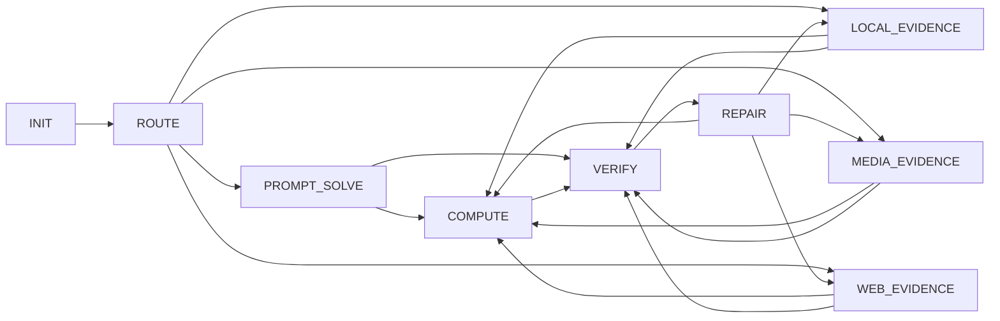

# 26.5.05 GAIA batch 增量图替代 bootstrap 调研

记录时间：2026-05-05 00:51 +0800

目标：调研“面向题目集合设计状态机 / 图结构，让 agent 在执行时更规范、提分”的已有路线，并结合当前 `/data/xsy/project_gaia_skillrl` 的 bootstrap/scale 图流程，给出一种按 batch 逐步维护图、最终替代一次性 bootstrap 的设计建议。

本文件只做调研和方案设计，不改代码，不启动实验。

## 一页结论

当前 one-shot bootstrap 的核心瓶颈是：模型一次性读 `runtime_contract + 83 题 snapshot`，同时完成分类、归纳、图设计、节点规则撰写。题量扩大后，全量题面会线性消耗 prompt，图质量也容易受输入顺序、稀有题覆盖、注意力分配影响。

更合适的方向是做一个 **Batch Graph Bootstrap，简称 BGB**：

1. 先把全量题转成 `batch_profile / shard_profile / representative_examples`，让图生成模型消费“分布画像和覆盖样本”。
2. 图生成从 one-shot 输出完整 `SKILL.md`，改成多轮维护 `GraphSpec`：每个 batch 只提交受约束的 graph patch，例如新增边、拆分节点、合并节点、调整工具 allowlist、改节点内 readiness 条件。
3. 每轮 patch 先过静态 lint，再跑很小的 coverage smoke。分数、无答案率、非法 NEXT/ANSWER、平均步数、工具失败和 graph 复杂度一起作为下一轮输入。
4. 图稳定后再渲染成最终 `SKILL.md`，进入现有 R 阶段的 graph lock。R 阶段继续只改 common text 和节点内规则。

一句话：让图在 pre-lock 阶段通过多批材料和小样本验证收敛；锁图后再让 critic/actor 做节点内优化。

## 当前项目约束

关联本地文件：

- 当前 bootstrap 输入预处理讨论：[26.5.04_2015_GAIA_bootstrap输入预处理轻量方案讨论.md](/data/xsy/project_gaia_skillrl/实验设计与迭代/26.5.04_2015_GAIA_bootstrap输入预处理轻量方案讨论.md)
- 当前 boot/R 固定图梳理：[26.5.04_1923_GAIA_9B_p04_boot提示词与R固定图输入梳理.md](/data/xsy/project_gaia_skillrl/实验设计与迭代/26.5.04_1923_GAIA_9B_p04_boot提示词与R固定图输入梳理.md)
- 早期强状态机设计：[26.4.20_1822_GAIA_L1_53题扫描后强状态机设计v1.md](/data/xsy/project_gaia_skillrl/实验设计与迭代/26.4.20_1822_GAIA_L1_53题扫描后强状态机设计v1.md)
- 当前 boot-only 确认：[26.5.05_0040_GAIA_9B_BOOTV3_ARCHV53_boot-only启动确认.md](/data/xsy/project_gaia_skillrl/实验设计与迭代/26.5.05_0040_GAIA_9B_BOOTV3_ARCHV53_boot-only启动确认.md)

当前实现特点：

- `gaia_skillrl/bootstrap.py` 的 `_batch_payload()` 会把每题 `question / gold_answer / attachments / file_list` 放入 `bootstrap_input.json`。
- `prompts/bootstrap_skill_system.md` 明确 bootstrap 是唯一设计硬图的步骤，后续 critic/actor 保持图固定。
- 图签名由 `skill_graph.py` 从 `## Phase: NAME` 和 `Next:` 解析，actor 阶段用 graph lock 防止节点和边变化。
- 当前 BOOT-V3 要求 no-CONCLUDE，不生成专门 answer-only phase；`any_phase` 答案接收策略下，任意 phase 在证据和格式满足时可以 `<ANSWER>`。

这意味着：batch 增量图如果要替代 bootstrap，应发生在 graph lock 之前。最终只向现有系统交付一个普通 `SKILL.md`，后续 R 阶段可以沿用现有 graph lock 机制。

## 外部工作怎么做

### 1. StateFlow：把流程控制和子任务求解拆开

StateFlow 把复杂任务求解建模为状态机，强调 `process grounding` 由状态和状态转移承担，`sub-task solving` 由状态内动作承担。论文报告在 InterCode SQL 和 ALFWorld 上，相比 ReAct 分别提升 13% 和 28% success rate，并降低成本。

对当前项目的启发：

- 图节点应表达“运行过程状态”，节点内规则才表达具体解题策略。
- `FLOW` 与 `Skill` 要分离：边条件、repair budget、answer readiness 属于图；工具选择、证据抽取细节属于节点规则。
- 当前 4 月 20 日强状态机设计已经接近这个方向，但现在的 bootstrap 仍然让模型一次性从题面堆里归纳图。BGB 可以把 StateFlow 的思想放到图生成阶段。

来源：[StateFlow: Enhancing LLM Task-Solving through State-Driven Workflows](https://arxiv.org/abs/2403.11322)

### 2. Tree/Graph of Thoughts：图搜索适合单题推理，但不等同于全局执行图

Tree of Thoughts 让模型在 inference time 维护多个 reasoning path，做自评、lookahead、backtracking。Graph of Thoughts 进一步把 thought 组织成任意图，支持聚合、反馈回路、蒸馏等操作。

对当前项目的启发：

- `BACKTRACK / REPAIR / VERIFY` 这类节点有必要存在，因为复杂题常需要回退和证据重组。
- 这些方法主要优化单题内部推理搜索；它们不能直接回答“从很多训练题形成一张通用执行图”的问题。
- 我们要借用的是“图上可控探索和反馈”的结构，不应把每道 GAIA 题都展开成 ToT/GoT 运行树来生成全局 skill。成本会高，且容易把题目事实写入 skill。

来源：[Tree of Thoughts](https://arxiv.org/abs/2305.10601)，[Graph of Thoughts](https://arxiv.org/abs/2308.09687)

### 3. ReAct / LATS：执行时搜索和外部反馈能提升 agent，但需要过程约束

ReAct 交错生成 reasoning traces 和 actions，让模型边想边用工具。LATS 把 MCTS、value function、自反思和环境反馈放进 agent 决策，覆盖编程、QA、WebShop、数学等任务。

对当前项目的启发：

- GAIA executor 需要外部工具和环境反馈，纯 prompt answer 模式不够。
- LATS 的价值在于“环境反馈 + 搜索”，可用于 small smoke 或候选图选择：同一批 coverage tasks 上，评估不同图候选的路径质量和答案率。
- 当前 9B executor 成本和上下文预算有限，BGB 阶段可以只用小规模 smoke，不建议把 LATS 式树搜索并入每题常规执行。

来源：[ReAct](https://arxiv.org/abs/2210.03629)，[Language Agent Tree Search](https://arxiv.org/abs/2310.04406)

### 4. Agent Workflow Memory：从历史轨迹诱导可复用 workflow

Agent Workflow Memory 从训练示例或测试过程诱导 reusable workflows，再按任务选择性提供给 agent。论文在 Mind2Web 和 WebArena 上报告了相对 success rate 提升，并减少 WebArena 成功任务步数。

对当前项目的启发：

- 很多题时，材料进入图生成器的形态应是“可复用 workflow 片段和统计摘要”，用统计摘要替代全量题面。
- 轨迹比静态题面更适合提炼 workflow。boot_dev state 出来后，BGB 或后续 R 可以把成功路径、失败路径归纳成图 patch 的证据。
- AWM 支持 offline 和 online 两种模式；当前项目可先做 offline：从 validation_dev/boot_dev compact rows 诱导 graph notes。

来源：[Agent Workflow Memory](https://arxiv.org/abs/2409.07429)

### 5. WISE-Flow：把历史交互转为带前置条件的过程经验

WISE-Flow 把历史服务交互转换成 reusable procedural experience，并在部署时把当前轨迹对齐到检索到的 workflow，做 prerequisite-aware feasibility reasoning。

对当前项目的启发：

- 节点和边不应只是自然语言标题，最好显式记录 `preconditions / outputs / blockers / repair trigger`。
- 对 GAIA 来说，典型 prerequisite 包括：已加载 task manifest、附件已解析、网页证据有来源 URL、候选答案已计算、格式约束已核验。
- 这类经验需要真实执行历史。静态题面阶段可以生成 profile；轨迹阶段再生成 prerequisite-aware action block。

来源：[WISE-Flow](https://arxiv.org/abs/2601.08158)

### 6. EvoFSM：受约束地演化 FSM，分离 Flow 和 Skill

EvoFSM 面向 deep research agent，把自进化限制在显式 FSM 上，分离宏观 Flow 和微观 Skill，通过 critic 和少量受限操作改 FSM，同时维护成功轨迹先验和失败模式约束。

对当前项目的启发最直接：

- 当前 graph lock 后只能改节点内文本；BGB 应在 lock 前引入受限 graph ops。
- 可允许的 graph ops 可以很少：`add_phase`、`remove_phase`、`split_phase`、`merge_phase`、`add_edge`、`remove_edge`、`edit_edge_condition`、`edit_tool_allowlist`、`edit_node_contract`。
- 每次 patch 都要有证据：来自哪些 shard、哪些失败族、哪些 smoke 指标。没有证据的结构修改进入候选区，不直接落主图。

来源：[EvoFSM: Controllable Self-Evolution for Deep Research with Finite State Machines](https://arxiv.org/abs/2601.09465)

### 7. APO / OPRO / MIPROv2：多批样本和指标驱动的 prompt 优化

APO 用 minibatch 数据生成自然语言“梯度”，再用 beam search/bandit 改 prompt。OPRO 每轮把历史候选和分数放入 optimizer prompt，让 LLM 提出新候选。MIPROv2 会先 bootstrapping few-shot examples，再基于 dataset summary、program summary、candidate demos 生成 instruction candidates，最后用 minibatch/full validation 选择组合。

对当前项目的启发：

- 不需要让图生成器读全量题。它需要读 dataset summary、代表样本、历史候选图和分数。
- batch 图维护可以借鉴“minibatch 提案 + periodic full eval”：每个 shard 只给局部信号，隔几轮用固定 holdout 或全 dev slice 评估。
- `graph patch` 可以看作 prompt optimization 的对象，只是优化对象从字符串扩展为图结构和节点规则。

来源：[Automatic Prompt Optimization](https://arxiv.org/abs/2305.03495)，[OPRO](https://arxiv.org/abs/2309.03409)，[MIPROv2 docs](https://github.com/stanfordnlp/dspy/blob/main/docs/docs/api/optimizers/MIPROv2.md)

### 8. Reflexion / STaR / OS-Copilot：经验要经过反馈或验证过滤

Reflexion 把反馈信号转成自然语言 reflection，放入 episodic memory。STaR 生成 rationale 后，只保留能导向正确答案的材料再训练。OS-Copilot/FRIDAY 在 GAIA 上通过积累跨任务技能获得提升。

对当前项目的启发：

- 静态题面不应被伪造成“成功经验”或“失败经验”。经验应来自执行轨迹、评分、工具失败、非法动作和答案对错。
- gold answer 在 bootstrap 前只适合转成 answer shape 和格式分布；完整答案事实默认留在审计文件。
- 如果要把题面转成策略材料，需要有验证过滤。没有 rollout 的 rationale 很容易污染 skill。

来源：[Reflexion](https://arxiv.org/abs/2303.11366)，[STaR](https://arxiv.org/abs/2203.14465)，[OS-Copilot / FRIDAY](https://arxiv.org/abs/2402.07456)

### 9. Workflow optimization survey：把模板图、运行图、执行轨迹分清

2026 年 workflow optimization 调研把 agentic computation graph 分成 static/dynamic 结构，并区分 reusable workflow template、run-specific realized graph 和 execution trace。

对当前项目的启发：

- `SKILL.md` 的 phase graph 是 reusable workflow template。
- 单题实际走过的 phase path 是 run-specific realized graph。
- state.json 里的 tool calls、NEXT、ANSWER、runtime feedback 是 execution trace。
- BGB 需要把这三层分开记录。用 execution trace 修改 template graph 时，要经过聚合和验证，避免单题 path 直接变成全局结构。

来源：[From Static Templates to Dynamic Runtime Graphs](https://arxiv.org/abs/2603.22386)

## 建议的 Batch Graph Bootstrap 设计

### 总体形态

BGB 的输入使用四类材料：

```json
{
  "runtime_contract": {},
  "global_profile": {},
  "shard_profiles": [],
  "graph_memory": {
    "previous_candidates": [],
    "accepted_patches": [],
    "rejected_patches": [],
    "smoke_scores": [],
    "lint_reports": []
  }
}
```

产物先维护一个结构化 `GraphSpec`，最后再渲染一次性的完整 `SKILL.md`：

```json
{
  "graph_id": "bgb_v1_candidate_03",
  "global_constraints": {
    "no_conclude": true,
    "answer_policy": "any_phase",
    "max_phase_count": 9,
    "max_repair_visits": 2
  },
  "phases": [
    {
      "id": "INIT",
      "purpose": "load task manifest and attachment inventory",
      "allowed_tools": ["list_dir", "read_json_file"],
      "state_outputs": ["task_manifest", "attachment_inventory", "format_constraints"],
      "answer_readiness": "only prompt-only low-risk tasks with fully determined answer",
      "next": ["ROUTE", "PROMPT_SOLVE", "LOCAL_EVIDENCE", "WEB_EVIDENCE"]
    }
  ],
  "edges": [
    {
      "from": "INIT",
      "to": "LOCAL_EVIDENCE",
      "condition": "attachments are primary evidence"
    }
  ]
}
```

最终 `GraphSpec` 再渲染成现有 runtime 可读的 `SKILL.md`，包括 `## Phase:`、`Allowed tools:`、`Available actions:`、`Next:`。

### Batch 组织

题目 batch 不建议按原始顺序切。应按 coverage 分层：

- 维度：`level × modality × operation_tags × answer_shape × risk_flags`
- 稀有类型必保留：audio、image、archive、PDB/structured、长文档、多跳 web、强格式题
- 常见 web lookup 限额，避免 batch 被普通网页题淹没
- 每个 batch 40-80 题比较合适；如果题量只有 83，也可以切成 3-4 个 coverage shard 来验证稳定性
- 每轮 graph smoke 只抽 10-20 题，包含新 shard 的代表题和历史 replay 题

核心原则：每个 batch 负责提供一个“覆盖切片”，模型每轮只读取当前切片和必要 replay。

### Patch 操作

图维护器每轮只能输出 patch，不直接重写整张图：

```json
{
  "patch_id": "bgb_patch_004",
  "ops": [
    {
      "op": "split_phase",
      "target": "LOCAL_EVIDENCE",
      "new_phase": "MEDIA_EVIDENCE",
      "reason": "image/audio failures have different tools and exit conditions than xlsx/doc/txt parsing",
      "evidence": ["shard_02 media_attachment_failure", "smoke invalid_local_parse_on_image"]
    },
    {
      "op": "edit_edge_condition",
      "from": "VERIFY",
      "to": "REPAIR",
      "condition": "candidate answer has missing source, mismatched unit, unsupported format, or unresolved contradiction"
    }
  ],
  "expected_metric_effect": {
    "invalid_next": "down",
    "media_attachment_failure": "down",
    "mean_steps": "slightly_up"
  }
}
```

建议第一版允许的操作：

- `add_phase`：仅当一组任务有不同工具、不同输入、不同退出条件，并且现有 phase 承担过重。
- `split_phase`：比 `add_phase` 更常用，例如把媒体证据从本地证据拆出来。
- `merge_phase`：当两个 phase 工具、状态输入和退出条件基本相同，且增加了路径长度。
- `add_edge / remove_edge`：修正可达性和短路径。
- `edit_edge_condition`：把自然语言跳转触发条件变成明确条件。
- `edit_tool_allowlist`：修正节点能调用的工具集合。
- `edit_node_contract`：调整 `Goal / Rules / Exit handoff / answer_readiness`。

每个 patch 都要经过 lint 和 smoke；通过后写入 `accepted_patches`。失败 patch 也要保存，后续避免重复犯同类错误。

### Lint 规则

BGB 的 lint 比普通 skill parse 更严格：

- 必须有 `INIT`。
- 禁止 `CONCLUDE` 和专门 answer-only phase。
- 所有 phase 必须有 `Next:`，除非设计为 answer-ready terminal work phase。
- phase 数量默认控制在 6-9，超过 10 需要强证据。
- 每个节点出边默认不超过 4，repair 节点可稍宽但要有 visit budget。
- 每条边必须有 condition，避免无条件大网状跳转。
- 所有节点 reachable；所有非 terminal 节点能通向至少一个 answer-ready work phase。
- repair loop 必须有预算和退出失败策略，避免无限搜索。
- `Allowed tools` 必须来自 runtime contract。
- 节点拆分必须带来工具 allowlist、state input/output、exit condition 至少一项变化。

这一步很关键。否则 batch 增量很容易让图越来越大，最后变成“看似全能、执行路径很乱”的网状图。

### 评分方式

图候选不只按准确率选。建议用一个综合分：

```text
score =
  1.00 * accuracy
  - 0.20 * no_answer_rate
  - 0.10 * invalid_next_rate
  - 0.10 * invalid_answer_rate
  - 0.05 * failed_tool_call_rate
  - 0.02 * mean_steps
  - 0.02 * graph_complexity_penalty
  + 0.05 * rare_modality_recall
```

实际权重可以试验，但指标方向要明确：

- 准确率是主指标。
- 无答案、非法动作和工具失败是执行规范性指标。
- 平均步数和图复杂度防止过度修复。
- 稀有 modality recall 防止普通 web 题支配优化。

候选选择可以借鉴 MIPROv2/OPRO：

- 每个 shard 提出 1-3 个 patch candidate。
- 每轮只在 minibatch smoke 上评估。
- 每 2-3 轮做一次固定 holdout smoke。
- 最终图在完整 boot_dev 或固定 dev slice 上验收。

### Replay 机制

为了避免后来的 batch 把前面已经覆盖的能力改坏，每轮 smoke 应包含：

- 当前 shard 代表题。
- 历史失败高发题。
- 历史成功 anchor 题。
- 稀有 modality anchor 题。
- 强格式 answer anchor 题。

这类似 prompt optimization 里的 validation set，也类似 AWM/WISE-Flow 的 workflow memory。没有 replay，batch 顺序会明显影响最终图。

## 适合当前 GAIA 的图形态

从现有 4 月 20 日强状态机和 5 月 4 日 boot 图看，GAIA 图不宜过细。推荐目标是 7-9 个 phase：



这里没有 `ANSWER` 节点。`VERIFY`、`COMPUTE`、以及少数证据已充分的 work phase 可以在 readiness 满足时直接 `<ANSWER>`。

每个节点的职责：

- `INIT`：加载 task manifest、附件清单、初步 answer shape 和格式约束。
- `ROUTE`：选择主证据路径，生成 route decision 和缺省预算。
- `PROMPT_SOLVE`：题内可解、逻辑题、轻计算题。
- `LOCAL_EVIDENCE`：xlsx/docx/txt/pptx/pdf/code/archive 等本地非媒体材料。
- `MEDIA_EVIDENCE`：image/audio/visual/OCR/transcription。若当前 tool profile 的媒体工具能力不足，可以先并入 `LOCAL_EVIDENCE`，但需要在 graph notes 里保留拆分候选。
- `WEB_EVIDENCE`：搜索、打开网页、抽取证据、维护来源链。
- `COMPUTE`：Python 计算、表格聚合、排序、单位换算、组合枚举。
- `VERIFY`：来源、实体链、计算、格式、答案字符串核验。
- `REPAIR`：带预算的定向回退，输出下一跳和原因。

当前 5 月 4 日图为 `INIT / PROMPT_SOLVE / LOCAL_EVIDENCE / WEB_EVIDENCE / COMPUTE / VERIFY / REPAIR`。BGB 的主要待验证改动是是否单独拆出 `ROUTE` 和 `MEDIA_EVIDENCE`。如果 smoke 显示拆分导致简单题路径变长或 9B 跳转更乱，可以保留现图，把 route/media 作为 `INIT` 和 `LOCAL_EVIDENCE` 的节点内 contract。

## 为什么这能替代 one-shot bootstrap

one-shot bootstrap 的输入结构是：

```text
runtime_contract + 全量 batch_task_snapshot -> LLM -> SKILL.md
```

BGB 的输入结构是：

```text
runtime_contract
  + global_profile
  + shard_profiles
  + graph_patch_history
  + smoke_scores
  + replay anchors
-> graph maintainer / consolidator
-> GraphSpec
-> SKILL.md
```

变化点：

- 图生成器每次只处理一个切片和已有图，不需要同时记住所有题。
- 稀有任务通过 coverage 和 replay 固定保留，不靠输入顺序碰运气。
- 图结构改动由 patch ops 控制，可以审计、回滚、对比。
- 最终图经过 smoke 选择，减少单次 Codex bootstrap 的随机性。
- R 阶段仍然沿用现有固定图 actor，不需要把整个训练框架推倒。

## 建议的 MVP

第一版 BGB 可以很轻，不需要复杂学习算法：

1. 复用 5 月 4 日预处理方案，先生成 `global_profile`、`shard_profiles`、`representative_examples`。
2. 由 bootstrap LLM 基于 `global_profile` 生成 2-3 个 `GraphSpec` seed candidates。
3. 对每个候选做 lint，失败直接淘汰或让 LLM 修复。
4. 在 10-20 条 coverage smoke 上跑候选 seed skill。
5. 选最优候选，进入 `shard_refine`：
   - 每次读一个 shard profile、当前 GraphSpec、smoke scores、accepted/rejected patches。
   - 只输出 graph patch。
   - lint + smoke 后决定 accept/reject。
6. 2-4 个 shard 后做 consolidation，压缩冗余节点和边。
7. 渲染最终 `SKILL.md`，进入现有 boot_dev/boot_test。

建议产物文件：

```text
bootstrap_raw_batch_input.json
bootstrap_profile_input.json
bgb_shards.json
bgb_graph_seed_candidates.json
bgb_patch_log.jsonl
bgb_lint_reports.jsonl
bgb_smoke_scores.jsonl
bgb_final_graph_spec.json
bgb_final_skill_decision.json
```

如果只做调研后的最小实验，可以先不引入 patch loop：

- 生成 3 个 seed graph。
- 每个 seed graph 跑同一组 coverage smoke。
- 选一个最终 graph。

这已经能验证“候选图 + 小样本选择”是否优于一次性 full bootstrap。

## 对比实验设计

建议后续实验比较三组：

- `G0_one_shot_full`：当前 full task snapshot one-shot bootstrap。
- `G1_profile_one_shot`：只用 `global_profile + representative_examples` 的 one-shot bootstrap。
- `G2_batch_graph_bootstrap`：profile seed + shard patch + smoke selection。

控制变量：

- 同一 executor：`Qwen3.5-9B-local`
- 同一 tool profile：当前 `atomic_v2`
- 同一 answer policy：`any_phase`
- 同一 no-trunc / token budget / max steps
- 同一 dev/test 切片和并发

主指标：

- dev/test accuracy
- no-answer rate
- invalid NEXT / invalid ANSWER
- failed tool calls
- mean steps
- task family slice：web、local document、table、image/audio、compute、format-sensitive
- graph complexity：phase count、edge count、repair loop count、平均出边
- boot prompt tokens 和总 LLM cost

验收判断：

- 如果 `G2` 准确率提升有限，但 invalid/no-answer/工具失败明显下降，也值得进入 R 阶段继续看 actor 是否更稳。
- 如果 `G2` 图复杂度明显增加且平均步数上涨，说明 patch accept 规则过松，需要更强的 complexity penalty。
- 如果 `G1` 已经接近 `G2`，说明当前题量下 profile one-shot 足够，batch patch 可留给几百题 scale。

## 风险和边界

### 图膨胀

多 batch 会天然诱导“每个失败族加一个节点”。解决办法：

- phase 数量默认上限 9。
- 节点拆分必须证明工具、输入、输出或退出条件不同。
- 每轮 consolidation 检查同构节点。

### batch 顺序偏置

后来的 batch 可能覆盖前面经验。解决办法：

- coverage shard 随机化，固定种子。
- 每轮加入 replay anchors。
- 每 2-3 轮做一次固定 holdout smoke。

### 伪经验污染

静态题面阶段生成的 rationale 和 failure notes 未经过执行验证。解决办法：

- 静态阶段只做 profile 和 answer shape。
- 经验阶段只消费真实 state、reward、tool failure、answer correctness。

### 过拟合 validation_dev

图可能学到某批题的事实或格式。解决办法：

- 进入 prompt 的样本默认不含 task_id、完整 gold answer、固定 URL、固定实体事实。
- answer 只转 shape 和 format constraints。
- test/holdout 不参与 patch 决策。

### runtime 表达能力不足

当前 runtime 主要从 `SKILL.md` 文本解析 phase 和 `Next:`，结构化状态槽还没有硬执行。解决办法：

- 第一版 BGB 输出仍然是普通 SKILL，兼容现状。
- 后续如果要进一步压实状态机，可在 runtime 增加 `task_state` 槽，例如 `route_decision / evidence_ledger / candidate_answer / format_constraints / repair_count`。

## 推荐下一步

短期最稳的路径：

1. 先把 5 月 4 日预处理方案落成 `profile_input`，减少 one-shot bootstrap 的输入噪声。
2. 在 profile 基础上做 `3 seed graph + coverage smoke select`，这是 BGB 的最小验证版。
3. 如果候选选择有收益，再加 shard patch loop。
4. 图最终锁定后，沿用当前 A_full/B_sharded critic/actor，只改节点内规则。

中期可以做完整 BGB：

- `GraphSpec` 成为 bootstrap 阶段中间产物。
- `graph patch` 有 JSON schema、lint、score、accept/reject 记录。
- `SKILL.md` 只是最终渲染物。

长期如果要把图真正变成强执行状态机：

- runtime 优先读取 `GraphSpec`，把 `SKILL.md` 作为渲染结果和可读说明。
- 每个 phase 有结构化 `state_inputs / state_outputs / edge_conditions / repair_budget`。
- executor 的 `<NEXT>` 只提交意图，runtime 用状态条件做二次 gate。

## 资料来源

- GAIA benchmark：[GAIA: a benchmark for General AI Assistants](https://arxiv.org/abs/2311.12983)
- State-driven workflow：[StateFlow](https://arxiv.org/abs/2403.11322)
- Reasoning/action loop：[ReAct](https://arxiv.org/abs/2210.03629)
- Inference-time search：[Tree of Thoughts](https://arxiv.org/abs/2305.10601)，[Graph of Thoughts](https://arxiv.org/abs/2308.09687)，[LATS](https://arxiv.org/abs/2310.04406)
- Workflow induction：[Agent Workflow Memory](https://arxiv.org/abs/2409.07429)，[WISE-Flow](https://arxiv.org/abs/2601.08158)
- FSM self-evolution：[EvoFSM](https://arxiv.org/abs/2601.09465)
- Prompt/program optimization：[APO](https://arxiv.org/abs/2305.03495)，[OPRO](https://arxiv.org/abs/2309.03409)，[MIPROv2 docs](https://github.com/stanfordnlp/dspy/blob/main/docs/docs/api/optimizers/MIPROv2.md)
- Experience and verified reasoning：[Reflexion](https://arxiv.org/abs/2303.11366)，[STaR](https://arxiv.org/abs/2203.14465)，[OS-Copilot / FRIDAY](https://arxiv.org/abs/2402.07456)
- Workflow optimization vocabulary：[From Static Templates to Dynamic Runtime Graphs](https://arxiv.org/abs/2603.22386)
