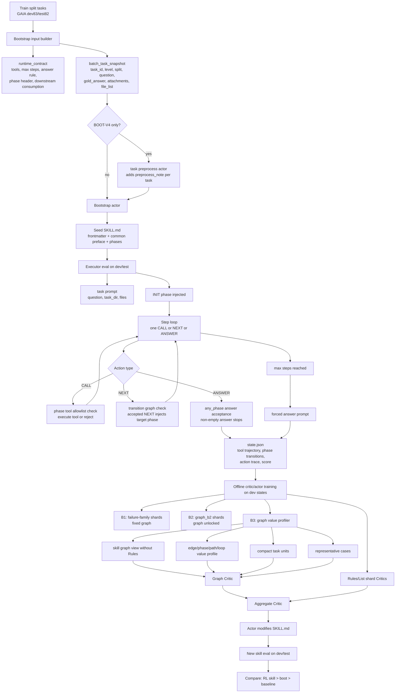

# GAIA SkillRL 转接手册（2026-05-15）

整理时间：2026-05-15 15:45 +0800

本文面向接手者。默认接手者知道当前项目在调 `boot / critic / actor`，也大致知道 `SKILL.md` 是一个分阶段执行指令。本文把 5 月 7 日手册更新到 5 月 15 日状态：BOOT 已推进到 `V5/V6/V7/V8`，FLOW 已从 `A1/B1/B2/B3` 继续推进到 `A2`，当前主要工作集中在 `BOOT-V7 -> A2 -> A2A2` 的可行性和收益验证。

## 一页结论

当前主线固定在 Serper 搜索、`atomic_v2` 工具、no-CONCLUDE、`any_phase` 答案接收、token guard、max-step forced answer 和 phase-local prompt 披露口径。早期 char cap 截断、旧 answer gate、TOOL-V4 去 `read_json_file`、Brave/非 Serper 对照、BOOT-V2、污染队列等只保留为历史索引。

当前最新架构可以概括为：

```text
BOOT-V3 seed skill
  -> BOOT-V5/V6 长规则与图约束探索
  -> BOOT-V7 pseudo-complete fixed graph 主线
  -> BOOT-V8 对照分支
  + ARCH-V5.3 stale phase prompt hiding
  + token guard no-trunc
  + answer guard: any_phase answer + max-step forced answer
  + FLOW-A1 / FLOW-A2 offline critic-actor
  + Serper search, DDG fallback 当前关闭
```

2026-05-15 的工作判断：

- GAIA 9B baseline 三次重复后已接近 boot/skill 上限区间：baseline 约 `dev 36/83`、`test 27/82`，BOOT-V7/A1/A2 目前没有拉出稳定收益；9B 更像卡在当前 skill 提醒范式的收益天花板附近。
- GAIA 8B 仍有可调空间。BOOT-V7 最好 source 当前按 `r2 dev 24/83 + test 17/82 = 41/165` 作为 A2 source；A2 三次重复正在跑，初步看没有明显超过 source。
- EarthBench 上 8B 比 9B 更适合继续调：8B 的 BOOT/A1/A2 至少能看到一定正向空间，9B 多轮 BOOT/A1/A2 相比 baseline 往往持平或负增长。
- 当前推荐把主要调参资源转向 8B。9B 可以保留少量对照和强基线复验，继续大规模调 9B 的 ROI 较低。

当前 A2 的核心改动是让 critic 的 actor-facing reward 同时包含正向保留、负向修复、冲突/代价三类信号，并要求每条信号标注作用 phase、触发条件、动作和保护项。目标是让 actor 有条件地改 skill，减少“只加检查、只加 REPAIR、test 变重”的倾向。

```text
A2 目标：
positive signal 保护已有成功路径
negative signal 修失败模式
tradeoff signal 防止修复伤到快路径
actor 只接收可落地的 skill 改动要求
```

## 最新推荐配置

### 固定运行口径

| 项 | 当前值 |
|---|---|
| 工具层 | `NLRL_RUNTIME_TOOL_PROFILE=atomic_v2` |
| 搜索 | `provider=serper`，当前关闭 DDG fallback |
| 代理 | `HTTP_PROXY=http://127.0.0.1:17890`，`HTTPS_PROXY=http://127.0.0.1:17890`，清理 `ALL_PROXY` |
| 答案接收 | `NLRL_RUNTIME_ANSWER_ACCEPTANCE_POLICY=any_phase` |
| phase 设计 | no-CONCLUDE，任意 phase 只要非空 `<ANSWER>` 且证据充分即可停止 |
| 超步数收口 | `max_executor_steps=24` 后追加 forced answer prompt，要求必须给非空短答案 |
| 上下文 | `NLRL_RUNTIME_MAX_CONTEXT_CHARS=0`，不再用字符 cap 截断 |
| token guard | tokenizer token guard 控制输入窗口，`safety_margin=512` |
| 输出预算 | `NLRL_EXECUTOR_MAX_TOKENS=12288` |
| thinking | `NLRL_EXECUTOR_ENABLE_THINKING=1`，`thinking_token_budget=None` |
| 并发 | eval lane 常用 `NLRL_RUNTIME_TASK_CONCURRENCY=20`，`NLRL_LLM_MAX_CONCURRENT_REQUESTS=20` |

Serper 当前配置文件：

```text
/data/xsy/projects(25.12-26.2)/qs-work/project_gaia_skillrl/configs/search_runtime.json
```

2026-05-15 已清理空 key，active key 采用随机顺序和本地 per-key rate limit。高并发实验要设置或继承 `NLRL_SERPER_KEY_ORDER=random`、`NLRL_SERPER_KEY_ROUNDS>=3`，并通过共享文件限速避免多进程同时打到同一把 key。DDG fallback 当前关闭，便于确认 Serper 是否真实生效。

### 8B/9B executor 区分

| 模型 | model | tokenizer | max_model_len | 最近 endpoint 口径 |
|---|---|---|---:|---|
| Qwen3-8B | `Qwen3-8B-local` | `/data/xsy/codes/checkpoints/Qwen3-8B` | `40960` | remote132 本机 `8128-8135` 或历史 tunnel `18122-18127` |
| Qwen3.5-9B | `Qwen3.5-9B-local` | `/data/xsy/codes/checkpoints/Qwen3.5-9B` | `49152` | remote132 本机/历史 tunnel `18120-18121` |

注意：8B 和 9B 的 `max_model_len` 要分开填。8B 固定用 `40960`，9B 固定用 `49152`。

### 强模型生成器

bootstrap actor、offline critic、offline actor 目前使用：

```text
model=gpt-5.4
base_url=codex-cli
api_mode=codex_cli
api_key=EMPTY
timeout_seconds=3600
```

Codex reasoning effort：最近队列没有在命令行传 `-c model_reasoning_effort=...`，也没有使用 `--ignore-user-config`，所以继承 `/data/xsy/.codex/config.toml` 的 `model_reasoning_effort="xhigh"`。

## 版本轴和当前取舍

### BOOT

| 版本 | 当前状态 | 作用 |
|---|---|---|
| `BOOT-V1` | 历史 active | 早期 no-CONCLUDE / any-phase seed skill 口径，字段较轻 |
| `BOOT-V2` | bad | 曾出现强 answer gate / quick-CONCLUDE 类问题，大面积空答，后续只当反例 |
| `BOOT-V3` | 主线来源 | 节点内部 `Rules` 明显加厚，强化六字段：`Goal / Allowed tools / Rules / Exit handoff / Available actions / Next` |
| `BOOT-V4` | 历史弱候选 | 在 V3 基础上给 bootstrap 输入加逐题 `preprocess_note`，收益不清晰 |
| `BOOT-V5` | 历史探索 | 图自由/长规则方向的早期探索，保留脚本和结果用于对照 |
| `BOOT-V6` | 历史探索 | long rules / full matrix / downstream fixed repeats，8B 上有部分可参考结果 |
| `BOOT-V7` | 当前主线 | 从 V3 派生，固定图结构，pseudo-complete：`INIT` 可指向主要 phase，其余 phase 的可达性更完整，actor 默认锁图改内容 |
| `BOOT-V8` | 对照分支 | 与 V7 同期生成的 pseudo-complete 对照，用于确认图约束和规则厚度的影响 |

BOOT-V7 是当前最重要的 seed。它把 V3 的 phase-local rule 风格保留下来，同时把图结构固定到更完整的 pseudo-complete 图，方便后续 A1/A2 actor 在不改图的前提下只改规则、触发条件、handoff 和 tool 使用约束。

BOOT-V5/V6/V8 都先作为对照和素材池。若后续要重开大规模矩阵，优先级仍是 `BOOT-V7 + A2`，其次再看 `BOOT-V8`。

### ARCH

| 版本 | 当前状态 | 作用 |
|---|---|---|
| `ARCH-V5.2` | active-anchor | no-CONCLUDE / any-phase / token guard / forced answer 稳定口径，当前历史 best test 来自这里 |
| `ARCH-V5.3` | 当前主线 candidate | 在 V5.2 基础上加入 stale phase prompt hiding，只保留当前 phase 完整披露 |

`ARCH-V5.3` 的动机：executor 只应被当前 phase 牵引。离开某个 phase 后，旧 phase 的提示会被替换为 inactive marker，保留任务说明、assistant thought 和工具结果，减少多阶段提示相互干扰。

### FLOW：A1、A2、B 系列

| flow | critic / actor | 图权限 | 当前理解 |
|---|---|---|---|
| `A1` / `A_full` | critic 给 unified reward，actor 改 skill | 通常固定图 | 历史主线。dev 有时升，test 不稳 |
| `A2` | critic 输出正向/负向/tradeoff 信号，actor 只接可落地改动 | 固定图，phase 级定位 | 当前主线。目标是让 actor 保留成功路径，避免过度加检查 |
| `A2A2` | 用 A2 产出的 skill 再跑一次 A2 | 固定图 | 用于观察二阶迭代是否继续提升；若一阶 A2 不升，二阶风险较大 |
| `B1/B2/B3` | sharded critic、graph/value profile、aggregate critic | B2/B3 曾允许小图探索 | 暂时降优先级。B 系列对 critic 结构有启发，但当前主线回到 A2 |
| `B4` | 有少量设计/草稿迹象 | 待验收 | 暂不作为主线投入 |

A2 的关键约束：

- critic 不把题目实例、task id、具体物体、具体答案塞给 actor-facing reward；
- 每条 positive/negative 信号都标明主要作用 phase；
- negative edit 必须包含 trigger、action、preserve/tradeoff；
- critic 给 actor 的信息聚焦 skill 该增、删、改的规则，不展开过深证据链；
- actor 默认锁图，若 critic 提到全局阈值或跨 phase 策略，必须落在所有相关 phase 或 common rules，不能只塞进 `REPAIR`。

## 最新实验结果口径

关键文档：

- `实验设计与迭代/26.5.15_1208_GAIA_EarthBench_8B9B调参收益对比与模型选择建议_AI整理.md`
- `实验设计与迭代/26.5.15_0920_GAIA_9B_BOOTV7_A2A2收益与skill差异分析.md`
- `实验设计与迭代/26.5.15_1234_GAIA_8B_BOOTV7_A2A2_from_v7best执行记录.md`

### GAIA

| 模型/配置 | dev | test | 当前判断 |
|---|---:|---:|---|
| 9B baseline repeat | 平均约 `36/83` | 平均约 `27/82` | 2026-05-15 重跑后 baseline 比早期低估更高 |
| 9B BOOT-V7 / A1 / A2 / A2A2 | 多数组合接近或弱于 baseline/boot | test 端没有稳定正收益 | 当前 skill 范式在 9B 上调不动 |
| 8B BOOT-V7 source r2 | `24/83` | `17/82` | 当前 A2 source，合计 `41/165` |
| 8B A2 repeat | 正在跑；中间口径约 `21-25/83` | 中间口径约 `16-18/82` | 暂未明显超过 source |

### EarthBench

| 模型/配置 | 当前观察 | 结论 |
|---|---|---|
| 8B baseline/BOOT/A1/A2 | baseline 仍在补 repeat；BOOT/A 系列已有可观察收益空间 | 继续调 8B 更有价值 |
| 9B baseline/BOOT/A1/A2 | 多数 skill 版本相对 baseline 无稳定收益，甚至负增长 | 9B 在当前范式下优先级降低 |

接手建议：GAIA 和 EarthBench 都优先把 8B 的 `BOOT-V7 -> A2` 跑完整，确认是否需要进一步改 critic prompt。9B 保留对照，不再作为主战场。

## 端到端流程图



## Boot 输入到 Skill 输出

bootstrap actor 的输入由 `gaia_skillrl/bootstrap.py` 生成，核心是两个对象。

`runtime_contract` 说明运行时硬边界：

- `executor_model`
- `max_executor_steps`
- `answer_rule`
- `phase_header_format`
- `action_tags`
- `tool_profile`
- `available_tools`
- `environment_limits`
- `downstream_consumption`

`batch_task_snapshot` 是训练 batch 摘要：

- `task_count`
- `levels`
- `attachment_suffix_histogram`
- 每题的 `task_id / level / split / question / gold_answer / attachments / file_list`
- BOOT-V4 额外有 `preprocess_note`

`gold_answer` 只在训练时帮助强模型理解答案形态和格式分布。skill 禁止写入 task id、固定答案、固定 URL、固定 named fact。

bootstrap actor 输出 JSON：

```json
{
  "summary": "one-sentence overview",
  "target_skill_name": "gaia-general-skill",
  "files_to_write": {
    "SKILL.md": "full skill markdown"
  }
}
```

`SKILL.md` 形态：

```text
---
name: gaia-general-skill
description: ...
allowed-tools:
  - list_dir
  - read_file
  - ...
metadata:
  benchmark: GAIA
  version: boot-v3
  executor_model: Qwen3.5-9B-local
  graph: routed-v1
---

Common preface with global invariants.

## Phase: INIT
Goal: ...
Allowed tools: ...
Rules: ...
Exit handoff: ...
Available actions: ...
Next: ...

## Phase: LOCAL_EVIDENCE
...
```

当前 BOOT-V3 / B3 样例 skill 有 7 个 phase：

```text
INIT
LOCAL_EVIDENCE
WEB_EVIDENCE
MEDIA_EVIDENCE
COMPUTE
VERIFY_AND_ANSWER
REPAIR
```

最新 B3 样例路径：

```text
/data/xsy/project_gaia_skillrl/runs/2026/5/2026-5-7/20260507_084814_8b9b_archv53_bootv3v4_remain20_fast_9b_bootv3_B3_offline_actor_iter1/offline_iter1/skill_after_actor/gaia-general-skill/SKILL.md
```

## Executor 如何消费 Skill

executor 入口在 `gaia_skillrl/environment.py` 和 `gaia_skillrl/agent_loop.py`。

执行前 runtime 会解析 skill：

- `## Phase: NAME` 解析成 phase。
- `Next:` 解析成 phase transition graph。
- `Allowed tools:` 解析成 per-phase tool allowlist。
- YAML frontmatter 的 `allowed-tools` 是全局 tool contract。

每道题开始时，executor 收到：

1. system prompt 和 tool protocol。
2. task prompt：`task_id / split / level / question / task_dir / files`。
3. 只有 `INIT` phase 的完整内容。

执行循环的约束：

- 每一步只允许一个动作：`<CALL>`、`<NEXT>` 或 `<ANSWER>`。
- `<CALL>` 会先检查全局 tool contract 和当前 phase 的 allowlist；非法工具调用会被 runtime 拒绝，记为 `tool_call_rejected`。
- `<NEXT>` 会检查当前 phase 的 `Next:` 目标；非法跳转记为 `invalid_phase_transition` 或 `unknown_phase`。
- 合法 `<NEXT>` 也占一步，并注入目标 phase 内容。
- 启用 `hide_stale_phase_prompts=1` 时，离开旧 phase 后，旧 phase 提示被替换成 inactive marker。
- `<ANSWER>` 在 `any_phase` 下只要非空就被 runtime 接收并停止。
- 24 步内没有非空 answer 时，runtime 追加 forced answer prompt，要求模型用已有证据给短答案。

每题产物是 `state.json`，关键字段包括：

- `env_result.final_answer`
- `env_result.tool_trajectory`
- `env_result.phase_transitions`
- `env_result.action_trace`
- `env_result.evaluation.task_success`

`action_trace` 是后续 critic 最重要的素材。它记录每一步的 `step_index / action_type / phase_before / phase_after / tool_name / next_phase / answer / accepted / success / outcome / feedback / raw_output`。

## 训练阶段：从轨迹到 critic，再到 actor

以 `FLOW-batch-V3` 为例，输入是 boot dev run 的 83 个 `state.json` 和当前 skill。

实际样例：

```text
offline run:
/data/xsy/project_gaia_skillrl/runs/2026/5/2026-5-7/20260507_084814_8b9b_archv53_bootv3v4_remain20_fast_9b_bootv3_B3_offline_actor_iter1

source boot dev:
/data/xsy/project_gaia_skillrl/runs/2026/5/2026-5-5/20260505_004012_9b_bootv3_archv53_fresh_bootv3_boot_dev_c20

source boot skill:
/data/xsy/project_gaia_skillrl/runs/2026/5/2026-5-5/20260505_004012_9b_bootv3_archv53_fresh_bootv3_boot_dev_c20/bootstrap/skill_after_bootstrap/gaia-general-skill/SKILL.md
```

该样例的 `offline_actor_summary.json` 记录：

```text
method_key=B3
strategy=graph_v3
graph_policy=graph_v3
source_state_count=83
missing_task_ids=[]
```

### 轨迹压缩

critic 先把每题 state 压成 compact row：

- `task_id`
- `level`
- `success`
- `final_answer`
- `file_list`
- `step_count`
- `empty_answer`
- `max_step_hit`
- `outcome_counts`
- `path`
- `tools`

B3 再扩展成 graph row：

- `phase_dwell`
- `edge_counts`
- `edge_first_steps`
- `repeated_edges`
- `tools_by_phase`
- `tool_failures_by_phase`
- `phase_outcomes`
- `invalid_next_by_phase`
- `invalid_tool_by_phase`
- `answer_events`
- `forced_answer_candidate`
- `last_events`

随后按失败族分桶：

```text
success_anchor
no_answer_or_timeout
protocol_friction
media_attachment_failure
local_attachment_failure
web_retrieval_failure
answer_synthesis_or_format_failure
other_failure
```

### B3 的 graph value profiler

B3 生成四类 graph critic 输入：

1. `critic_graph_v3_skill_graph_view.json`
   - 当前 skill header、phase order、phase purpose、Allowed tools、Next、edges。
   - per-phase `Rules:` 正文被移除，避免 graph critic 被内容细节拖散。

2. `critic_graph_v3_value_profiles.json`
   - `edge_value_profile`
   - `phase_value_profile`
   - `loop_profile`
   - `missing_transition_profile`
   - `path_profile`
   - reward 权重说明。

3. `critic_graph_v3_task_units.json`
   - 每题只保留 task id、level、family、tags、file types、success、trajectory reward、path、phase dwell、edge repeats、major failure flags。
   - 不放完整题面和工具长输出。

4. `critic_graph_v3_representative_cases.json`
   - 从 value profile 自动挑 top negative edges、top positive edges、high-cost phases。

实际样例中的 graph profile 摘要：

```text
task_count=83
task_success_count=40
trajectory_success_count=32
max_step_hit_count=31
empty_answer_count=0
avg_steps=16.3976
avg_trajectory_reward=0.6475
```

关键边信号：

| edge | support | success rate | advantage | max-step rate | 解释 |
|---|---:|---:|---:|---:|---|
| `WEB_EVIDENCE->VERIFY_AND_ANSWER` | 15 | 0.8000 | 0.6217 | 0.0000 | 成功锚点，应保护 |
| `COMPUTE->VERIFY_AND_ANSWER` | 18 | 0.5556 | 0.1422 | 0.0000 | compute 后验证是可用路径 |
| `WEB_EVIDENCE->COMPUTE` | 10 | 0.6000 | 0.0667 | 0.0000 | web 后进入确定性处理有价值 |
| `INIT->MEDIA_EVIDENCE` | 5 | 0.0000 | -1.1146 | 1.0000 | direct media entry 当前是坏信号 |
| `VERIFY_AND_ANSWER->REPAIR` | 1 | 0.0000 | -1.7949 | 1.0000 | verify/repair bounce 低支持但很坏 |
| `MEDIA_EVIDENCE->REPAIR` | 3 | 0.0000 | -0.0833 | 1.0000 | media/repair loop 要收紧 |

典型路径信号：

| path | support | success rate | max-step rate |
|---|---:|---:|---:|
| `INIT->WEB_EVIDENCE` | 29 | 0.2759 | 0.7586 |
| `INIT->WEB_EVIDENCE->VERIFY_AND_ANSWER` | 15 | 0.8000 | 0.0000 |
| `INIT->WEB_EVIDENCE->COMPUTE->VERIFY_AND_ANSWER` | 10 | 0.6000 | 0.0000 |
| `INIT->MEDIA_EVIDENCE->REPAIR` | 2 | 0.0000 | 1.0000 |

### Graph Critic、Rules/List Critics、Aggregate Critic

B3 的 Graph Critic 只看图：

```text
critic_graph_v3_response.json
```

它在样例中的总结是：保留 web-first 和 compute-to-verify 骨架，收紧 direct media entry 和 repair bounce-back。

Rules/List shards 仍按 failure family 看内容和工具：

```text
critic_graph_v3_rules_shard_01_success_anchor_response.json
...
critic_graph_v3_rules_shard_11_answer_synthesis_or_format_failure_response.json
critic_graph_v3_rules_shards.json
```

Aggregate Critic 合并图和内容信号：

```text
critic_graph_v3_aggregate_response.json
reward.json
```

该样例的 actor-facing reward 摘要：

```text
Keep the current web-first backbone and compute-to-verify finish, but stop paying budget for control failures.
```

它指出 batch 中有：

```text
30 forced-final-after-max-steps
116 rejected calls
135 failed calls
```

主要问题：

- 当前 phase 内调用非法工具，产生 `tool_call_rejected`。
- `WEB_EVIDENCE` 在 decisive source 已经出现后继续长时间停留。
- `MEDIA_EVIDENCE / REPAIR` 少量循环消耗 step。
- `VERIFY_AND_ANSWER / REPAIR` bounce 在低支持样例中表现很差。

aggregate 给 actor 的修改信号包括：

- 收紧 `INIT->MEDIA_EVIDENCE` 条件。
- 收紧 `MEDIA_EVIDENCE->REPAIR`。
- 收紧 `REPAIR->MEDIA_EVIDENCE`。
- 收紧 `VERIFY_AND_ANSWER->REPAIR`。
- 鼓励 `WEB_EVIDENCE->COMPUTE`。
- 鼓励 `WEB_EVIDENCE->VERIFY_AND_ANSWER`。
- common preface 增加 pre-call legality check、no-loop rule、source-fidelity rule、tool-shape rule、final-string rule。

### Actor 修改 skill

actor 输入：

```text
reward_json
skill_json
similar_experience
```

actor 输出：

```text
actor_decision.json
actor_graph_lock_check.json
skill_after_actor/gaia-general-skill/SKILL.md
```

B3 样例 actor summary：

```text
Tightened routing legality, earlier WEB exits, and bounded MEDIA/REPAIR/VERIFY bounce conditions while preserving the existing web-first phase graph.
```

actor 的 experience signature：

```text
illegal-in-phase-calls + long-web-dwell-after-decisive-source + media-repair-loop + verify-repair-bounce
```

该轮 `actor_graph_lock_check.json` 显示：

```text
graph_edit_policy=graph_v3
graph_lock_enforced=false
graph_unchanged=true
```

含义：B3 允许改图，但本轮 actor 选择保持 phase order 和 edge set 不变，只改条件、rules 和共通约束。这是当前 critic/actor 的一个重要观察点：即使图权限打开，actor 仍倾向于保守改规则。

## 关键产物路径

### 最新 9B BOOT-V3 B3 样例

```text
offline actor:
/data/xsy/project_gaia_skillrl/runs/2026/5/2026-5-7/20260507_084814_8b9b_archv53_bootv3v4_remain20_fast_9b_bootv3_B3_offline_actor_iter1

source boot dev:
/data/xsy/project_gaia_skillrl/runs/2026/5/2026-5-5/20260505_004012_9b_bootv3_archv53_fresh_bootv3_boot_dev_c20

source boot skill:
/data/xsy/project_gaia_skillrl/runs/2026/5/2026-5-5/20260505_004012_9b_bootv3_archv53_fresh_bootv3_boot_dev_c20/bootstrap/skill_after_bootstrap/gaia-general-skill/SKILL.md

B3 skill:
/data/xsy/project_gaia_skillrl/runs/2026/5/2026-5-7/20260507_084814_8b9b_archv53_bootv3v4_remain20_fast_9b_bootv3_B3_offline_actor_iter1/offline_iter1/skill_after_actor/gaia-general-skill/SKILL.md

B3 dev eval primary:
/data/xsy/project_gaia_skillrl/runs/2026/5/2026-5-7/20260507_084823_8b9b_archv53_bootv3v4_remain20_fast_9b_bootv3_B3_dev_eval_c20_oversub_refill_c20

B3 dev eval rebalance:
/data/xsy/project_gaia_skillrl/runs/2026/5/2026-5-7/20260507_103807_rebalance_8b9b_remain20_refill_9b_bootv3_B3_dev_gpu4_9b_rebalanced_c20

B3 test eval primary:
/data/xsy/project_gaia_skillrl/runs/2026/5/2026-5-7/20260507_084823_8b9b_archv53_bootv3v4_remain20_fast_9b_bootv3_B3_test_eval_c20_oversub_refill_c20

B3 test eval rebalance:
/data/xsy/project_gaia_skillrl/runs/2026/5/2026-5-7/20260507_103807_rebalance_8b9b_remain20_refill_9b_bootv3_B3_test_gpu5_9b_rebalanced_c20
```

### 主要记录文档

```text
/data/xsy/project_gaia_skillrl/实验设计与迭代/ZZ_版本技能图草案.md
/data/xsy/project_gaia_skillrl/实验设计与迭代/26.5.05_1855_GAIA_迭代分数整合索引.md
/data/xsy/project_gaia_skillrl/实验设计与迭代/26.5.07_0123_GAIA_8B9B_ARCH53_BOOTV3V4_24实验启动与结果.md
/data/xsy/project_gaia_skillrl/实验设计与迭代/26.5.05_1328_GAIA_BOOTV3_ARCHV53_B1_B2启动与结果.md
/data/xsy/project_gaia_skillrl/实验设计与迭代/26.5.05_1041_GAIA_BOOTV3_BOOTV4_ARCHV53四实验分数记录.md
/data/xsy/project_gaia_skillrl/实验设计与迭代/26.5.05_1137_GAIA_B2状态机自动强化调研.md
/data/xsy/project_gaia_skillrl/实验设计与迭代/26.5.07_OfficeQA口径路由与小模型适配分析.md
/data/xsy/project_gaia_skillrl/实验设计与迭代/26.5.06_1038_当前已落地benchmark资产总览.md
```

## 当前创新点

### 1. Skill + graph 跳转的渐进式披露

skill 已经从一次性长 prompt 走到可解析的 phase graph：

- phase graph 来自 `Next:`。
- per-phase tool scope 来自 `Allowed tools:`。
- executor 每步只能看到当前 phase 的完整说明。
- 合法 `<NEXT>` 会注入下一 phase。
- `hide_stale_phase_prompts` 会隐藏旧 phase 说明。
- 每次跳转也占一步，因此图结构会直接影响 budget。

这个设计把“任务流程控制”从一整段 prompt 变成运行时可观测的状态机，critic 能看到具体哪个边、哪个 phase、哪个 allowlist 在耗 budget。

### 2. Dev 环境轨迹及时反馈并强化 Skill

当前方法不只做预生成 seed skill。它会在 dev 环境里跑出真实 executor 轨迹，再从多个维度提取特征：

- 正确率、空答案、max-step、forced answer。
- 每题 path、edge、phase dwell。
- 工具调用成功/失败、非法工具、非法跳转。
- web/fetch/local/media/compute 失败族。
- success anchors 和 failure families。
- graph reward、edge advantage、loop profile、path profile。

这些素材再给 critic 和 actor，形成“轨迹 -> 修改信号 -> skill 改写 -> test 验证”的闭环。目标是在 test 上证明：

```text
RL 后 skill > boot seed > direct baseline
```

## 当前待办

### 待办 1：继续优化 critic 行为

BOOT 已经调了几轮。更多收益应来自环境观察和 critic/actor。

当前方向：

1. 继续尝试不同 critic 观察素材。
   - Graph critic 只看 graph view、value profile、compact task units。
   - Rules/List critic 看 full rules、allowlist、exit handoff 和失败族。
   - 可继续增加专门 critic：web retrieval critic、forced-answer critic、tool-call legality critic、local/media parser critic、answer-format critic。

2. 降低上下文压力和幻觉。
   - graph 结构无需完整接入 per-phase rules。
   - 内容修改可以按 family 或 phase 分桶。
   - aggregate critic 负责去冲突，最后给 actor 单一清晰 reward。

3. 让 actor 获得更可执行的修改信号。
   - B2/B3 已放开图权限，但实际 graph signature 常不变。
   - 下一版可以要求 critic 输出更明确的 patch schema，例如 `tighten_edge_condition / add_edge / remove_edge / split_phase / edit_allowlist / edit_rules`，并给 actor 明确采纳条件。

4. 继续跑分验收。
   - 至少要稳定看到 boot 高于 baseline。
   - B 系列要在 dev 和 test 上进一步高于 boot。
   - 幅度需要足够大，才说明 actor/critic 闭环在增强 skill。

### 待办 2：找其它 benchmark

目标是找更适合当前架构发挥的 benchmark：

- 小模型 baseline 能跑起来，分数要处在可学习区间。
- 支持小模型 tool-ReAct 框架。
- 多跳、多步骤、需要证据路由或状态管理。
- 避免单点任务，避免一次调用就能解决的题型。
- 有足够 train 和 test。
- train/test 范式相似，训练得到的 skill 能迁移到 test。

当前本机已落地的新 benchmark scaffold：

```text
/data/xsy/project_agent_skillrl_transfer
```

已经盘点的候选：

- SkillsBench：最贴近显式 `SKILL.md` 工件，优先可运行性核对。
- SkillFlow：family-local lifelong skill patch，和当前 actor/critic patch 框架很贴。
- OfficeQA：多文档路由、表格证据和计算。当前 Qwen3.5-9B 在 `full / exact0 / TXT / evoskill_corpus` 是 `8/246 = 3.25%`，说明 full corpus routing 对小模型太难，需要先做 `oracle_source_files` 和 `retrieval_topk` baseline。
- SealQA / BrowseComp：搜索和证据 skill 可迁移，但 web/search 波动仍要控制。
- SQLBench / AgentBench DB：适合 smoke 和状态机调试，方法主展示价值相对低。

建议 benchmark 迁移顺序：

1. 先跑一个干净的小模型 baseline。
2. 再把 baseline 调到可解释，确认工具、scorer、split、成本。
3. 再上 boot skill。
4. 最后上 critic/actor B 系列。

## 接手后优先读的代码入口

```text
gaia_skillrl/bootstrap.py
gaia_skillrl/environment.py
gaia_skillrl/agent_loop.py
gaia_skillrl/critic.py
gaia_skillrl/actor.py
gaia_skillrl/config.py
gaia_skillrl/llm.py
gaia_skillrl/skills.py
gaia_skillrl/skill_graph.py
prompts/bootstrap_skill_system.md
prompts/bootstrap_skill_user.md
prompts/critic_system_graph_v3.md
prompts/critic_user_graph_v3.md
prompts/critic_aggregate_graph_v3_user.md
prompts/actor_system_graph_v3.md
```

## 接手后的工作建议

先用 `9b_bootv3_B3` 样例熟悉闭环：

1. 打开 `offline_actor_summary.json` 看 source states 和 source skill。
2. 打开 `critic_graph_v3_value_profiles.json` 看 edge/phase/path/loop。
3. 打开 `critic_graph_v3_response.json` 看 Graph Critic 如何从 value profile 提 patch。
4. 打开 `critic_graph_v3_rules_shards.json` 和各 shard response 看内容问题。
5. 打开 `critic_graph_v3_aggregate_response.json` 看最终 actor-facing reward。
6. 打开 `actor_decision.json` 和 `actor_graph_lock_check.json` 看 actor 实际采纳了什么。
7. 对比 `batch_state/skill_library/.../SKILL.md` 和 `offline_iter1/skill_after_actor/.../SKILL.md`。
8. 再看 B3 dev/test 的 `state.json`，确认修改是否减少了 forced answer、非法工具、web dwell 或 media/repair loop。

短期最务实的方向：继续把 B3 拆得更可控，让 critic 给出更精确的局部修改信号，actor 做小而可测的改动，跑小矩阵快速验证。GAIA 继续作为当前主线时，所有新实验都按 Serper、token guard、forced answer、ARCH-V5.3、`atomic_v2` 口径启动和记录。
