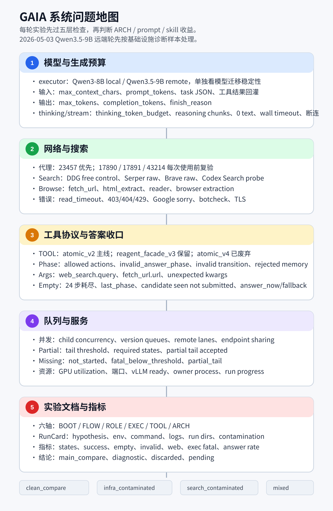
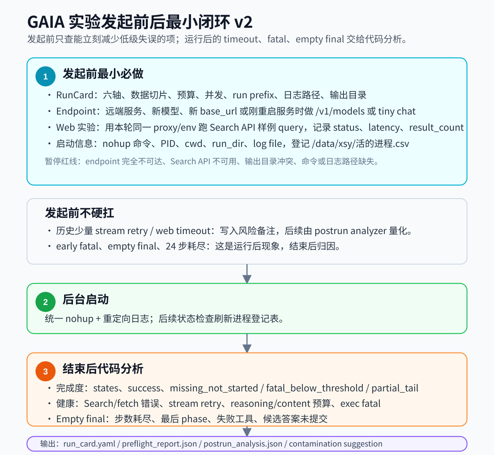

# 2026-05-03 GAIA 系统问题地图与统一记录约定试验稿

记录时间：2026-05-03 18:56 +0800

用途：把近期 GAIA 实验里反复互相干扰的问题压到一张图和一套 RunCard 里。以后发起实验前先做必要预检，发起时写清参数和预算，结束后用代码产出统一分析字段。

参考材料：

- `26.5.3_最新Qwen35远端GAIA系统性问题分析.md`
- `26.5.03_Qwen_thinking_chunk与输出预算问题讨论.md`
- `26.4.29_2035_GAIA六路实验网络指标总表.md`
- `26.4.29_2332_GAIA四路WebSearch后端对比与CodexSearch发现.md`
- `ZZ_版本技能图草案.md`

配套静态图：

- `26.5.3_1856_GAIA系统问题地图.svg`
- `26.5.3_1856_GAIA发起复盘闭环v2.svg`

## 一眼结论

近期问题已经分成五层：版本与配置契约、模型生成预算、远端服务稳定性、搜索/抓取链路、工具协议/阶段约束。发起前先检查 run intent、版本坐标、skill generator provider、answer policy、endpoint/proxy/search smoke 和输出目录；运行后的 timeout、early fatal、empty final 用代码分析归因，再决定这轮能否进入主比较。

当前 2026-05-03 Qwen3.5-9B 远端轮应标记为 `infra_contaminated`。它适合作为 Qwen3.5-9B 远端服务、streaming timeout、runaway thinking、队列 partial/fatal 策略的诊断样本，暂时不放进架构优劣主比较。

## 当前使用方式

这份文档当前先当“启动前控制台”，再当“结束后归因表”。新实验启动前只需要完成下面几项，预算和网络字段可以记录得简洁，版本和协议字段必须完整。

### 挂起实验确认门

触发条件：用户说要“挂起实验 / 后台跑 / 无人值守跑 / 发起队列”，并把本文档或本文档路径甩给 AI。

AI 默认流程：

1. 先阅读本文、`ZZ_版本技能图草案.md`、当轮计划/结果文档、相关启动脚本和配置快照。
2. 在当轮实验文档里新增“启动前确认”块，记录 AI 当前理解的架构、预算、模型、网络、队列和日志信息。中心问题地图只维护协议，不写具体 run 的一次性参数。
3. 向用户发起确认，必须包含下面三组核心问题；用户确认后再启动后台实验。
4. 用户确认后，用 `nohup` 启动，写入 `/data/xsy/活的进程.csv`，并把启动命令、PID、log、run_prefix、确认块所在文档路径回报给用户。
5. 启动后做一次实际配置回读：找到最早生成的 `config_snapshot.json`、bootstrap request 或启动日志中的 env，核对 provider、模型、answer policy、预算、端口。默认只向用户报告差异并记录到当轮文档；除非用户在确认块里明确授权自动停止，否则不自动停队列。

确认问题最少包含：

1. 架构原理确认：AI 用自然语言复述本轮方法的运行语义。至少覆盖 `BOOT / FLOW / ROLE / EXEC / TOOL / ARCH` 六轴、skill 是否 no-CONCLUDE、答案在哪些阶段会被接收、boot 如何产生 A/B skill、A/B 如何进入 eval。确认内容必须包含一段 `behavior_digest`，不能只列版本标签。例如：“本轮 ARCH-V5.2 no-CONCLUDE，executor 任意阶段输出非空 `<ANSWER>` 即停止并计分，没有专门 CONCLUDE 阶段。”
2. 上下文与预算确认：AI 列出输入限制、服务端 `max_model_len`、输出 `max_tokens`、`thinking_token_budget`、是否 no-trunc、并发、tail/partial 策略。当前批量改参数阶段，预算项可以不作为启动红线，但必须让用户确认这组实验实际要比较的参数。
3. 模型与 provider 确认：AI 分别列出 executor、bootstrap actor、offline critic、offline actor 的 `model`、`base_url`、`api_mode`、timeout、reasoning/thinking 设置。Codex intent 必须显式出现 `gpt-5.4 / codex-cli / codex_cli`，并写清 Codex CLI reasoning effort 及其来源：命令行 `-c model_reasoning_effort=...`、`/data/xsy/.codex/config.toml` 继承值，或模型默认值；SSSAI intent 必须显式出现 `gpt-5.2 / responses_sse / node-hk.sssaicode.com`。

建议附带确认：

- 网络/API：search provider、proxy、API smoke 是否通过。当前 API 额度充足时，这项主要确认“走哪个 provider 和 proxy”。
- 资源与队列：使用哪些 GPU/端口、是否保留 vLLM、是否允许长尾补位、队列停止条件。
- 输出与追踪：run_prefix、run_dir、log 文件、结果汇总文档、是否需要补写 postrun analyzer。
- 启动后回读：预计核对哪个 `config_snapshot.json` / request payload；默认差异只汇报和记录，是否自动停必须由用户明确授权。

标准确认话术：

```text
我准备按下面理解启动，请确认：
1. 架构：...
2. 上下文/预算：...
3. 模型/provider：...
4. 网络/队列/log：...
5. 启动后回读：...

你确认“可以启动”后我再挂 nohup；确认前不启动。
```

### 启动前 90 秒硬检查

1. 写清 run intent：本轮是 `main_compare`、`diagnostic`、`smoke` 还是 `discarded`，要对照哪条 baseline。
2. 写清版本坐标：`BOOT / FLOW / ROLE / EXEC / TOOL / ARCH` 六轴都要有值；没有 skill 的 direct run 明确写 `BOOT=none`、`FLOW=none`、`ROLE=none`。
3. 写清 skill generator：bootstrap actor、offline critic、offline actor 的 `model`、`base_url`、`api_mode`、reasoning effort 和 reasoning 来源。Codex intent 必须看到 `gpt-5.4`、`codex-cli`、`codex_cli`；若 Codex CLI 命令没有 `--ignore-user-config`，还要回读 `/data/xsy/.codex/config.toml` 的 `model_reasoning_effort`。SSSAI / Responses intent 必须显式写成另一条实验假设。
4. 写清 answer policy：no-CONCLUDE / any-phase skill 必须看到 `NLRL_RUNTIME_ANSWER_ACCEPTANCE_POLICY=any_phase`；CONCLUDE-gated skill 才能使用 `conclude_only`。
5. 写清 executor 服务：模型名、端口、`max_model_len`、endpoint smoke 结果。当前上下文/输出预算矩阵阶段，`max_context_chars`、`max_tokens`、`thinking_token_budget` 作为参数字段记录，不作为主要启动红线。
6. 写清网络 smoke：Search API 和 proxy 能返回正常结果即可。默认 GAIA/Search 代理以项目 `configs/search_runtime.json` 和当轮 smoke 为准；2026-05-04 当前 `project_gaia_skillrl` 已切到 `http://127.0.0.1:17890`，`23457` 当轮 Serper smoke 失败，重新启用前必须复验。
7. 写清后台启动凭据：`nohup` 命令、PID、log、run_prefix、run_dir collision 检查、`/data/xsy/活的进程.csv` 登记。

### 当前阶段的优先级

| 优先级 | 检查项 | 判断方式 |
| --- | --- | --- |
| P0 | `ROLE` / skill generator provider | 启动前必须和 run intent 一致；错了整轮标 `config_contaminated` |
| P0 | `answer_acceptance_policy` 与 `FLOW/ARCH` 契约 | no-CONCLUDE / any-phase 与 `conclude_only` 混用时整轮标 `config_contaminated` |
| P0 | 六轴版本坐标 | 没有坐标的结果不能进入主比较 |
| P1 | executor endpoint / `max_model_len` | 服务换过、端口换过、模型换过时必须 smoke |
| P1 | Search API / proxy | web/search 实验必须 smoke；失败后归 `search_contaminated` |
| P2 | context/output/thinking budget | 当前矩阵阶段主要做记录和分组，异常由 postrun 指标解释 |
| P2 | 队列 tail / missing / fatal | 结束后拆分，不提前压成一个 missing |

### 启动记录最小片段

```yaml
run_intent:
  evidence_role: "main_compare | diagnostic | smoke | discarded"
  compare_against: ""
  clean_requirements:
    - "version_axes_complete"
    - "skill_generator_matches_intent"
    - "answer_policy_matches_arch"

version_axes:
  BOOT: ""
  FLOW: ""
  ROLE: ""
  EXEC: ""
  TOOL: ""
  ARCH: ""

skill_generator_expected:
  provider: "codex_cli | responses_sse | none"
  model: ""
  base_url: ""
  api_mode: ""

runtime_contract:
  behavior_digest: ""
  answer_acceptance_policy: ""
  no_conclude_skill: false
  accepts_answer_any_phase: false
  boot_to_ab_flow: ""

preflight_smoke:
  executor_models_ok: false
  tiny_chat_ok: false
  search_api_ok: false
  proxy_used: ""
```

## 总问题图

> Markdown 预览器的 Mermaid 版本可能只有 8.8.0，`mindmap` 会报语法错误。这里默认使用大字号静态 SVG。



## 发起与复盘闭环图



### 图的维护方式

SVG 是阅读版；长期源头放在下面的 RunCard 字段和检查逻辑。后续调整时优先改文字约定；需要更新图时，直接按 SVG 文本里的节点改几行即可。当前阶段图和文字必须同步，避免预览时看到旧口径。

## AI 自取自用入口

这些文件不需要固定在工作区前面。人只固定当前需要看的文档；AI 发起实验、排查 API、检查后台任务或补记录时，先从这里按用途自取。

版式约定：长绝对路径不放进三列表格。入口类内容统一使用“标题 + 路径 + 何时打开”的条目格式，避免 Markdown 预览器把路径列挤成竖排。

如果确实需要保留三列视觉表格，使用 HTML `div-grid` 模拟表格，不使用原生 Markdown table。当前 Markdown 预览由 Office Viewer / Vditor 渲染，原生 table 会套用 `white-space: nowrap`，长路径容易把列宽挤坏；`div-grid` 可以在单元格上显式设置 `overflow-wrap:anywhere`。

可复用模板：

```html
<div style="display:grid; grid-template-columns:minmax(10em, 1fr) minmax(18em, 2fr) minmax(18em, 2fr); gap:0; width:100%; border-top:1px solid #ccc; border-left:1px solid #ccc;">
  <div style="font-weight:bold; padding:8px; border-right:1px solid #ccc; border-bottom:1px solid #ccc;">用途</div>
  <div style="font-weight:bold; padding:8px; border-right:1px solid #ccc; border-bottom:1px solid #ccc;">文件</div>
  <div style="font-weight:bold; padding:8px; border-right:1px solid #ccc; border-bottom:1px solid #ccc;">何时打开</div>

  <div style="padding:8px; border-right:1px solid #ccc; border-bottom:1px solid #ccc;">用途名</div>
  <div style="padding:8px; border-right:1px solid #ccc; border-bottom:1px solid #ccc; overflow-wrap:anywhere;"><code>/data/xsy/example/long/path.md</code></div>
  <div style="padding:8px; border-right:1px solid #ccc; border-bottom:1px solid #ccc;">打开场景说明。</div>
</div>
```

### 后台实验进程登记

路径：`/data/xsy/活的进程.csv`

何时打开：发起新后台实验前刷新已有 PID；启动后写入 PID、cwd、run_dir、command、log_path；确认结束后更新状态。

### GAIA 当前待验收与队列协调

路径：`/data/xsy/project_gaia_skillrl/实验设计与迭代/ZZ_当前待验收事项与版本索引.md`

何时打开：需要看当前还有哪些实验、PID、日志、收口策略、历史 ACC 事项时打开。

### GAIA 六轴版本与技能图

路径：`/data/xsy/project_gaia_skillrl/实验设计与迭代/ZZ_版本技能图草案.md`

何时打开：需要确认 BOOT / FLOW / ROLE / EXEC / TOOL / ARCH 版本含义和当前推荐组合时打开。

### GAIA 网络指标总表

路径：`/data/xsy/project_gaia_skillrl/实验设计与迭代/26.4.29_2035_GAIA六路实验网络指标总表.md`

何时打开：需要比较 web succ/fail、timeout、403、exec fatal、empty 等跨轮指标时打开。

### Qwen thinking 与预算

路径：`/data/xsy/project_gaia_skillrl/实验设计与迭代/26.5.03_Qwen_thinking_chunk与输出预算问题讨论.md`

何时打开：调整 `max_tokens`、`thinking_token_budget`、stream timeout、reasoning/content 指标时打开。

### Qwen3.5-9B 远端系统问题

路径：`/data/xsy/project_gaia_skillrl/实验设计与迭代/26.5.3_最新Qwen35远端GAIA系统性问题分析.md`

何时打开：判断 2026-05-03 远端 9B 轮为何 infra-contaminated、missing/empty/fatal 如何拆分时打开。

### Web Search API 管理

路径：`/data/xsy/skill-pool/API说明/26.4.29_2314_web_search_API管理.md`

何时打开：发起 GAIA web/search 实验前确认 Serper/Brave key、provider、proxy、smoke 结果和默认环境变量。

### 通用 API 说明

路径：`/data/xsy/skill-pool/API说明/最新api说明.txt`

何时打开：需要查通用 LLM / tool server base_url、API key、SSS AI 调用说明时打开。

### SSS AI 细节

路径：`/data/xsy/skill-pool/API说明/SSS AI文档.txt`

何时打开：需要复查 SSS AI 的实际调用方式、stream 参数、Responses 入口时打开。

### 蒲公英 Qwen3.5-9B 远端压测

路径：`/data/xsy/skill-pool/API说明/26.5.03_蒲公英远端qwen35_9b压测记录.md`

何时打开：检查 `http://127.0.0.1:18000/v1`、隧道来源、模型信息、压测结论、失效排查时打开。

### 蒲公英远端测试脚本

路径：`/data/xsy/skill-pool/API说明/蒲公英远端qwen9b-3.5测试.py`

何时打开：需要手动测试远端 Qwen / vLLM OpenAI-compatible 服务、tool calling、模型列表时使用。

### 蒲公英压测脚本

路径：`/data/xsy/skill-pool/API说明/bench_pgy_qwen35_remote.py`

何时打开：需要重跑 Qwen3.5-9B 远端并发、thinking、stream、max_tokens 压测时使用。

### 日常进展旧入口

路径：`/data/xsy/skill-pool/待办/每日进展.md`

何时打开：需要追溯早期每日计划时打开；当前 GAIA 实验不以它作为主入口。

使用规则：

- 文件保持原地，不移动、不重命名，避免破坏历史链接和脚本依赖。
- 人类固定区只保留当前要看的文档；AI 需要细节时按上表打开源文件。
- 如果源文件里的关键默认值变化，例如 Serper key、proxy、Qwen35 endpoint、预算建议，要回到本文补一条入口或更新使用说明。
- 本文只做导航和约定，不复制大段源文档内容。

## 统一记录约定

### 文档层级

| 层级 | 文件 | 写什么 | 更新节奏 |
| --- | --- | --- | --- |
| 总索引 | `ZZ_当前待验收事项与版本索引.md` | 只放当前需要验收、已完成主结论、下一步动作 | 每次验收后更新 |
| 版本图 | `ZZ_版本技能图草案.md` | BOOT / FLOW / ROLE / EXEC / TOOL / ARCH 六轴，以及已验收组合 | 主轴语义变化后更新 |
| 问题地图 | 本文 | 跨文档的风险框架、判读门、RunCard 字段 | 新问题成体系后更新 |
| 单轮记录 | `YY.M.D_HHMM_主题.md` | 一轮实验的假设、命令、环境、结果、污染标签、结论 | 每轮实验落稿 |
| 细分诊断 | `YY.M.D_HHMM_主题.md` 或表格附录 | 网络、thinking、空答、工具协议、逐题复盘 | 发现异常后补 |

### RunCard 最小字段

```yaml
record:
  title: ""
  created_at: "2026-05-03 HH:MM +0800"
  status: "planned | running | completed | failed | abandoned"
  evidence_role: "main_compare | diagnostic | smoke | discarded"
  contamination: "clean_compare | infra_contaminated | search_contaminated | protocol_contaminated | mixed"

hypothesis:
  question: ""
  expected_signal: ""
  stop_or_accept_rule: ""

version_axes:
  BOOT: ""
  FLOW: ""
  ROLE: ""
  EXEC: ""
  TOOL: ""
  ARCH: ""

runtime_contract:
  behavior_digest: ""
  answer_acceptance_policy: ""
  no_conclude_skill: false
  accepts_answer_any_phase: false
  boot_to_ab_flow: ""

skill_generator:
  bootstrap_actor:
    model: ""
    base_url: ""
    api_mode: ""
    timeout_seconds: ""
    thinking_or_reasoning: ""
    reasoning_source: "explicit_cli_config | codex_config_toml | model_default | payload | unset"
  offline_critic:
    model: ""
    base_url: ""
    api_mode: ""
    timeout_seconds: ""
    thinking_or_reasoning: ""
    reasoning_source: "explicit_cli_config | codex_config_toml | model_default | payload | unset"
  offline_actor:
    model: ""
    base_url: ""
    api_mode: ""
    timeout_seconds: ""
    thinking_or_reasoning: ""
    reasoning_source: "explicit_cli_config | codex_config_toml | model_default | payload | unset"
  expected_provider: "codex_cli | responses_sse | other"
  provider_matches_intent: false
  request_payload_sample: ""

executor:
  model: ""
  base_url: ""
  local_or_remote: ""
  enable_thinking: true
  max_context_chars: 48000
  max_model_len: ""
  max_tokens: ""
  thinking_token_budget: ""
  stream: true
  wall_timeout_seconds: ""
  retry_limit: ""

network:
  HTTP_PROXY: ""
  HTTPS_PROXY: ""
  ALL_PROXY: ""
  search_provider: "ddg | serper | brave | codex_probe"
  fallback_provider: ""
  reader_backend: "fetch_html | jina | browser | none"
  search_api_health: ""
  proxy_health: ""

preflight:
  checked_at: ""
  endpoint:
    required_when: "remote endpoint changed | model changed | service restarted | manual request"
    base_url: ""
    models_ok: false
    tiny_chat_ok: false
    model_reported: ""
    latency_ms: ""
    error: ""
  proxy:
    required_when: "web/search experiment"
    env_used: ""
    target_url: ""
    ok: false
    latency_ms: ""
    error: ""
  search_api:
    required_when: "web/search experiment"
    provider: ""
    sample_query: ""
    ok: false
    status_code: ""
    latency_ms: ""
    result_count: ""
    error: ""
  resources:
    required_when: "background experiment launch"
    gpu_snapshot_optional: ""
    port_check_optional: ""
    run_dir_collision: false
    active_registry_checked: false
  launch_pause_red_flags:
    - "endpoint completely unreachable when endpoint check is required"
    - "search API unavailable when web/search check is required"
    - "skill generator provider, model, or api_mode does not match the run intent"
    - "answer_acceptance_policy does not match FLOW/ARCH contract"
    - "run_dir collision"
    - "missing command, log_file, or registry entry"
  risk_notes_not_red_flags:
    - "historical small number of stream retry warnings"
    - "possible web timeout during long run"
    - "early fatal and empty final are postrun analysis targets"

queue:
  command: ""
  cwd: ""
  queue_pid: ""
  log_file: ""
  run_prefix: ""
  run_dirs: []
  child_concurrency: ""
  max_version_queues: ""
  remote_lanes_per_queue: ""
  tail_threshold: 3
  allow_partial_tail: true

metrics:
  states: ""
  success: ""
  empty_final: ""
  missing_not_started: ""
  missing_fatal_below_threshold: ""
  missing_partial_tail: ""
  invalid_broad: ""
  invalid_answer_phase: ""
  web_search_succ_fail: ""
  web_external_states: ""
  fetch_html_fail: ""
  llm_retry_warning: ""
  exec_fatal_calls_states: ""
  answer_submission_rate: ""
  steps_exhausted_without_answer: ""
  last_phase_when_empty_top: []
  failed_tools_top: []

postrun_analysis:
  analyzer_command: ""
  analyzer_output: ""
  completion_summary: ""
  network_health_summary: ""
  llm_stream_summary: ""
  empty_final_cause_summary: ""
  contamination_suggestion: ""

decision:
  keep_for_main_compare: false
  summary: ""
  next_action: ""
```

## 约定细节

### 1. 模型与预算

每轮必须写清：

- `model`、`base_url`、本地/远端、vLLM 启动参数或 `/v1/models` 看到的 `max_model_len`。
- `skill_generator` 的 bootstrap actor、offline critic、offline actor：`model`、`base_url`、`api_mode`、timeout、reasoning/thinking 显式字段，以及 reasoning 来源。
- 如果 run intent 是 Codex 生成 skill，启动记录里必须看到 `api_mode=codex_cli`、`base_url=codex-cli`、目标模型，例如 `gpt-5.4`。
- Codex CLI 若未带 `--ignore-user-config`，会读取 `/data/xsy/.codex/config.toml`；当命令行没有显式 `-c model_reasoning_effort=...` 时，记录继承到的 `model_reasoning_effort`。当前本机 `gpt-5.4` 完全未设置 reasoning effort 时，模型缓存默认值为 `medium`；若 `/data/xsy/.codex/config.toml` 写了 `xhigh`，实际按 `xhigh` 归档。
- 如果 run intent 是 SSSAI / Responses 生成 skill，启动记录里必须写明 `base_url`、`api_mode=responses_sse`、模型和实际 payload 是否带 `reasoning` / `reasoning_effort`。
- `max_context_chars` 控制输入裁剪；它不限制模型输出。
- `max_tokens` 控制单次请求新 token 上限，包含 hidden reasoning 和可见正文。
- `thinking_token_budget` 单独限制 hidden reasoning；若未设置，写 `unset`。
- response metadata 至少保留 `chunk_count`、`reasoning_chunk_count`、`content_chunk_count`、`first_content_chunk_index`、`finish_reason`、`usage.completion_tokens`。

初始预算网格沿用 2026-05-03 讨论：

| 配置 | `max_model_len` | `max_tokens` | `thinking_token_budget` | 用途 |
| --- | ---: | ---: | ---: | --- |
| A | 40960 或 49152 | 4096 | 2048 | 保守烟测，先压 runaway thinking |
| B | 40960 或 49152 | 8192 | 4096 | GAIA 主线候选 |
| C | 40960 或 49152 | 12288 | 8192 | 长上下文容忍度对照 |

远端服务暂时无法重启时，先在请求侧记录并控制 `max_tokens`；vLLM 支持时再加 `thinking_token_budget`。

### 2. 网络与搜索

每轮必须写清：

- 代理：`HTTP_PROXY`、`HTTPS_PROXY`、`ALL_PROXY` 的实际值。
- search：`DDG`、`Serper`、`Brave`、`Codex Search probe`。
- browse：现有 `fetch_url/html_extract`、Jina Reader、browser extraction。
- 错误拆分：search 召回失败、搜索 API 错误、网页读取失败、reader 失败、工具参数协议失败。

当前默认口径：

| 场景 | 建议 |
| --- | --- |
| 低成本 smoke | DDG 或 DDG fallback |
| 主诊断后端 | Serper raw |
| 低改动对照 | Brave raw |
| 错题证据和上限诊断 | Codex Search probe |
| GAIA/Search 实验代理 | 优先读取 `configs/search_runtime.json`；2026-05-04 当前为 `http://127.0.0.1:17890` |
| 已知风险代理 | `127.0.0.1:23457` 当前 Serper smoke 失败；`127.0.0.1:43214` 临时端口需避开 |

### 3. 工具协议与答案收口

空答要拆成三类：

| 类别 | 判据 | 处理 |
| --- | --- | --- |
| 接收路径问题 | 轨迹里有答案，但 phase 或 CONCLUDE 约束导致未接收 | `any_phase`、`no-CONCLUDE`、answer receiver 修复 |
| 主动收口问题 | 走满 24 步，最后仍在 `WEB_EVIDENCE`、`REPAIR`、`COMPUTE` 等阶段 | `answer_now`、最后 3 步停止无界搜索、候选答案提取 |
| 工具失败循环 | 失败工具和外部错误持续堆积，模型一直修复 | search/browse 修复、工具参数校验、错误反馈压缩 |

建议新增或固定这些指标：

- `answer_submission_rate`
- `steps_exhausted_without_answer`
- `last_phase_when_empty`
- `answer_candidate_seen_but_not_submitted`
- `failed_tools_top`
- `tool_arg_missing_query_or_url`

### 4. 队列与资源

队列记录必须区分：

| 字段 | 含义 |
| --- | --- |
| `missing_not_started` | lane 或 run 目录没有启动 |
| `missing_fatal_below_threshold` | 子进程低于 required states 退出 |
| `missing_partial_tail` | 达到 partial tail 接受条件后剩余题缺失 |
| `exec_fatal_calls_states` | LLM streaming 或 empty content 重试耗尽造成的 fatal |

运行中判断资源时看实际状态：GPU utilization、端口、vLLM readiness、owner process、run progress、manifest running item。长尾阶段若服务空闲，后续任务可补位，但需要确认输出目录、端口和缓存没有冲突。

### 5. 污染标签

| 标签 | 触发信号 | 用途 |
| --- | --- | --- |
| `clean_compare` | web external states 低、exec fatal 为 0、missing 主要是 partial tail、预算和代理锁定 | 可进入 ARCH / prompt / skill 主比较 |
| `infra_contaminated` | stream timeout、0 text fragments、empty content retry、server disconnected、exec fatal、远端 endpoint 压力过高 | 只作基础设施诊断 |
| `search_contaminated` | search timeout/403/429/botcheck 成片，或代理 TLS 错误 | 只作搜索/代理诊断 |
| `config_contaminated` | actor/critic provider 漂移、answer policy 与 FLOW/ARCH 不匹配、预算字段与 run intent 不一致 | 只作配置事故复盘，结果不进入主比较 |
| `protocol_contaminated` | invalid broad、invalid_answer_phase、tool arg 错误爆量 | 只作工具协议/phase 修复诊断 |
| `mixed` | 多层同时异常 | 拆分后再决定是否局部采用 |

## 当前近期问题放到图上的位置

| 问题 | 归属分支 | 当前判断 | 下一步 |
| --- | --- | --- | --- |
| Qwen3.5-9B 远端 8 万 chunk timeout | 模型与生成预算 / stream 稳定性 | `infra_contaminated` | 限 `max_tokens`，验证 `thinking_token_budget`，降并发 smoke |
| 9B 正常 response 很短，异常 attempt 极长 | hidden thinking / stream 稳定性 | 说明异常集中在失败 attempt | 保存失败 attempt 统计，避免只看 state 可见输出 |
| V5.1/V5.2 仍大量 empty final | 工具协议与答案收口 | 多数是 24 步耗尽和工具失败循环 | 加 `answer_now` 与 final fallback 指标 |
| V5.1 B_test 整条 missing | 队列与服务 / missing 拆分 | `missing_not_started` | RunCard 单列，不并入 partial tail |
| baseline/V4/V5 strict 50 多题 fatal | 队列与服务 / exec fatal | `missing_fatal_below_threshold` | 健康守卫提前停队列 |
| 2026-04-30 17890 TLS wrong version number；2026-05-04 17890 Serper smoke 通过、23457 失败 | 网络与搜索 / 代理 | `search_contaminated` | 按当轮 smoke 和 `search_runtime.json` 选择代理 |
| DDG timeout/403 窗口 | 网络与搜索 / 外部错误 | 搜索噪声会覆盖架构差异 | Serper/Brave raw 对照，DDG 作为 free control |
| `web_search` 缺 query、`fetch_url` 缺 url | 工具协议 / tool args | protocol issue | 工具参数预校验和更短错误反馈 |
| `invalid_answer_phase` 爆量 | phase guard | ARCH-V5 strict 的关键反例 | 继续保留 any_phase/no-CONCLUDE，指标单列 |
| 2026-05-04 AB priority `conclude_only` 跑 no-CONCLUDE skill | 启动配置 / answer policy | `config_contaminated` + `protocol_contaminated` | 结果不进主比较；boot 只用 rejected answer 离线补救；后续 run 强制 `any_phase` |
| 2026-05-04 AB priority actor/critic 漂到 SSSAI `gpt-5.2` | 启动配置 / skill generator provider | `config_contaminated` | 标记本轮 bootstrap 与 offline critic/actor skill 均为 `gpt-5.2 responses_sse` 生成；后续 Codex intent 必须显式 `gpt-5.4 codex_cli` |

## 2026-05-04 AB priority 双配置污染记录

记录时间：2026-05-04 10:51 +0800

本轮 `20260504_0110_abprio` 同时命中两个启动配置问题：

1. `answer_acceptance_policy` 实际为 `conclude_only`，而本轮 skill 走 no-CONCLUDE / any-phase 语义。表现为 `<ANSWER>` 在非 CONCLUDE 阶段被标成 `invalid_answer_phase`，官方 run 的 `final_answer` 全空。当前仅对 boot_dev / boot_test 做只读离线补救，主口径取第一次非空 rejected answer。
2. skill generator provider 漂移：4/29 与 4/30 旧 boot 的 actor/critic 配置为 `gpt-5.4`、`base_url=codex-cli`、`api_mode=codex_cli`；本轮 5/4 priority queue 没有覆盖 actor/critic，child queue 读取 `configs/system.json`，实际变成 `gpt-5.2`、`https://node-hk.sssaicode.com/api/v1/responses`、`responses_sse`。

证据文件：

- 当前 8B p03 config snapshot：`/data/xsy/project_gaia_skillrl/runs/2026/5/2026-5-4/20260504_011036_abprio_8b_p03_cap49152_think4k_out12k_fresh_bootv3_boot_dev_c10/config_snapshot.json`
- 当前 8B p03 bootstrap request：`/data/xsy/project_gaia_skillrl/runs/2026/5/2026-5-4/20260504_011036_abprio_8b_p03_cap49152_think4k_out12k_fresh_bootv3_boot_dev_c10/bootstrap/20260504T001516Z_bootstrap_initial_skill_request.json`
- 旧 4/30 V5.2 Codex 对照：`/data/xsy/project_gaia_skillrl/runs/2026/4/2026-4-30/20260430_092214_archv5_2_noconclude_anyphase_serper_fresh_bootv3_boot_dev_c20/config_snapshot.json`
- 当前补救重评分脚本：`/data/xsy/project_gaia_skillrl/scripts/rescore_rejected_answers_any_phase.py`

判读：

- 本轮 bootstrap 初始 skill 由 `gpt-5.2 responses_sse` 生成。
- 本轮 offline critic / actor 生成 A/B skill 也由 `gpt-5.2 responses_sse` 完成。
- executor 分数仍来自本地 Qwen 8B/9B，不能把本轮 skill 生成侧当成 4/29/4/30 的 `gpt-5.4 codex_cli` 对照。
- 本轮整体标记为 `config_contaminated`，AB 四路不进入主比较；boot 只保留作离线补救和故障分析。

后续启动前红线：

- no-CONCLUDE / any-phase skill 必须在 RunCard 与 command 中同时看到 `NLRL_RUNTIME_ANSWER_ACCEPTANCE_POLICY=any_phase`。
- Codex 生成 skill 的实验必须在 RunCard 与 `config_snapshot.json` 中同时看到 actor/critic `model=gpt-5.4`、`base_url=codex-cli`、`api_mode=codex_cli`。
- SSSAI / Responses 生成 skill 的实验必须显式写成另一条实验假设，不能和 Codex 生成 skill 的历史 baseline 混比较。

## 2026-05-03 旧消息预裁剪污染记录

发现 `gaia_skillrl/agent_loop.py` 里 `_prepare_messages_for_call()` 还有一层旧消息预裁剪：除最近 3 个 tool result 外，历史消息超过 `1600 chars` 会被压成带 `[truncated]` 的内容；总字符仍超限时还会进入 `600 chars` 二次压缩。这层逻辑会让长链任务里大量旧 `Tool result` 被裁剪，即使总输入离 `48K chars` 还有距离。

当前 9B `20260503_193121_qwen35_9b_vllm_keylist17890_ctx49152_nomax_think4k_serper_direct_test82_c20_gpu1_clean` 的诊断：

| 指标 | 数值 |
| --- | ---: |
| executor requests | 1032 |
| 带 exact `[truncated]` 的请求 | 663 / 1032 = 64.24% |
| `>=95% * 49152 chars` 的请求 | 48 / 1032 = 4.65% |
| marker 请求中低于 50% cap | 220 / 663 = 33.18% |
| marker 请求中 50%-75% cap | 267 / 663 = 40.27% |
| marker 请求中 `>=95%` cap | 48 / 663 = 7.24% |
| marker 主要来源 | 旧 `Tool result`，尤其 search / fetch / html_extract |

判断：这个 marker 主要反映历史工具结果被预裁剪，不等价于总输入真正撞到 `48K chars`。后续矩阵要把“移除旧消息预裁剪”作为单独版本轴，和 `max_context_chars`、`thinking_token_budget`、`max_tokens` 分开记录。

本轮矩阵最终报告需要落这些字段：

| 类别 | 字段 |
| --- | --- |
| 配置 | model、input cap 是否启用、`NLRL_RUNTIME_MAX_CONTEXT_CHARS`、`thinking_token_budget`、`max_tokens`、并发、服务端 `max_model_len` |
| 分数 | completed states、correct、accuracy on completed、accuracy on 82、missing / fatal / 400 / timeout |
| 输入分位 | prompt chars、prompt tokens 的 P95 / P99 / P99.5 / P99.9 / max |
| 输出分位 | visible content、completion tokens、reasoning tokens 的 P95 / P99 / P99.5 / P99.9 / max |
| 压力 | request count、wall time、avg req/s、vLLM 400、stream timeout、GPU util / 显存、长尾任务数 |
| 结论 | 与旧 baseline 同配置差异、最优候选配置、污染标签、下一步动作 |

## 后续落地建议

1. 后续每轮实验先写 RunCard，再启动后台队列。
2. `ZZ_当前待验收事项与版本索引.md` 只收干净结论和当前动作，异常细节留在单轮诊断文档。
3. 网络、thinking、空答三类异常各保留一张持续更新的小表，字段与本文 RunCard 对齐。
4. Qwen3.5-9B 远端下一轮先跑低并发 smoke：`max_version_queues=1`、`remote_lanes_per_queue=1`、`child_concurrency=4/8`，并显式设置 `max_tokens`。
5. 架构比较报告里固定写 `evidence_role` 和 `contamination`，避免把诊断样本混进主结论。
