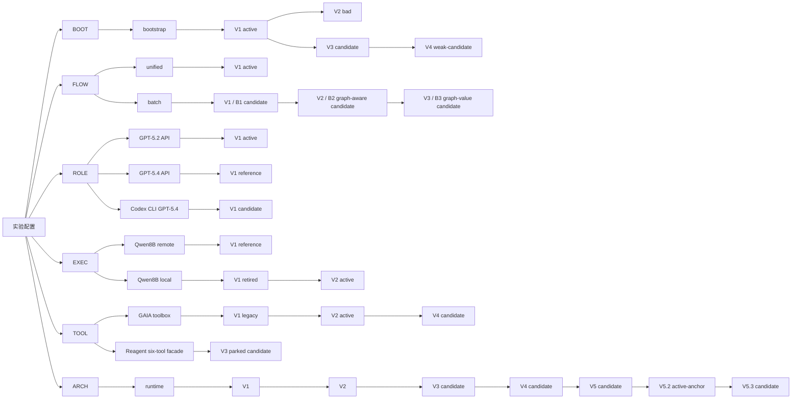

# GAIA 版本技能图草案

更新时间：2026-05-07 01:00 +0800

用途：把 prompt、流程、模型、executor、runtime、工具暴露层当成几条可选择的“技能轴”。一次实验从每条主轴各选一个版本，组合成可复现配置。历史 run 先不全量搬入，后续只把经过验收的组合补到“当前待验收事项与版本索引”。

2026-05-04 使用警告：`ROLE` 轴必须按 run intent 显式选择。`configs/system.json` 当前默认 `gpt-5.2 responses_sse` 只能代表项目默认配置，不能自动代表本轮要对齐的历史 baseline。若本轮 intent 是复现 4/29-4/30 Codex 生成 skill，对应 `ROLE` 必须写 `ROLE-GPT54-codex-V1`，并在启动命令和 `config_snapshot.json` 中看到 actor/critic `model=gpt-5.4`、`base_url=codex-cli`、`api_mode=codex_cli`。no-CONCLUDE / any-phase skill 还必须同步看到 `NLRL_RUNTIME_ANSWER_ACCEPTANCE_POLICY=any_phase`。

## 主图



读图规则：

- 一次实验从 `BOOT / FLOW / ROLE / EXEC / TOOL / ARCH` 各选一个可用叶子版本。
- 同一主轴出现分叉时，每次只能选其中一条。比如 `FLOW` 选了 `unified`，本轮就不再同时选 `batch`。
- 分叉有两类含义：一种是方法或配置分支，比如 `FLOW-unified` 和 `FLOW-batch`；另一种是 git 式回退分支，比如 `BOOT-V2 bad` 从 `BOOT-V1` 分出后被放弃。若后续从 `BOOT-V1` 继续迭代，届时再新增新版本节点。
- 图上只放版本名和状态，具体差异维护在下面表格。

## 对外只报六个主版本

实验记录里优先写这六项：

```text
BOOT-*
FLOW-*
ROLE-*
EXEC-*
TOOL-*
ARCH-*
```

`FLOW-*` 内部锁定对应的 critic、actor、merge 方式。这样一条实验记录不用反复写 `critic-*` 和 `actor-*`。

例子：

```text
BOOT-V1
FLOW-batch-V1
ROLE-GPT52-api-V1
EXEC-QWEN8B-local-V2
TOOL-GAIA-V2
ARCH-V3
```

## FLOW 子组件绑定

| flow                | 状态      | critic                | actor                | merge                             | 说明                                           |
| ------------------- | --------- | --------------------- | -------------------- | --------------------------------- | ---------------------------------------------- |
| `FLOW-unified-V1` | active    | `critic-unified-V1` | `actor-unified-V1` | single-pass synthesis             | 一次性把样本交给 critic，再由 actor 修改 skill |
| `FLOW-batch-V1`   | candidate | `critic-batch-V1`   | `actor-batch-V1`   | batch aggregate + actor synthesis | B1；按 failure family / shard 分批审计，aggregate 后交给 actor；phase graph 锁住，主要改 rules、allowlist、phase 内提示 |
| `FLOW-batch-V2`   | candidate | `critic-batch-graph-V2` | `actor-batch-graph-V2` | graph/rules signals + actor synthesis | B2；在 B1 基础上追加 `graph_structure_signals` 与 `allowlist_rules_signals`，actor 被允许改 phase graph、`Next:`、allowlist、rules；2026-05-05 实际产物 graph signature 未变，主要落在 rules/allowlist |
| `FLOW-batch-V3`   | candidate | `critic-batch-graph-V3` + `critic-batch-rules-list-V1` | `actor-batch-graph-V3` | graph critic + rules/list shards + aggregate critic + actor synthesis | B3；新增数学 profiler，把轨迹压成 edge/phase value、process reward、path/loop/missing-transition、全题 compact task table；Graph Critic 只负责节点/边/routing/repair 结构建议，Rules/List critic 沿用 B1 分桶负责 rules、allowlist、exit handoff；aggregate 去冲突后给 actor 明确信号 |

后续只改 critic 或 actor 时，也让对应 `FLOW-*` 涨版本。`FLOW-batch-V3` 已把 B2 的 graph signal 改成显式 graph-value 输入和 graph patch proposal；若 actor 实际采纳后仍主要只改 rules/allowlist，下一版应继续调整 value profile 或 aggregate/actor 消化方式。

### FLOW-batch-V3 输入组织

V3 的目标是把“图是否合理”从全量题面阅读中抽出来，先用数学统计给 critic 一张收益账本，再让强模型做结构判断。主流程：

```text
executor trajectories
  -> math profiler
     -> skill graph view without per-phase Rules
     -> edge/phase value profile
     -> path/loop/missing-transition profile
     -> all-task compact unit table
  -> Graph Critic
  -> B1-style Rules/List shard Critics
  -> Aggregate Critic
  -> Graph-unlocked Actor
```

Graph Critic 主输入：

- 固定常量和职责边界：`answer guide / any-phase answer / forced answer / no-CONCLUDE / BOOT / ARCH / provider / budget` 不作为回退候选；Graph Critic 只给 phase/edge/routing/repair 结构建议。
- `skill_graph_view`：从当前 skill 提取 header、global protocol、phase order、phase purpose、Allowed tools、Next、graph edges，并去掉 per-phase `Rules:` 正文；完整 rules 交给 Rules/List critic。
- `value_profiles`：包含 `edge_value_profile`、`phase_value_profile`、`loop_profile`、`missing_transition_profile`、`path_profile` 和 reward 权重说明。
- `all_task_units`：每道题保留 `task_id / level / family / tags / file_types / task_success / trajectory_success / trajectory_reward / empty_answer / max_step / step_count / path / edge_repeats / phase_dwell / major_failure_flags`；不放完整题面、推理过程和工具返回。
- `representative_cases`：从 value profile 自动挑出 top negative edges、top positive edges、high-cost phases，给 Graph Critic 快速定位。

V3 的启用口径：

```text
NLRL_RUNTIME_CRITIC_STRATEGY=graph_v3
NLRL_RUNTIME_ACTOR_GRAPH_EDIT_POLICY=graph_v3
```

离线生成 B3 skill 的轻量入口：

```text
scripts/run_gaia_9b_bootv3_archv53_b3_graph_v3_20260507.py
```

主要新增产物：

```text
critic_graph_v3_skill_graph_view.json
critic_graph_v3_value_profiles.json
critic_graph_v3_task_units.json
critic_graph_v3_representative_cases.json
critic_graph_v3_response.json
critic_graph_v3_rules_shard_*.json
critic_graph_v3_aggregate_response.json
```

## 涨版本规则

| 主轴     | 什么时候涨版本                                                                          | 例子                                                       |
| -------- | --------------------------------------------------------------------------------------- | ---------------------------------------------------------- |
| `BOOT` | bootstrap prompt 文本或输出约束变了                                                     | `BOOT-V2` 加强 CONCLUDE gate 后表现异常                  |
| `FLOW` | critic/actor prompt、分 batch 方式、聚合方式、actor 消化 critic 的方式、是否允许图结构修改变了 | `FLOW-batch-V1` 到 `FLOW-batch-V2`                   |
| `ROLE` | bootstrap / critic / actor 的模型组、base URL、API mode、关键参数变了                   | `ROLE-GPT52-api-V1`、`ROLE-GPT54-api-V1`、`ROLE-GPT54-codex-V1` |
| `EXEC` | executor 模型来源、远端/本地服务、vLLM 参数、stream/thinking/usage/timeout 对齐逻辑变了 | `EXEC-QWEN8B-local-V2`                                   |
| `TOOL` | executor 看到的工具集合、工具粒度、工具 facade、工具内部确定性分派变了                  | `TOOL-GAIA-V2` 原子工具；`TOOL-GAIA-V4` V2 去掉 `read_json_file` 后废弃；`TOOL-GAIA-V3` Reagent-style 六工具 facade |
| `ARCH` | 闭环语义、scorer、executor runtime、phase guard、状态机行为变了                         | `ARCH-V2` scorer；`ARCH-V3` executor/phase 修复；`ARCH-V4` invalid next 强反馈；`ARCH-V5` allowed-scope feedback + task JSON prompt hygiene |

运行参数只进入 run 记录：数据切片、并发、GPU/port、队列 PID、日志、tail threshold。若队列策略开始影响可复现实验语义，再把它纳入 `ARCH`。

## ARCH 版本补充

| 版本 | 状态 | 差异 | 证据 |
|---|---|---|---|
| `ARCH-V3` | candidate | executor prompt / phase guard / 固定阶段修复；Codex54 双组 AB 使用此口径 | 2026-04-27 双组 AB 分数与空答分析 |
| `ARCH-V4` | candidate | invalid `<NEXT>` 反馈改为强约束格式：`{target} is illegal from {current_phase}. You must choose one of: ...`；覆盖任意非法下一跳和未知 phase | 本次 `gaia_skillrl/agent_loop.py` 与 partial resume 脚本改动；等待 fresh 5.4 boot 空答回归 |
| `ARCH-V5` | candidate | rejected output 不回灌下一轮 executor context；invalid feedback 只列当前 scope 允许动作；executor prompt 明确 task JSON 已在 prompt 中，附件按需读取 | 2026-04-28 `agent_loop.py`、`environment.py`、`executor_system.md`、`direct_executor_system.md` 改动；ACC-005 用 TOOL-GAIA-V2 重跑 boot/AB |
| `ARCH-V5.2` | active-anchor | no-CONCLUDE / any-phase 答案接收口径稳定下来；任意 phase 非空 `<ANSWER>` 可终止，配合 token guard 与 max-step 后 forced answer 成为 2026-05-04 9B p04 主对照 | 2026-05-04 `9B p04 token_guard + forced_answer + BOOT-V3 + B_sharded`，B_test `39/82` |
| `ARCH-V5.3` | candidate | 在 `ARCH-V5.2` 基础上增加 stale phase prompt hiding：executor 初始 task prompt 与 `INIT` phase prompt 拆分；启用 `NLRL_RUNTIME_HIDE_STALE_PHASE_PROMPTS=1` 时，离开节点后把旧节点披露替换成 inactive marker，只保留当前节点完整披露、任务说明、assistant thought 和工具结果。`answer guide` 不是 V5.3 独有变量，应视作 V5.2 之后常驻口径 | 2026-05-05 `agent_loop.py`、`environment.py`、`config.py` 改动；BOOT-V3 boot-only test `36/82`，B1/B2 test 未超过 seed |

## BOOT 版本补充

| 版本 | 状态 | 差异 | 证据 |
|---|---|---|---|
| `BOOT-V1` | active | no-CONCLUDE / any-phase seed skill 生成口径；`Goal / Allowed tools / Rules / Exit handoff / Available actions / Next` 六字段接口 | 2026-05-04 9B p04 token-guard boot/AB |
| `BOOT-V2` | bad | 历史 quick-CONCLUDE / 过强 answer gate 口径，fresh bootstrap 大面积空答 | 版本索引保留为反例 |
| `BOOT-V3` | candidate | 为配合 `ARCH-V5.3` 的 stale phase prompt hiding，允许节点内 `Rules` 比早期 seed 更大、更具体；保留六字段接口；`Allowed tools` 作为硬工具 allowlist，`Available actions` 只写许可动作形式和合法跳转，`Rules` 承担节点经验、工具选择、证据/计算/验证、answer-readiness 与 transition 判断；去掉“阶段名本身决定能不能答”的诱导 | 2026-05-05 `prompts/bootstrap_skill_system.md`、`prompts/bootstrap_skill_user.md` 改动；BOOT-V3 + ARCH-V5.3 boot-only dev/test 为 `40/83`、`36/82` |
| `BOOT-V4` | weak-candidate | 在 `BOOT-V3` 口径上调整 bootstrap 输入：强模型先为每道题生成一个短 `preprocess_note`，写工具调用顺序、证据/计算流程和格式检查；不做聚类，不加多字段。该版本主要验证“题目级预处理能否改善 boot seed” | 2026-05-05 `bootstrap_task_preprocess_*` prompt 与 `gaia_skillrl/bootstrap.py` 改动；BOOT-V4 + ARCH-V5.3 boot-only dev/test 为 `40/83`、`29/82 partial`，暂未显示收益 |

## TOOL 版本补充

| 版本 | 状态 | executor 可见工具 | 内部实现 | 适用问题 |
|---|---|---|---|---|
| `TOOL-GAIA-V1` | legacy | 早期 GAIA toolbox | 历史 direct / skill run 里的初始工具集合，后续不作为新实验起点 | 保留历史索引 |
| `TOOL-GAIA-V2` | active | `list_dir`、`read_file`、`read_json_file`、`extract_pdf_text`、`read_table`、`image_metadata`、`audio_transcribe`、`ocr_image`、`image_qa`、`parse_docx`、`parse_pptx`、`extract_archive`、`web_search`、`fetch_url`、`html_extract`、`run_python` | executor 直接在十六个原子工具之间路由 | 可解释性强，便于看原子工具错配 |
| `TOOL-GAIA-V3` | parked-candidate | `search`、`browse`、`python`、`file_reader`、`image2text`、`audio2text` | Reagent-style 六工具 facade；`file_reader` 按后缀分派到底层文件工具，`browse` 统一网页读取并对网页 PDF 走文本抽取，`image2text/audio2text/python/search` 包装现有原子能力 | 作为 Reagent 对齐分支保留；当前免费/本地平替版低于 V2，后续接厚搜索/浏览/多模态后端再回归 |
| `TOOL-GAIA-V4` | abandoned | `list_dir`、`read_file`、`extract_pdf_text`、`read_table`、`image_metadata`、`audio_transcribe`、`ocr_image`、`image_qa`、`parse_docx`、`parse_pptx`、`extract_archive`、`web_search`、`fetch_url`、`html_extract`、`run_python` | 从 `TOOL-GAIA-V2` 主线分出，executor 可见工具去掉 `read_json_file`；代码入口保留为 `NLRL_RUNTIME_TOOL_PROFILE=atomic_v4` / `tool_v4`，但新实验回退 `atomic_v2` | `ACC-004` direct_test partial `11/81`，低于 4/26 direct `13/81`；后续不作为主线 |

`TOOL-GAIA-V3` 当前通过环境变量启用：

```text
NLRL_RUNTIME_TOOL_PROFILE=reagent_facade_v3
```

底层原子工具继续保留。facade 结果会记录 `facade`、`subtool`、`metadata` 和 `warnings`，便于后续分析哪些底层能力被触发。

当前主线回到 `TOOL-GAIA-V2`。代码默认 `NLRL_RUNTIME_TOOL_PROFILE=atomic_v2`，不设置环境变量时 executor 继续看到十六个原子工具。

`TOOL-GAIA-V4` 建议作为 V2 的下一条主线候选，改动面限定在 executor 可见工具和 INIT/LOCAL/MEDIA phase 的工具选择文案：

- 去掉 executor 可见的 `read_json_file`，避免 `files == ["task.json"]` 时重复读取已注入题面。
- 保留 `read_file` 对 `.json` 的文本读取能力；需要结构化解析时再用 `run_python`。
- INIT 规则改为：`## Task` 已加载；若只有 `task.json` 且题目自包含，直接路由到 `COMPUTE`、`WEB_EVIDENCE` 或相应 evidence phase。
- 附件题继续使用 exact `files` 名称调用专用工具：xlsx/csv 走 `read_table`，pdf 走 `extract_pdf_text`，音频走 `audio_transcribe`，图片走 `ocr_image` / `image_qa`，py/txt/json/html 走 `read_file` / `html_extract`。
- 验收指标：`read_json_file(task.json)` 空转应归零；有附件题的首个有效附件工具调用率不下降；dev/test 正确数和空答数按 `TOOL-GAIA-V2` 同切片对照。

## 已跑组合索引草案

这里记录“坐标点”，不再给组合本身单独维护版本。每行表示一次基本完整或近乎完整的实验组合；明显失败、API 中断、异常配置、只跑到很小样本的 run 先不进入这张表。

`skill artifact` 表示这套配置实际产出的 skill 或执行形态。主轴坐标相同的配置，经过不同迭代轮次可能得到不同 artifact，因此结果也会不同。

编号口径：`actor1/actor2` 按实际 offline actor 生成轮次计数；`eval iter2/iter3` 按后续评估 run 名计数。比如 `offline_actor_iter2/offline_iter2/skill_after_actor` 产出的 skill，会被后续 `iter3_*_eval` run 使用，所以记录为 `actor2 skill / eval iter3`。

| 记录                          | 状态                | BOOT        | FLOW                | ROLE              | EXEC                      | ARCH           | skill artifact                      |       dev |           validation_test | 证据                                                                                                                                        |
| ----------------------------- | ------------------- | ----------- | ------------------- | ----------------- | ------------------------- | -------------- | ----------------------------------- | --------: | ------------------------: | ------------------------------------------------------------------------------------------------------------------------------------------- |
| direct qwen3-8b remote        | reference           | none        | none                | none              | `EXEC-QWEN8B-remote-V1` | `ARCH-V2/V3` | no skill                            |         - |                 `14/82` | `20260421_144652_gaia_validation_test82_direct_qwen3_8b_c20_setsid`；见 4/25 汇总                                                         |
| bootstrap v0.2                | legacy-reference    | legacy      | none                | `ROLE-GPT54-api-V1` | `EXEC-QWEN8B-remote-V1` | `ARCH-V2`    | bootstrap v0.2 skill                | `18/83` |                 `15/82` | 见 4/25 汇总                                                                                                                                |
| boot-v3 初始 skill            | reference           | `BOOT-V1` | none                | `ROLE-GPT54-api-V1` | `EXEC-QWEN8B-remote-V1` | `ARCH-V3`    | bootstrap skill / eval iter1        | `18/83` |                 `14/82` | `20260421_214829_*` / `20260421_221130_*`；见 4/25 汇总                                                                                 |
| A full iter2                  | reference           | `BOOT-V1` | `FLOW-unified-V1` | `ROLE-GPT54-api-V1` | `EXEC-QWEN8B-remote-V1` | `ARCH-V3`    | A_full actor1 skill / eval iter2    | `21/83` |                 `11/82` | 见 4/25 汇总                                                                                                                                |
| B sharded iter2               | candidate-reference | `BOOT-V1` | `FLOW-batch-V1`   | `ROLE-GPT54-api-V1` | `EXEC-QWEN8B-remote-V1` | `ARCH-V3`    | B_sharded actor1 skill / eval iter2 | `14/83` |                 `17/82` | 见 4/25 汇总；短期最高，需干净重跑确认                                                                                                      |
| A full iter3                  | reference           | `BOOT-V1` | `FLOW-unified-V1` | `ROLE-GPT54-api-V1` | `EXEC-QWEN8B-remote-V1` | `ARCH-V3`    | A_full actor2 skill / eval iter3    | `21/83` |                 `14/82` | 见 4/25 汇总                                                                                                                                |
| B sharded iter3               | reference           | `BOOT-V1` | `FLOW-batch-V1`   | `ROLE-GPT54-api-V1` | `EXEC-QWEN8B-remote-V1` | `ARCH-V3`    | B_sharded actor2 skill / eval iter3 | `21/83` |                 `13/82` | `20260422_104135_gaia_bootv3_ab_B_sharded_iter3_test_eval_c20`；见 4/25 汇总                                                              |
| direct qwen3-8b local aligned | active-baseline     | none        | none                | none              | `EXEC-QWEN8B-local-V2`  | `ARCH-V3`    | no skill                            |         - | `13/81`，最高 `14/82` | `20260426_132116_aligned_qwen3_local_validation_test82_direct_c20`；见 direct 修复记录                                                    |
| A full iter2 local aligned    | active-reference    | `BOOT-V1` | `FLOW-unified-V1` | `ROLE-GPT54-api-V1` | `EXEC-QWEN8B-local-V2`  | `ARCH-V3`    | A_full actor2 skill / eval iter3    |         - |                 `16/82` | `20260426_132116_aligned_qwen3_local_validation_test82_A_full_iter3_skill_c20`；历史 skill 换本地 executor 复评                           |
| B sharded iter2 local aligned | active-partial      | `BOOT-V1` | `FLOW-batch-V1`   | `ROLE-GPT54-api-V1` | `EXEC-QWEN8B-local-V2`  | `ARCH-V3`    | B_sharded actor2 skill / eval iter3 |         - |                 `16/80` | `20260426_155133_aligned_qwen3_local_validation_test82_B_sharded_iter3_skill_gpu2_c20`；历史 skill 换本地 executor 复评，近乎完整 partial |
| A full on GPT-5.2 boot, codex54 | supplement-partial | `BOOT-V1` | `FLOW-unified-V1` | `ROLE-GPT54-codex-V1` | `EXEC-QWEN8B-local-V2` | `ARCH-V3` | GPT-5.2 bootstrap skill + Codex 5.4 A_full actor1 skill | `12/80` | `9/79` | `20260427_001726_codex54_ab_on_gpt52_boot_fresh_bootv3_A_full_*_eval_c20`；tail partial |
| B sharded on GPT-5.2 boot, codex54 | supplement-partial | `BOOT-V1` | `FLOW-batch-V1` | `ROLE-GPT54-codex-V1` | `EXEC-QWEN8B-local-V2` | `ARCH-V3` | GPT-5.2 bootstrap skill + Codex 5.4 B_sharded actor1 skill | `10/81` | `10/80` | `20260427_001726_codex54_ab_on_gpt52_boot_fresh_bootv3_B_sharded_*_eval_c20`；tail partial |
| fresh bootstrap codex54 | supplement-partial | `BOOT-V1` | none | `ROLE-GPT54-codex-V1` | `EXEC-QWEN8B-local-V2` | `ARCH-V3` | Codex 5.4 bootstrap skill / eval iter1 | `11/81` | `14/80` | `20260427_001726_codex54_fresh_bootstrap_ab_fresh_bootv3_boot_*_c20`；tail partial |
| A full after fresh codex54 boot | supplement-partial | `BOOT-V1` | `FLOW-unified-V1` | `ROLE-GPT54-codex-V1` | `EXEC-QWEN8B-local-V2` | `ARCH-V3` | Codex 5.4 fresh bootstrap + A_full actor1 skill | `20/80` | `14/79` | `20260427_001726_codex54_fresh_bootstrap_ab_fresh_bootv3_A_full_*_eval_c20`；tail partial |
| B sharded after fresh codex54 boot | supplement-partial | `BOOT-V1` | `FLOW-batch-V1` | `ROLE-GPT54-codex-V1` | `EXEC-QWEN8B-local-V2` | `ARCH-V3` | Codex 5.4 fresh bootstrap + B_sharded actor1 skill | `15/81` | `13/81` | `20260427_001726_codex54_fresh_bootstrap_ab_fresh_bootv3_B_sharded_*_eval_c20`；tail partial |
| fresh bootstrap codex54 archv4 | completed-partial | `BOOT-V1` | none | `ROLE-GPT54-codex-V1` | `EXEC-QWEN8B-local-V2` | `ARCH-V4` | Codex 5.4 bootstrap skill / eval iter1 | `16/80` | `15/81` | `20260427_114226_codex54_fresh_bootstrap_ab_archv4_r6_fresh_bootv3_boot_*_c20`；tail partial |
| A full after fresh codex54 boot archv4 | completed-partial | `BOOT-V1` | `FLOW-unified-V1` | `ROLE-GPT54-codex-V1` | `EXEC-QWEN8B-local-V2` | `ARCH-V4` | Codex 5.4 fresh bootstrap + A_full actor1 skill | `15/80` | `20/79` | `20260427_114226_codex54_fresh_bootstrap_ab_archv4_r6_fresh_bootv3_A_full_*_eval_c20`；tail partial |
| B sharded after fresh codex54 boot archv4 | completed-partial | `BOOT-V1` | `FLOW-batch-V1` | `ROLE-GPT54-codex-V1` | `EXEC-QWEN8B-local-V2` | `ARCH-V4` | Codex 5.4 fresh bootstrap + B_sharded actor1 skill | `15/81` | `16/79` | `20260427_114226_codex54_fresh_bootstrap_ab_archv4_r6_fresh_bootv3_B_sharded_*_eval_c20`；tail partial |

### 补充：2026-04-27 Codex CLI GPT-5.4 双组 AB

口径：`正确/完成` 是完成口径；总分母口径按 dev `83`、validation_test `82` 计算。队列日志为 `/data/xsy/project_gaia_skillrl/runs/_launch_logs/20260427_001726_codex54_dual_ab_outer_queue.log`，外层队列已在 `2026-04-27 04:39:38 +0800` 收尾。

| 组 | 项 | 正确/完成 | 完成口径 | 总分母口径 | 空答 | run |
|---|---|---:|---:|---:|---:|---|
| 5.4 on GPT-5.2 boot | A_full dev | `12/80` | `15.00%` | `14.46%` | 12 | `20260427_001726_codex54_ab_on_gpt52_boot_fresh_bootv3_A_full_dev_eval_c20` |
| 5.4 on GPT-5.2 boot | A_full test | `9/79` | `11.39%` | `10.98%` | 12 | `20260427_001726_codex54_ab_on_gpt52_boot_fresh_bootv3_A_full_test_eval_c20` |
| 5.4 on GPT-5.2 boot | B_sharded dev | `10/81` | `12.35%` | `12.05%` | 6 | `20260427_001726_codex54_ab_on_gpt52_boot_fresh_bootv3_B_sharded_dev_eval_c20` |
| 5.4 on GPT-5.2 boot | B_sharded test | `10/80` | `12.50%` | `12.20%` | 16 | `20260427_001726_codex54_ab_on_gpt52_boot_fresh_bootv3_B_sharded_test_eval_c20` |
| fresh 5.4 boot | bootstrap dev | `11/81` | `13.58%` | `13.25%` | 14 | `20260427_001726_codex54_fresh_bootstrap_ab_fresh_bootv3_boot_dev_c20` |
| fresh 5.4 boot | bootstrap test | `14/80` | `17.50%` | `17.07%` | 8 | `20260427_001726_codex54_fresh_bootstrap_ab_fresh_bootv3_boot_test_c20` |
| fresh 5.4 boot | A_full dev | `20/80` | `25.00%` | `24.10%` | 8 | `20260427_001726_codex54_fresh_bootstrap_ab_fresh_bootv3_A_full_dev_eval_c20` |
| fresh 5.4 boot | A_full test | `14/79` | `17.72%` | `17.07%` | 9 | `20260427_001726_codex54_fresh_bootstrap_ab_fresh_bootv3_A_full_test_eval_c20` |
| fresh 5.4 boot | B_sharded dev | `15/81` | `18.52%` | `18.07%` | 16 | `20260427_001726_codex54_fresh_bootstrap_ab_fresh_bootv3_B_sharded_dev_eval_c20` |
| fresh 5.4 boot | B_sharded test | `13/81` | `16.05%` | `15.85%` | 15 | `20260427_001726_codex54_fresh_bootstrap_ab_fresh_bootv3_B_sharded_test_eval_c20` |

补充结论：GPT-5.2 bootstrap skill 上接 Codex 5.4 A/B 没有改善；fresh Codex 5.4 bootstrap 后，A_full dev 达到 `20/80`，但 test 仍在 `14/79`，整体还不足以把 `ROLE-GPT54-codex-V1` 提升为 active。

### 补充：2026-04-27 ARCH-V4 invalid next 强反馈回归

口径：`正确/完成` 是完成口径；总分母口径按 dev `83`、validation_test `82` 计算。队列日志为 `/data/xsy/project_gaia_skillrl/runs/_launch_logs/20260427_114226_codex54_fresh_bootstrap_ab_archv4_r6_fresh_bootstrap_ab_tail_queue_c20.log`，队列已在 `2026-04-27 14:44:47 +0800` 收尾。GPU2 `121759` 与 GPU3 `121760` vLLM 已在 `2026-04-27 14:56 +0800` 停止。

| 组 | 项 | 正确/完成 | 完成口径 | 总分母口径 | 空答 | run |
|---|---|---:|---:|---:|---:|---|
| fresh 5.4 boot + ARCH-V4 | bootstrap dev | `16/80` | `20.00%` | `19.28%` | 7 | `20260427_114226_codex54_fresh_bootstrap_ab_archv4_r6_fresh_bootv3_boot_dev_c20` |
| fresh 5.4 boot + ARCH-V4 | bootstrap test | `15/81` | `18.52%` | `18.29%` | 8 | `20260427_114226_codex54_fresh_bootstrap_ab_archv4_r6_fresh_bootv3_boot_test_c20` |
| fresh 5.4 boot + ARCH-V4 | A_full dev | `15/80` | `18.75%` | `18.07%` | 6 | `20260427_114226_codex54_fresh_bootstrap_ab_archv4_r6_fresh_bootv3_A_full_dev_eval_c20` |
| fresh 5.4 boot + ARCH-V4 | A_full test | `20/79` | `25.32%` | `24.39%` | 6 | `20260427_114226_codex54_fresh_bootstrap_ab_archv4_r6_fresh_bootv3_A_full_test_eval_c20` |
| fresh 5.4 boot + ARCH-V4 | B_sharded dev | `15/81` | `18.52%` | `18.07%` | 13 | `20260427_114226_codex54_fresh_bootstrap_ab_archv4_r6_fresh_bootv3_B_sharded_dev_eval_c20` |
| fresh 5.4 boot + ARCH-V4 | B_sharded test | `16/79` | `20.25%` | `19.51%` | 8 | `20260427_114226_codex54_fresh_bootstrap_ab_archv4_r6_fresh_bootv3_B_sharded_test_eval_c20` |

补充结论：ARCH-V4 对 bootstrap 有小幅改善，bootstrap dev/test 从 ARCH-V3 fresh Codex 5.4 的 `11/81`、`14/80` 变为 `16/80`、`15/81`。A/B 后续没有稳定提升，最高点是 A_full test `20/79`；下一步优化应按错误分类文档优先处理数值题、实体错配、访问失败和协议尾部损失。

### 补充：2026-04-28 phased executor allowed-scope feedback

变更口径：`gaia_skillrl/agent_loop.py` 的 `PhaseExecutorAgent` 不再把协议拒绝的 assistant 原始输出写回下一轮 executor 上下文。保留策略如下：

- 有效 tool call：保留 assistant 原始输出，再追加 tool result。
- 有效 phase transition：保留 assistant 原始输出，再追加新 phase 指令。
- `invalid_answer_phase`、`invalid_phase_transition`、`unknown_phase`、`unrecognized_action`：raw trace / `action_trace` 继续记录原始输出；下一轮上下文只追加 runtime feedback。
- rejected feedback 统一以 `Attention: continue with one allowed action in the current scope.` 开头，只列当前 scope 允许的 tool call / phase transition / final answer 动作，省略被拒动作与错误类型。
- executor system prompt 与 direct initial prompt 改为“task JSON 已在当前 prompt 中”，只在附件内容需要时读取 listed local attachments，避免继续把 `task.json` 推成首个工具目标。
- `DirectExecutorAgent` 暂不变，避免影响 no-skill direct baseline。

预期影响：降低 skill 加持下 early answer 被拒后反复自我锚定的问题，同时保留有效 thought 作为单题内部工作记忆；降低 direct / skill 两条路径围绕 `task.json` 的首步空转。该变更记为 `ARCH-V5 candidate`（runtime memory + invalid feedback protocol + task JSON prompt hygiene），先做小切片回归，再决定是否提升为当前 ARCH 建议。

排除规则：

- `BOOT-V2 bad` 的 fresh bootstrap 大面积空答案，只作为反例维护在版本表。
- `c100` 本地 direct 异常 run 不进入组合索引；它属于 serving / 并发异常诊断样本。
- `20260426_222526_partial_ab_recovery_*` 已作为 GPT-5.2 actor/critic 反例保留在待验收索引，暂不提升为组合索引主记录。

## 当前草案口径

| 主轴     | 当前建议                                                | 备注                                                                  |
| -------- | ------------------------------------------------------- | --------------------------------------------------------------------- |
| `BOOT` | `BOOT-V1 active`；`BOOT-V3 candidate`；`BOOT-V4 weak-candidate` | `BOOT-V3` 配合 `ARCH-V5.3` 隐藏旧 phase prompt，扩充并优化 `Rules`；`BOOT-V4` 追加题目级轻量预处理注入，boot-only 暂未显示收益；`BOOT-V2 bad` 保留为反例 |
| `FLOW` | `FLOW-unified-V1 active`；`FLOW-batch-V1 candidate`；`FLOW-batch-V2 candidate`；`FLOW-batch-V3 candidate` | `FLOW-batch-V1` 对应 B1：sharded critic/actor，图锁住；`FLOW-batch-V2` 对应 B2：追加 graph/rules 信号并允许改图，但 2026-05-05 实际 graph signature 未变；`FLOW-batch-V3` 对应 B3：Graph Critic 专线 + B1-style Rules/List 分桶 + aggregate 去冲突 |
| `ROLE` | `ROLE-GPT52-api-V1 active-for-SSSAI`；`ROLE-GPT54-api-V1 reference`；`ROLE-GPT54-codex-V1 candidate-reference` | 当前 `configs/system.json` 是 `gpt-5.2 responses_sse`；Codex CLI `gpt-5.4` 独立成线。启动前按 run intent 选择 ROLE，不能用默认 config 代替历史 baseline |
| `EXEC` | `EXEC-QWEN8B-local-V2 active`                         | 本地 vLLM Qwen3-8B 已完成 API 对齐修复                                |
| `TOOL` | `TOOL-GAIA-V2 active`；`TOOL-GAIA-V4 abandoned`；`TOOL-GAIA-V3 parked-candidate` | V4 去掉 executor 可见 `read_json_file` 后 direct 回归不佳；V3 作为 Reagent-style 六工具 facade 分支保留，需厚工具后端后再回归 |
| `ARCH` | `ARCH-V5.2 active-anchor`；`ARCH-V5.3 candidate` | `ARCH-V5.2` 是 no-CONCLUDE / any-phase / forced-answer 主对照；`ARCH-V5.3` 在 V5.2 基础上增加 stale phase prompt hiding；`answer guide` 不作为需要回退的独立轴 |

## 待确认

- `FLOW-batch-V3` 代码入口已实现，下一步需要用 BOOT-V3/ARCH-V5.3 的 boot dev 轨迹生成 B3 skill，并先跑 dev 验证 graph patch 是否真的被 actor 采纳、是否降低 max-step/loop。
- `ROLE-GPT54-codex-V1` 后续是否需要重测；4/27 双组 AB 暂未支持替代当前 `ROLE-GPT52-api-V1`。
- `TOOL-GAIA-V4` 已按 ACC-004 废弃；后续工具主线回到 `TOOL-GAIA-V2`。
- `TOOL-GAIA-V3` 若接入 API search / Jina Reader / LLM summarizer / VLM 后端，再评估是否回到主线。
- `ARCH-V3` 是否包含 queue tail 容忍。当前建议先作为运行策略记录；如果它会进入所有后续实验，再并入 `ARCH-V3`。
- `ARCH-V5.2` 和 `ARCH-V5.3` 后续比较时，默认固定 answer guide / any-phase / forced answer / token guard，不再把这些作为回退变量。
